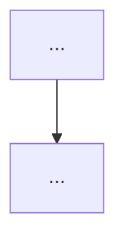

# Workflow: Feature Dev
# PhuPhatCorp Web — BA → Tech Lead → Backend → QA Tests → Frontend → QA Regression

## Tổng quan

```
User mô tả yêu cầu tính năng
            ↓
[PHASE 1] business-analyst  → Phân tích yêu cầu, flowchart, data model
            ↓ ✋ dừng confirm
[PHASE 2] tech-lead        → Đọc hiểu BA, xác định tasks BE + FE
            ↓ ✋ dừng confirm
[PHASE 3] dev-backend       → Implement backend (migration → service → API route → validation)
            ↓ tự động
[PHASE 4] dev-backend       → Run migration trên dev environment
            ↓ tự động
[PHASE 5] test-qa          → Viết unit/integration tests cho backend
            ↓ tự động
[PHASE 6] test-qa          → Chạy tests, nếu fail → quay lại BE fix
            ↓ tự động
[PHASE 7] dev-frontend      → Implement frontend (hook → page → component → i18n)
            ↓ tự động
[PHASE 8] test-qa           → Test chức năng UI + regression
            ↓ tự động
[PHASE 9] dev-backend       → Cập nhật file migration nếu có thay đổi data model
            ↓ tự động
[PHASE 10] dev-backend & dev-frontend → Cập nhật .claude/knowhow/system-features.md
            ↓ tự động
         Báo cáo kết quả cuối
```

**Chỉ dừng 2 lần:** Sau Phase 1 và sau Phase 2.
**Escape hatch:** Nếu có blocking bug không thể fix trong 3 lần thử ở Phase 6 hoặc Phase 8 → báo cáo user và dừng workflow.

---

## PHASE 1 — Business Analyst

### Input
Nhận yêu cầu từ `$ARGUMENTS` hoặc nội dung user paste vào.

Nếu yêu cầu chưa đủ rõ để phân tích, hỏi ngắn gọn tối đa 2 câu.
Không hỏi nhiều — workflow này ưu tiên tốc độ.

### Thực hiện

Dùng skill `business-analyst` để thực hiện các công việc sau:
- Đọc file `.claude/knowhow/system-features.md` để hiểu về các chức năng đang có trên hệ thống.
- Phân tích yêu cầu, xác định các user story chính và edge cases, thực hiện đầy đủ các công việc bên dưới:

#### 1.1 Flowchart TO-BE


#### 1.2 Business Rules
```
BR-001: [Rule 1]
BR-002: [Rule 2]
```

#### 1.3 Data Model
```sql
-- Tables cần tạo hoặc thay đổi
-- Chú ý: các bảng cần có created_at, updated_at
```

#### 1.4 API Contract
```
[METHOD] /api/[admin|customer]/[endpoint]
Request:  { field: type }
Response: { success: true, data: { ... } }
```

#### 1.5 UI Screens cần thiết
```
- Screen 1: [Tên] → apps/[admin|customer]/pages/[Name].tsx
- Screen 2: [Tên] → apps/[admin|customer]/pages/[Name].tsx
```

#### 1.6 Edge Cases
```
- [Case 1] → xử lý thế nào
- [Case 2] → xử lý thế nào
```

Lưu file tại:
```
docs/ba/YYYYMMDD_[feature-name]-analysis.md
```

Cập nhật `.claude/knowhow/system-features.md` nếu có thêm chức năng mới hoặc thay đổi chức năng cũ.

### Checkpoint 1 ✋
```
━━━━━━━━━━━━━━━━━━━━━━━━━━━━━━━━━━━━━━━━
✅ PHASE 1 HOÀN TẤT — BA Analysis sẵn sàng
📄 Lưu tại: docs/ba/YYYYMMDD_[feature-name]-analysis.md
━━━━━━━━━━━━━━━━━━━━━━━━━━━━━━━━━━━━━━━━

Bạn có muốn:
A) Tiếp tục — Tech Lead đọc BA và xác định tasks
B) Chỉnh sửa BA trước khi tiếp tục
C) Dừng tại đây

Trả lời A, B, hoặc C?
```

---

## PHASE 2 — Tech Lead

### Thực hiện

Đọc BA Analysis từ Phase 1 và codebase liên quan.
Dùng skill `tech-lead` để xác định tasks cụ thể:

```markdown
# Task List: [Tên feature]
**Ngày:** YYYY-MM-DD
**BA Doc:** docs/ba/YYYYMMDD_[feature-name]-analysis.md

---

## ⚙️ BACKEND TASKS

| ID   | Task | Chi tiết kỹ thuật | Effort |
|------|------|-------------------|--------|
| BE-01 | Tạo migration | [tên table, columns cụ thể] | S/M/L |
| BE-02 | Viết service | [tên service, methods cần] | S/M/L |
| BE-03 | Tạo API route | [METHOD /api/...] | S/M/L |
| BE-04 | Validation | [Zod schema cho request] | S/M/L |

## 🎨 FRONTEND TASKS

| ID   | Task | Chi tiết kỹ thuật | Effort |
|------|------|-------------------|--------|
| FE-01 | React Query hook | [tên hook, API integrate] | S/M/L |
| FE-02 | Tạo page | [đường dẫn file, route] | S/M/L |
| FE-03 | Tạo component | [tên component, props] | S/M/L |
| FE-04 | i18n keys | [danh sách keys cần thêm] | S |

## 📊 Thứ tự thực hiện

Phase 3: BE-01 → BE-02 → BE-03 → BE-04
Phase 4: Run migration
Phase 5: Viết tests
Phase 6: Chạy tests
Phase 7: FE-01 → FE-02 → FE-03 → FE-04
Phase 8: Regression

## ⚠️ Lưu ý kỹ thuật
- [Điểm cần chú ý khi implement]
- [Dependency hoặc conflict cần tránh]
```

Lưu file tại:
```
docs/tasks/YYYYMMDD_[feature-name]-tasks.md
```

### Checkpoint 2 ✋
```
━━━━━━━━━━━━━━━━━━━━━━━━━━━━━━━━━━━━━━━━
✅ PHASE 2 HOÀN TẤT — Task List sẵn sàng
📄 Lưu tại: docs/tasks/YYYYMMDD_[feature-name]-tasks.md
━━━━━━━━━━━━━━━━━━━━━━━━━━━━━━━━━━━━━━━━

Backend tasks:  [số lượng] tasks | Tổng effort: ~[X] giờ
Frontend tasks: [số lượng] tasks | Tổng effort: ~[X] giờ

Bạn có muốn:
A) Bắt đầu implement — Backend → Tests → Frontend → QA (tự động)
B) Điều chỉnh task list trước khi implement
C) Dừng tại đây

Trả lời A, B, hoặc C?
```

Nếu user chọn **A** → chạy tự động Phase 3–10 không dừng lại.

---

## PHASE 3 — Backend Implement

### Thực hiện tự động

Đọc task list từ Phase 2, thực hiện **tuần tự theo thứ tự** tất cả Backend tasks:

1. **BE-01 (Migration)**: Dùng skill `dev-backend` để tạo migration file
2. **BE-02 (Service)**: Dùng skill `dev-backend` để viết business logic
3. **BE-03 (API Route)**: Dùng skill `dev-backend` để tạo API endpoint
4. **BE-04 (Validation)**: Dùng skill `dev-backend` để thêm Zod validation

Sau mỗi task:
```bash
cd backend && npm run lint
cd backend && npm run test
```

Nếu lint hoặc test fail → tự fix trước khi chuyển task tiếp theo.

### Báo cáo BE xong
```
⚙️ PHASE 3 HOÀN TẤT — Backend implement xong
✅ BE-01: [Tên task]
✅ BE-02: [Tên task]
✅ BE-03: [Tên task]
✅ BE-04: [Tên task]
→ Bắt đầu Phase 4: Run migration...
```

---

## PHASE 4 — Run Migration

### Thực hiện tự động

Chạy migration trên dev environment để FE có DB schema để dev:
```bash
cd backend && npm run migrate
```

Nếu migration fail → fix migration rồi chạy lại. Không chuyển Phase 5 cho đến khi migration thành công.

### Báo cáo
```
✅ PHASE 4 HOÀN TẤT — Migration đã chạy thành công
→ Bắt đầu Phase 5: QA viết tests...
```

---

## PHASE 5 — QA: Viết Unit/Integration Tests

### Thực hiện tự động

Đọc BA Analysis từ Phase 1, task list từ Phase 2, và codebase backend đã implement ở Phase 3.
Dùng skill `test-qa` để viết tests:

```markdown
### Test Cases: [Tên feature]
**Ngày:** YYYY-MM-DD
**BA Doc:** docs/ba/YYYYMMDD_[feature-name]-analysis.md

---

1. Viết unit test cho service layer (BE-02)
   - [Tên service] → [tên file test]
2. Viết integration test cho API route (BE-03)
   - [METHOD /api/...] → [tên file test]
```

Lưu file tại:
```
docs/unit-integration/YYYYMMDD_[feature-name]-testcases.md
```

### Báo cáo
```
🧪 PHASE 5 HOÀN TẤT — Tests đã viết xong
→ Bắt đầu Phase 6: Chạy tests...
```

---

## PHASE 6 — QA: Chạy Tests

### Thực hiện tự động

Đọc test cases từ Phase 5 và codebase backend.
Dùng skill `test-qa` để chạy tests:

```bash
cd backend && npm run test
```

**Nếu tests fail:**
- Tối đa 3 lần thử tự fix (fix code → run lại)
- Sau 3 lần fail → báo cáo user chi tiết về blocking bug và **dừng workflow**

**Nếu tests pass:**
### Báo cáo
```
✅ PHASE 6 HOÀN TẤT — Tất cả tests pass
→ Bắt đầu Phase 7: Frontend implement...
```

---

## PHASE 7 — Frontend Implement

### Thực hiện tự động

Đọc task list từ Phase 2 và API đã implement ở Phase 3.
Thực hiện **tuần tự theo thứ tự** tất cả Frontend tasks:

1. **FE-01 (React Query hook)**: Dùng skill `dev-frontend` để tạo hook
2. **FE-02 (Page)**: Dùng skill `dev-frontend` để tạo page
3. **FE-03 (Component)**: Dùng skill `dev-frontend` để tạo component
4. **FE-04 (i18n)**: Thêm keys vào `vi.json` và `en.json`

Lưu ý khi implement:
- Integrate đúng API endpoints đã tạo ở Phase 3
- Handle loading state, empty state, error state
- Responsive với Tailwind breakpoints

Sau mỗi task:
```bash
cd frontend && npm run lint
cd frontend && npm run typecheck
```

Nếu lint hoặc typecheck fail → tự fix trước khi chuyển task tiếp theo.

### Báo cáo FE xong
```
🎨 PHASE 7 HOÀN TẤT — Frontend implement xong
✅ FE-01: [Tên task]
✅ FE-02: [Tên task]
✅ FE-03: [Tên task]
✅ FE-04: [Tên task]
→ Bắt đầu Phase 8: QA regression...
```

---

## PHASE 8 — QA: Functional Test + Regression

### Thực hiện tự động

Đọc test cases từ Phase 5 và codebase frontend đã implement ở Phase 7.
Dùng skill `test-qa` để test UI:

#### 8.1 Chạy toàn bộ test suite
```bash
cd backend  && npm run test
cd frontend && npm run test
```

#### 8.2 Manual QA Checklist
```
Functional:
- [ ] Tất cả BA requirements đã implement đúng
- [ ] Edge cases đã handle
- [ ] API response đúng format { success, data/error }

Technical:
- [ ] lint pass: npm run lint (BE + FE)
- [ ] test pass: npm run test (BE + FE)
- [ ] TypeScript không có lỗi
- [ ] i18n đầy đủ cả vi.json và en.json
- [ ] API filter đúng theo user context

Security:
- [ ] Không log sensitive data
- [ ] File URL là presigned (có expiry)
- [ ] Auth check đầy đủ trên mọi route
```

**Nếu có bug mới phát sinh:** Viết regression test và báo cáo chi tiết.
**Nếu có blocking bug:** Tối đa 3 lần thử tự fix → báo cáo user và dừng workflow.

### Báo cáo
```
✅ PHASE 8 HOÀN TẤT — QA regression pass
→ Bắt đầu Phase 9: Cập nhật migration docs...
```

---

## PHASE 9 — Backend: Cập nhật Docs

### Thực hiện tự động
Nếu có thay đổi schema hoặc API mới → cập nhật:
- `know-how.md` → DB schema mới, API endpoints mới, thay đổi cấu trúc thư mục nếu có.
Nếu Phase 3 có tạo migration mới → cập nhật docs migration và báo cáo:
```
✅ PHASE 9 HOÀN TẤT — Migration docs đã cập nhật
→ Bắt đầu Phase 10: Cập nhật system-features.md...
```

Nếu không có thay đổi migration → bỏ qua và chuyển Phase 10.

---

## PHASE 10 — Cập nhật System Features

### Thực hiện tự động

Cập nhật `.claude/knowhow/system-features.md` nếu có thay đổi:
- Business logic mới
- Feature flows mới
- Role access thay đổi

---

## Báo cáo cuối — Workflow hoàn tất

```
━━━━━━━━━━━━━━━━━━━━━━━━━━━━━━━━━━━━━━━━
🎉 FEATURE-DEV HOÀN TẤT: [Tên feature]
━━━━━━━━━━━━━━━━━━━━━━━━━━━━━━━━━━━━━━━━

📄 Docs đã tạo:
  - docs/ba/YYYYMMDD_[feature]-analysis.md
  - docs/tasks/YYYYMMDD_[feature]-tasks.md
  - docs/unit-integration/YYYYMMDD_[feature]-testcases.md

⚙️  Backend:  [X] tasks hoàn tất (Phase 3)
🎨 Frontend: [X] tasks hoàn tất (Phase 7)
🧪 QA:       [X] tests pass, [X] regression tests

✅ Sẵn sàng tạo PR
→ Nhớ tạo branch và PR với link đến docs/ba/ và docs/tasks/
```

---

## Cấu trúc docs được tạo

```
docs/
├── ba/
│   └── YYYYMMDD_[feature-name]-analysis.md
├── tasks/
│   └── YYYYMMDD_[feature-name]-tasks.md
└── unit-integration/
    └── YYYYMMDD_[feature-name]-testcases.md
```

---

## Quy tắc bất biến

- **KHÔNG skip Phase 1 và Phase 2** — đây là 2 checkpoint bắt buộc
- **Từ Phase 3 trở đi chạy tự động** liên tục đến khi QA xong, không dừng lại hỏi
- **Escape hatch:** Blocking bug không fix được trong 3 lần → báo cáo user và dừng
- **KHÔNG chuyển sang FE khi BE chưa lint/test pass**
- **KHÔNG chuyển sang Phase 5 khi migration chưa pass**
- **KHÔNG báo cáo QA pass khi còn test fail**
- **KHÔNG hardcode text trong FE** — luôn dùng i18n
- **Mọi API route phải filter đúng theo user context**
