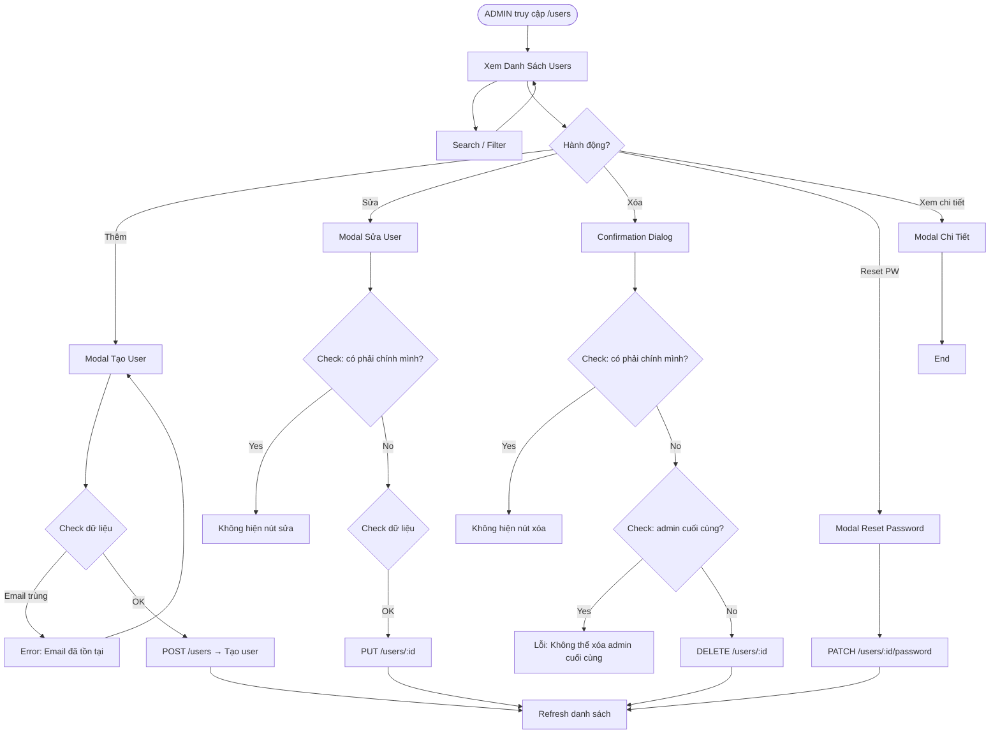

# BA Analysis — Quản lý User Truy Cập Hệ Thống

**Ngày:** 2026-03-30
**Người phân tích:** Business Analyst Agent
**Feature:** Quản lý User Truy Cập Hệ Thống

---

## 1. Feature Description

Cho phép ADMIN quản lý toàn bộ users trong hệ thống: xem danh sách, tạo mới, chỉnh sửa thông tin, thay đổi role, và vô hiệu hóa tài khoản user. Đây là chức năng nằm trong route `/users` — chỉ ADMIN được truy cập.

---

## 2. User Stories

### US-01: Xem danh sách users
> **Actor:** ADMIN
> **JOURNEY:**
> 1. ADMIN truy cập `/users` → hiển thị danh sách toàn bộ users dạng bảng
> 2. Mỗi dòng: STT, Họ tên, Email, Role (badge), Ngày tạo, Hành động
> 3. ADMIN có thể search theo họ tên hoặc email
> 4. ADMIN có thể filter theo role (Tất cả / ADMIN / ACCOUNTANT / VIEWER)
> 5. ADMIN có thể sort theo cột (mặc định: theo id ASC)

### US-02: Tạo user mới
> **Actor:** ADMIN
> **JOURNEY:**
> 1. ADMIN click nút "Thêm user" → mở modal
> 2. Form: Họ tên (bắt buộc), Email (bắt buộc, unique), Mật khẩu (bắt buộc, min 6 ký tự), Vai trò (bắt buộc, dropdown)
> 3. Submit → tạo user → đóng modal → refresh danh sách
> 4. Nếu email đã tồn tại → hiển thị lỗi trong form

### US-03: Chỉnh sửa user
> **Actor:** ADMIN
> **JOURNEY:**
> 1. ADMIN click icon edit trên dòng user → mở modal với form pre-filled
> 2. Form: Họ tên, Email (disabled), Vai trò, Trạng thái hoạt động
> 3. Không cho sửa email của user đã có
> 4. Submit → cập nhật → đóng modal → refresh danh sách
> 5. **Không cho sửa chính mình** (không có nút edit/icon trên dòng của user đang đăng nhập)

### US-04: Xóa user
> **Actor:** ADMIN
> **JOURNEY:**
> 1. ADMIN click icon delete trên dòng user → confirmation dialog
> 2. Confirm → xóa user → refresh danh sách
> 3. **Không cho xóa chính mình**
> 4. **Không cho xóa admin cuối cùng** (nếu chỉ còn 1 user có role=ADMIN → báo lỗi)

### US-05: Reset password
> **Actor:** ADMIN
> **JOURNEY:**
> 1. ADMIN click icon key trên dòng user → modal xác nhận
> 2. Modal nhập mật khẩu mới (min 6 ký tự)
> 3. Submit → cập nhật password_hash → success message

### US-06: Xem chi tiết user
> **Actor:** ADMIN
> **JOURNEY:**
> 1. ADMIN click vào dòng user → mở modal chi tiết
> 2. Hiển thị: Họ tên, Email, Vai trò, Ngày tạo, Ngày cập nhật, Trạng thái

---

## 3. Flowchart TO-BE



---

## 4. Business Rules

| ID | Rule | Mô tả |
|----|------|--------|
| BR-001 | Quyền truy cập | Chỉ ADMIN mới được truy cập `/users`. ACCOUNTANT và VIEWER nhận 403. |
| BR-002 | Tạo user | Mỗi user có email DUY NHẤT trong hệ thống. |
| BR-003 | Vai trò mặc định | User mới tạo mà không chỉ định role → mặc định là VIEWER. |
| BR-004 | Sửa thông tin | ADMIN có thể sửa `full_name`, `role`, `is_active` của user khác. Không sửa được email. |
| BR-005 | Tự bảo vệ | ADMIN không thể sửa hoặc xóa tài khoản của chính mình. |
| BR-006 | Bảo vệ admin cuối | Không thể xóa user cuối cùng có role = ADMIN. |
| BR-007 | Reset password | ADMIN có thể reset password của bất kỳ user nào khác. Mật khẩu mới phải ≥ 6 ký tự. |
| BR-008 | Trạng thái hoạt động | User bị `is_active = false` → vẫn tồn tại trong DB, không hiển thị trong danh sách mặc định. |
| BR-009 | Soft delete | Xóa user = hard delete (DELETE khỏi DB). Không dùng soft delete. |
| BR-010 | Không tự khóa | ADMIN không thể thay đổi role của chính mình thành non-ADMIN. |

---

## 5. Data Model

### Thay đổi table `users`

Cột mới cần thêm:

```sql
-- Thêm vào bảng users hiện tại
ALTER TABLE users ADD COLUMN IF NOT EXISTS is_active BOOLEAN NOT NULL DEFAULT TRUE;
ALTER TABLE users ADD COLUMN IF NOT EXISTS last_login_at TIMESTAMP;
ALTER TABLE users ADD COLUMN IF NOT EXISTS created_by INTEGER REFERENCES users(id);
ALTER TABLE users ADD COLUMN IF NOT EXISTS updated_by INTEGER REFERENCES users(id);
```

### Table `user_activities` (mới — log hành động quản trị)

```sql
CREATE TABLE IF NOT EXISTS user_activities (
  id SERIAL PRIMARY KEY,
  actor_id INTEGER NOT NULL REFERENCES users(id),
  target_user_id INTEGER REFERENCES users(id),
  action VARCHAR(50) NOT NULL,
  details JSONB,
  ip_address VARCHAR(45),
  created_at TIMESTAMP DEFAULT CURRENT_TIMESTAMP
);

-- action: 'CREATE_USER', 'UPDATE_USER', 'DELETE_USER', 'RESET_PASSWORD', 'TOGGLE_STATUS'
```

---

## 6. API Contract

Base URL: `/api`

### 6.1 GET /users
**Auth:** JWT + ADMIN
**Query params:** `?search=&role=&is_active=&page=&limit=`
**Response:**
```json
{
  "success": true,
  "message": "Users retrieved",
  "data": {
    "users": [
      {
        "id": 1,
        "email": "admin@phuphatcorp.com",
        "full_name": "Admin",
        "role": "ADMIN",
        "is_active": true,
        "created_at": "2026-03-30T00:00:00Z",
        "updated_at": "2026-03-30T00:00:00Z"
      }
    ],
    "meta": {
      "total": 10,
      "page": 1,
      "limit": 20,
      "totalPages": 1
    }
  }
}
```

### 6.2 POST /users
**Auth:** JWT + ADMIN
**Body:**
```json
{
  "email": "user@example.com",
  "password": "Password123",
  "full_name": "Nguyễn Văn A",
  "role": "ACCOUNTANT"
}
```
**Response:** `201 Created`
```json
{
  "success": true,
  "message": "User created successfully",
  "data": { "id": 2, "email": "user@example.com", "full_name": "Nguyễn Văn A", "role": "ACCOUNTANT", "is_active": true, "created_at": "...", "updated_at": "..." }
}
```

### 6.3 GET /users/:id
**Auth:** JWT + ADMIN
**Response:**
```json
{
  "success": true,
  "message": "User retrieved",
  "data": { "id": 2, "email": "...", "full_name": "...", "role": "...", "is_active": true, "created_at": "...", "updated_at": "...", "created_by": 1, "updated_by": 1 }
}
```

### 6.4 PUT /users/:id
**Auth:** JWT + ADMIN
**Body:**
```json
{
  "full_name": "Nguyễn Văn B",
  "role": "VIEWER",
  "is_active": true
}
```
**Response:**
```json
{
  "success": true,
  "message": "User updated successfully",
  "data": { "id": 2, "email": "...", "full_name": "Nguyễn Văn B", "role": "VIEWER", "is_active": true, "created_at": "...", "updated_at": "..." }
}
```

### 6.5 DELETE /users/:id
**Auth:** JWT + ADMIN
**Response:**
```json
{ "success": true, "message": "User deleted successfully" }
```
**Error 400 (không thể xóa admin cuối cùng):**
```json
{ "success": false, "message": "Cannot delete the last admin user", "error": "LAST_ADMIN" }
```

### 6.6 PATCH /users/:id/password
**Auth:** JWT + ADMIN
**Body:**
```json
{
  "new_password": "NewPass123"
}
```
**Response:**
```json
{ "success": true, "message": "Password reset successfully" }
```

### 6.7 GET /users/me/profile (bonus — cho user xem profile của mình)
**Auth:** JWT (any role)
**Response:** Thông tin user hiện tại (đã có từ `/auth/me`, có thể không cần implement riêng)

---

## 7. UI Screens

### Screen 1: UserManagementPage
**Path:** `/users`
**File:** `frontend/src/pages/admin/UserManagementPage.tsx`
**Layout:** MainLayout
**Components:**
- Header: Tiêu đề "Quản lý người dùng" + nút "Thêm user" (icon Plus)
- Search bar: Input search + Select filter role + Toggle "Hiển thị bị khóa"
- Table:
  - Columns: STT, Họ tên, Email, Vai trò (Badge), Trạng thái (Badge), Ngày tạo, Hành động
  - Hành động: icon Eye (xem chi tiết), icon Pencil (sửa), icon Key (reset pw), icon Trash (xóa)
  - Nếu là chính mình → ẩn Pencil và Trash
- Pagination: Previous / Next + page info
- Empty state: "Chưa có người dùng nào"

### Screen 2: CreateUserModal
**Type:** Modal (size: md)
**Fields:**
- Input: Họ tên (required)
- Input: Email (required, type=email)
- Input: Mật khẩu (required, type=password)
- Select: Vai trò (ADMIN / ACCOUNTANT / VIEWER), default=VIEWER
- Footer: Button "Hủy" (outline) + Button "Tạo user" (primary, isLoading)

### Screen 3: EditUserModal
**Type:** Modal (size: md)
**Fields:**
- Input: Họ tên (required)
- Input: Email (disabled/readonly)
- Select: Vai trò
- Toggle/Switch: Trạng thái hoạt động
- Footer: Button "Hủy" + Button "Lưu thay đổi"

### Screen 4: UserDetailModal
**Type:** Modal (size: sm)
**Content:** Read-only display of user info

### Screen 5: ResetPasswordModal
**Type:** Modal (size: sm)
**Fields:**
- Input: Mật khẩu mới (type=password, min 6)
- Input: Xác nhận mật khẩu mới
- Footer: Button "Hủy" + Button "Đặt lại mật khẩu"

### Screen 6: DeleteConfirmDialog
**Type:** Modal (size: sm)
**Content:** "Bạn có chắc muốn xóa user [name]? Hành động này không thể hoàn tác."
**Footer:** Button "Hủy" + Button "Xóa" (danger)

---

## 8. Edge Cases

| Case | Xử lý |
|------|--------|
| Email trùng khi tạo user | Trả 409 Conflict, hiển thị lỗi inline trong form |
| Sửa user không tồn tại | Trả 404 |
| Xóa user không tồn tại | Trả 404 |
| Xóa admin cuối cùng | Trả 400 với error code LAST_ADMIN |
| Sửa/xóa chính mình | Frontend ẩn nút, Backend check thêm để đảm bảo an toàn |
| User đang active/inactive | Toggle trong form sửa, filter "Hiển thị bị khóa" trong list |
| Search không ra kết quả | Hiển thị empty state "Không tìm thấy người dùng nào" |
| Password < 6 ký tự | Validation ở cả FE (Yup) và BE (express-validator) |
| Role không hợp lệ | Trả 400 |
| ADMIN tự thay đổi role của chính mình | Backend check: nếu actor_id === target_id → từ chối thay đổi role |

---

## 9. Technical Notes

### Backend Changes Required
1. Thêm migration cho cột mới (`is_active`, `last_login_at`, `created_by`, `updated_by`) và table `user_activities`
2. Tạo `userService.ts` — tách logic từ `userController` hoặc mở rộng
3. Tạo `usersController.ts` mới — CRUD endpoints
4. Thêm validation schemas (Zod hoặc express-validator)
5. Thêm route `PATCH /users/:id/password`
6. Thêm route `DELETE /users/:id`
7. Thêm route `PUT /users/:id`
8. User activity logging (insert vào `user_activities`)

### Frontend Changes Required
1. Thêm route `/users` → `UserManagementPage`
2. Thêm nav item "Quản lý người dùng" trong MainLayout (chỉ hiện cho ADMIN)
3. Tạo `usersApi.ts` (React Query hooks + API calls)
4. Tạo UserManagementPage + các Modal components
5. i18n keys: vi.json + en.json

### Authorization
- Backend: kiểm tra `authorizeRoles(UserRole.ADMIN)` trên TẤT CẢ endpoints
- Backend: kiểm tra actor_id !== target_id khi update/delete
- Frontend: ẩn menu item "/users" cho non-ADMIN
- Frontend: ẩn action buttons trên dòng của chính mình

---

## 10. Acceptance Criteria

| # | Criteria |
|---|----------|
| AC-01 | ADMIN thấy danh sách toàn bộ users khi truy cập `/users` |
| AC-02 | Non-ADMIN (ACCOUNTANT, VIEWER) nhận 403 khi truy cập `/users` |
| AC-03 | ADMIN tạo user mới với đầy đủ thông tin → user xuất hiện trong danh sách |
| AC-04 | ADMIN sửa full_name, role, is_active của user khác thành công |
| AC-05 | ADMIN không thể sửa email của user |
| AC-06 | ADMIN không thể sửa/xóa chính mình |
| AC-07 | ADMIN không thể xóa admin cuối cùng |
| AC-08 | ADMIN reset password user khác thành công |
| AC-09 | Filter role và search hoạt động đúng |
| AC-10 | Tất cả text trên UI dùng i18n (vi + en) |
| AC-11 | API trả đúng format `{ success, message, data }` |
| AC-12 | Validation đầy đủ ở cả frontend và backend |
| AC-13 | User activity được ghi log vào `user_activities` |
