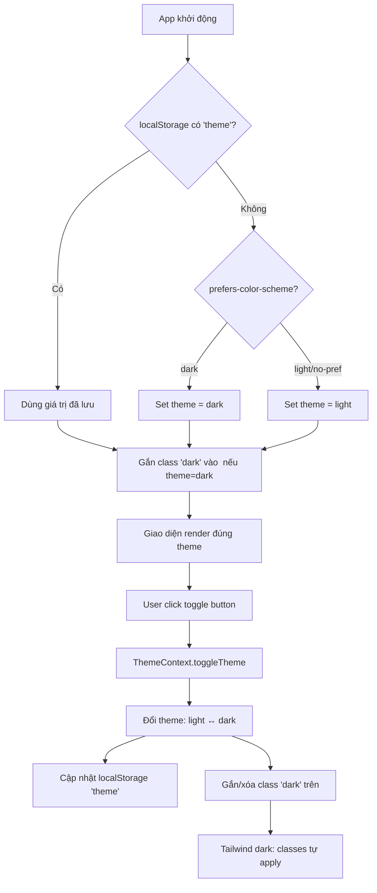

# BA Analysis: Chức năng chuyển chế độ sáng/tối (Dark/Light Mode)

**Ngày:** 2026-04-06
**Feature:** Dark/Light Mode Toggle
**Scope:** Frontend only — không cần backend, không cần DB migration

---

## 1.1 Flowchart TO-BE



---

## 1.2 Business Rules

```
BR-001: Default theme khi chưa có preference = system preference (prefers-color-scheme media query).
        Nếu OS đang dark → app dùng dark. Nếu light/không xác định → app dùng light.

BR-002: Khi user click toggle → lưu preference vào localStorage với key 'theme' (giá trị: 'dark' | 'light').

BR-003: Preference từ localStorage có độ ưu tiên cao hơn system preference.
        Một khi user đã toggle, app luôn dùng giá trị trong localStorage.

BR-004: Theme được apply bằng cách gắn/xóa class 'dark' trên thẻ <html>.
        Tailwind CSS darkMode: 'class' strategy sẽ tự động activate các dark: variant.

BR-005: Toggle button hiển thị icon phù hợp:
        - Đang ở light mode → hiển thị icon Moon (chuyển sang dark)
        - Đang ở dark mode → hiển thị icon Sun (chuyển sang light)

BR-006: Theme phải được apply trước khi React render để tránh flash of unstyled content (FOUC).
        → Inject script inline trong <head> của index.html để set class 'dark' synchronously.
```

---

## 1.3 Data Model

**Không cần thay đổi DB.** Theme preference lưu ở client-side:

```
localStorage key: 'theme'
Values: 'dark' | 'light'
Scope: Browser localStorage (persist qua sessions)
```

---

## 1.4 API Contract

**Không cần API.** Đây là tính năng pure frontend.

---

## 1.5 UI Screens cần thiết

```
- Screen 1: Toggle button trong MainLayout sidebar
  → frontend/src/layouts/MainLayout.tsx
  Vị trí: Khu vực dưới cùng sidebar, giữa nav và user info (hoặc kế bên user info)

- Screen 2: Toggle button trong AuthLayout (trang login/register)
  → frontend/src/layouts/AuthLayout.tsx
  Vị trí: Top-right corner

- Component: ThemeToggle button tái sử dụng
  → frontend/src/components/ui/ThemeToggle.tsx
```

---

## 1.6 Edge Cases

```
- [FOUC] Flash of unstyled content khi tải trang:
  → Xử lý bằng inline script trong index.html <head> để set class 'dark' synchronously
    trước khi React hydrate.

- [System pref thay đổi] Khi OS chuyển dark/light trong khi app đang mở:
  → Nếu user đã set explicit preference (localStorage có giá trị) → bỏ qua.
  → Nếu user chưa set preference → KHÔNG tự động thay đổi (tránh gây ngạc nhiên).

- [localStorage unavailable] Private browsing hoặc storage disabled:
  → Fallback về system preference, theme sẽ không persist nhưng vẫn hoạt động
    trong session hiện tại.

- [Tailwind components chưa có dark: variants] Nhiều components hiện tại chỉ có light colors:
  → Cần thêm dark: variants vào tất cả components và layouts.

- [AuthLayout] Trang login/register cần toggle button nhưng không có MainLayout:
  → ThemeToggle phải hoạt động độc lập, không phụ thuộc vào MainLayout.

- [ThemeContext scope] ThemeProvider phải bọc toàn bộ app (trong App.tsx),
  không nằm trong AuthProvider hoặc I18nProvider.
```

---

## 1.7 Các files cần chỉnh sửa

```
frontend/index.html                      ← Thêm inline script chống FOUC
frontend/tailwind.config.js              ← Thêm darkMode: 'class'
frontend/src/App.tsx                     ← Wrap với ThemeProvider
frontend/src/index.css                   ← Thêm CSS variables cho dark mode (nếu cần)
frontend/src/layouts/MainLayout.tsx      ← Thêm ThemeToggle button
frontend/src/layouts/AuthLayout.tsx      ← Thêm ThemeToggle button
frontend/src/i18n/vi.json                ← Thêm i18n keys
frontend/src/i18n/en.json                ← Thêm i18n keys

Tạo mới:
frontend/src/contexts/ThemeContext.tsx   ← ThemeProvider + useTheme hook
frontend/src/components/ui/ThemeToggle.tsx ← Toggle button component
```
