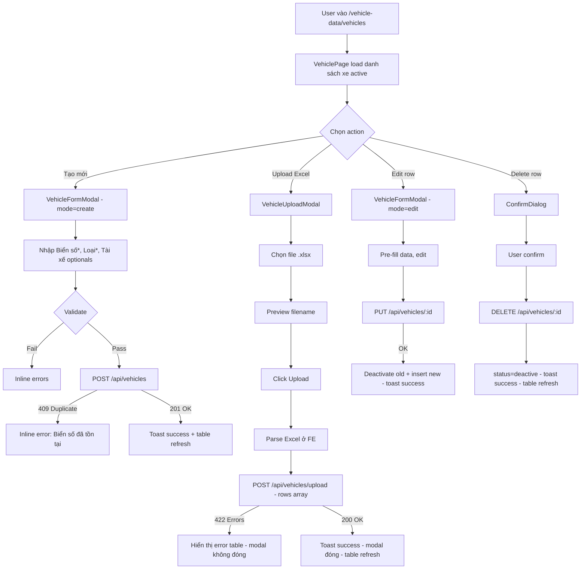

# BA Analysis — Dữ liệu xe (Vehicle Master Data)

**Ngày:** 2026-04-06
**Feature:** Dữ liệu xe — sub-menu trong "Quản lý dữ liệu xe"
**Scope:** Thêm masterdata quản lý danh sách xe vận chuyển

---

## 1.1 Flowchart TO-BE



---

## 1.2 Business Rules

```
BR-001: Biển số case-sensitive unique among active rows — enforced at service layer, NOT DB constraint
         (same biển số can exist in deactive/history rows)
BR-002: Soft update — PUT deactivates old row (status=deactive, end_date=now) + inserts new row as transaction
BR-003: Soft delete — DELETE sets status=deactive, end_date=now (no physical delete)
BR-004: Loại must be one of: 'Xe lớn' | 'Xe nhỏ' | 'Xe trung chuyển'
BR-005: Tài xế stored as JSONB array of strings (e.g. ["Nguyễn Văn A", "Trần Văn B"])
         Can be empty array [] if no driver assigned
BR-006: Upload Excel — parse at frontend (xlsx lib) → send JSON rows to backend
         Fail-fast: any row error → no insert at all, return all errors
BR-007: Upload duplicate check: (1) within file (case-sensitive), (2) against active rows in DB
BR-008: Excel Tài xế column: comma-separated names → split to array; blank → []
BR-009: start_date auto-set to NOW() on insert (not user-editable)
```

---

## 1.3 Data Model

```sql
CREATE TABLE vehicles (
  id          SERIAL PRIMARY KEY,
  bien_so     VARCHAR(50)  NOT NULL,
  loai        VARCHAR(50)  NOT NULL,          -- 'Xe lớn' | 'Xe nhỏ' | 'Xe trung chuyển'
  tai_xe      JSONB        NOT NULL DEFAULT '[]',  -- array of driver name strings
  status      VARCHAR(20)  NOT NULL DEFAULT 'active',
  start_date  TIMESTAMP    NOT NULL DEFAULT NOW(),
  end_date    TIMESTAMP,
  created_at  TIMESTAMP    NOT NULL DEFAULT NOW(),
  updated_at  TIMESTAMP    NOT NULL DEFAULT NOW()
);

CREATE INDEX idx_vehicles_bien_so ON vehicles(bien_so);
CREATE INDEX idx_vehicles_status  ON vehicles(status);
CREATE INDEX idx_vehicles_bien_so_status ON vehicles(bien_so, status);
```

**Notes:**
- No UNIQUE constraint on `bien_so` at DB level — same biển số appears in multiple deactive (history) rows
- `loai` validated at application layer (CHECK at DB level optional but not needed given app-layer validation)
- `tai_xe` is JSONB, FE sends array, BE stores as-is

---

## 1.4 API Contract

```
GET  /api/vehicles
  Response: { success: true, message: "Danh sách xe", data: Vehicle[] }
  — Returns active vehicles only, ORDER BY start_date DESC

POST /api/vehicles
  Request:  { bien_so: string, loai: string, tai_xe: string[] }
  Response 201: { success: true, message: "Tạo xe thành công", data: Vehicle }
  Response 409: { success: false, message: "Biển số 'X' đã tồn tại" }
  Response 400: { success: false, message: "Validation error", errors: [...] }

PUT  /api/vehicles/:id
  Request:  { bien_so: string, loai: string, tai_xe: string[] }
  Response 200: { success: true, message: "Cập nhật xe thành công", data: { newVehicle: Vehicle } }
  Response 404: { success: false, message: "Xe không tồn tại hoặc đã bị xóa" }
  Response 409: { success: false, message: "Biển số 'X' đã tồn tại" }

DELETE /api/vehicles/:id
  Response 200: { success: true, message: "Đã xóa xe" }
  Response 404: { success: false, message: "Xe không tồn tại hoặc đã bị xóa" }

POST /api/vehicles/upload
  Request:  { rows: [{ bien_so: string, loai: string, tai_xe: string[] }] }
  Response 200: { success: true, message: "Đã upload X xe thành công", data: { inserted: number } }
  Response 422: { success: false, message: "Có lỗi khi upload",
                  data: { errors: [{ row: number, bien_so: string, reason: string }] } }
```

---

## 1.5 UI Screens cần thiết

```
- Screen 1: VehiclePage             → pages/admin/vehicle-data/VehiclePage.tsx
- Screen 2: VehicleFormModal        → components/vehicle-data/VehicleFormModal.tsx
- Screen 3: VehicleUploadModal      → components/vehicle-data/VehicleUploadModal.tsx
- Screen 4: ConfirmDialog (Delete)  → dùng chung Modal component (như TripCodePage)
```

**Sidebar update:** Thêm sub-menu "Dữ liệu xe" dưới "Quản lý dữ liệu xe" trong MainLayout.
**Router update:** Thêm route `/vehicle-data/vehicles`.

---

## 1.6 Edge Cases

```
- Biển số trùng (create/update) → API 409 → inline error dưới field
- Biển số trùng trong Excel file (upload) → error table row, không insert
- Biển số trùng với active record (upload) → error table row, không insert
- Tài xế field rỗng → lưu [] (không lỗi, tài xế là optional)
- Loại không hợp lệ → API 400 validation error
- Excel thiếu cột Biển số → filter bỏ dòng đó + ghi lỗi
- Excel Tài xế: "A, B, C" → ["A", "B", "C"]; blank → []
- Excel Biển số empty string → filter bỏ (xem như dòng trống)
- Update xe đã deactive → 404 Not Found
- Delete xe đã deactive → 404 Not Found
- Upload 0 rows valid → lỗi "Không có dữ liệu hợp lệ" (FE-side)
- loai trong Excel: phải đúng 1 trong 3 giá trị (case-sensitive) → nếu sai: lỗi upload
```
