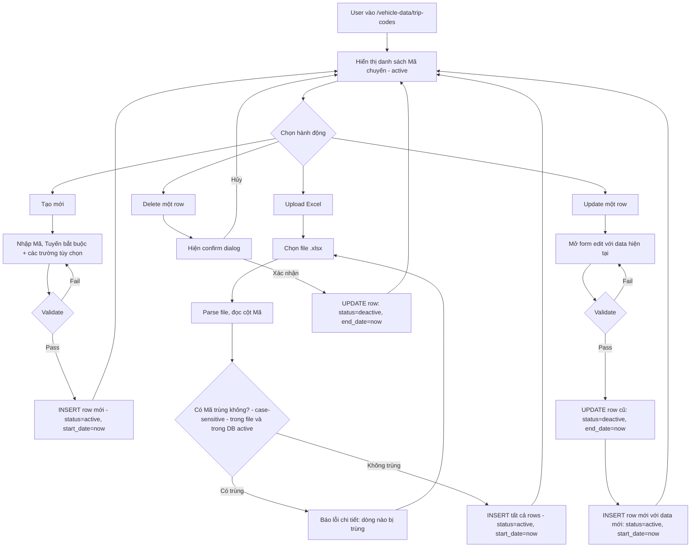

# BA Analysis — Quản lý dữ liệu xe / Mã chuyến

**Ngày:** 2026-04-06
**Feature:** Quản lý dữ liệu xe → Masterdata "Mã chuyến"
**Analyst:** Business Analyst Agent

---

## 1. Tổng quan

Chức năng "Quản lý dữ liệu xe" là một module mới với nhiều sub-menu. Mỗi sub-menu là một bảng masterdata riêng biệt. Masterdata đầu tiên là **"Mã chuyến"** — dùng để quản lý các chuyến vận chuyển của công ty.

### 1.1 Mục tiêu

- Lưu trữ và quản lý danh sách mã chuyến vận chuyển.
- Hỗ trợ upload hàng loạt qua Excel.
- Lịch sử thay đổi: mọi update/delete không xóa vật lý mà chuyển trạng thái thành `deactive`.

---

## 2. Flowchart TO-BE



---

## 3. Business Rules

```
BR-001: Mã là trường bắt buộc, phân biệt chữ hoa/thường (case-sensitive).
BR-002: Khi tạo mới / upload, kiểm tra Mã không được trùng với bất kỳ row nào có status='active'.
BR-003: Tuyến là trường bắt buộc.
BR-004: Start_date tự động set = CURRENT_TIMESTAMP khi INSERT (không nhập tay).
BR-005: Status mặc định là 'active' khi tạo mới.
BR-006: Khi Update:
  - Row cũ: UPDATE SET status='deactive', end_date=CURRENT_TIMESTAMP.
  - Row mới: INSERT với data mới, status='active', start_date=CURRENT_TIMESTAMP, end_date=NULL.
BR-007: Khi Delete:
  - UPDATE SET status='deactive', end_date=CURRENT_TIMESTAMP.
  - KHÔNG xóa vật lý.
BR-008: Upload Excel (case-sensitive duplicate check):
  - Kiểm tra duplicate Mã trong file Excel (so sánh giữa các dòng trong file, exact string match).
  - Kiểm tra duplicate Mã trong DB (so với active rows, exact string match).
  - Nếu có trùng: báo lỗi kèm số dòng Excel bị lỗi, không insert bất kỳ dòng nào.
BR-009: Danh sách mặc định chỉ hiển thị các row có status='active'.
BR-010: Số tiền (so_tien) là số thực, đơn vị VND, không bắt buộc.
```

---

## 4. Data Model

```sql
-- Bảng trip_codes (Mã chuyến)
CREATE TABLE trip_codes (
  id           SERIAL PRIMARY KEY,
  ma           VARCHAR(255) NOT NULL,          -- Mã (case-sensitive, unique among active)
  tuyen        VARCHAR(255) NOT NULL,           -- Tuyến
  so_tien      DECIMAL(15, 2),                 -- Số tiền (VND, optional)
  status       VARCHAR(20) NOT NULL DEFAULT 'active', -- 'active' | 'deactive'
  start_date   TIMESTAMP NOT NULL DEFAULT CURRENT_TIMESTAMP,
  end_date     TIMESTAMP,                      -- NULL khi active, set khi deactive
  boc_xep      VARCHAR(500),                   -- Bốc xếp (optional)
  ghi_chu      TEXT,                           -- Ghi chú (optional)
  created_at   TIMESTAMP NOT NULL DEFAULT CURRENT_TIMESTAMP,
  updated_at   TIMESTAMP NOT NULL DEFAULT CURRENT_TIMESTAMP
);

-- Index
CREATE INDEX idx_trip_codes_ma ON trip_codes(ma);
CREATE INDEX idx_trip_codes_status ON trip_codes(status);
CREATE INDEX idx_trip_codes_ma_status ON trip_codes(ma, status);
```

**Lưu ý:** Cột `ma` KHÔNG unique ở DB level vì một mã có thể tồn tại ở cả active và nhiều deactive row (lịch sử). Unique được kiểm tra bằng business rule (chỉ 1 active row cho mỗi mã).

---

## 5. API Contract

### 5.1 List trip codes
```
GET /api/trip-codes?status=active
Response: {
  success: true,
  data: [
    {
      id: number,
      ma: string,
      tuyen: string,
      so_tien: number | null,
      status: 'active' | 'deactive',
      start_date: string (ISO),
      end_date: string | null (ISO),
      boc_xep: string | null,
      ghi_chu: string | null
    }
  ]
}
```

### 5.2 Create trip code
```
POST /api/trip-codes
Request: {
  ma: string (required),
  tuyen: string (required),
  so_tien?: number,
  boc_xep?: string,
  ghi_chu?: string
}
Response: { success: true, data: { id, ma, tuyen, ... } }
Errors:
  409 Conflict — "Mã '[ma]' đã tồn tại"
  400 Bad Request — validation errors
```

### 5.3 Update trip code (soft update)
```
PUT /api/trip-codes/:id
Request: {
  ma: string (required),
  tuyen: string (required),
  so_tien?: number,
  boc_xep?: string,
  ghi_chu?: string
}
Response: { success: true, data: { newRow: {...} } }
Behavior:
  - Deactivate old row (id) → set status='deactive', end_date=NOW
  - Insert new row with provided data
Errors:
  404 — Row không tồn tại hoặc đã deactive
  409 — Mã mới trùng với active row khác (khi đổi mã)
```

### 5.4 Delete trip code (soft delete)
```
DELETE /api/trip-codes/:id
Response: { success: true, message: "Đã xóa mã chuyến" }
Behavior:
  - UPDATE SET status='deactive', end_date=NOW
Errors:
  404 — Row không tồn tại hoặc đã deactive
```

### 5.5 Upload Excel
```
POST /api/trip-codes/upload
Content-Type: multipart/form-data
Body: file (xlsx)
Expected columns in Excel:
  - Mã (required)
  - Tuyến (required)
  - Số tiền (optional)
  - Bốc xếp (optional)
  - Ghi chú (optional)

Response (success): {
  success: true,
  data: { inserted: number, message: string }
}
Response (error): {
  success: false,
  message: "Có lỗi khi upload",
  data: {
    errors: [
      { row: number, ma: string, reason: string }
    ]
  }
}
```

---

## 6. UI Screens cần thiết

```
Screen 1: Trang danh sách Mã chuyến
  → frontend/src/pages/admin/vehicle-data/TripCodePage.tsx
  → Route: /vehicle-data/trip-codes

Screen 2: Modal Tạo mới Mã chuyến
  → frontend/src/components/vehicle-data/TripCodeFormModal.tsx

Screen 3: Modal Edit Mã chuyến
  → Cùng component TripCodeFormModal, mode="edit"

Screen 4: Upload Excel — dùng Dialog/Modal
  → frontend/src/components/vehicle-data/TripCodeUploadModal.tsx
```

Menu "Quản lý dữ liệu xe" cần thêm vào sidebar với sub-menu:
```
- /vehicle-data/trip-codes  → Mã chuyến
(các sub-menu khác sẽ thêm sau)
```

---

## 7. Edge Cases

```
EC-001: Upload Excel có dòng trống giữa data → bỏ qua dòng trống.
EC-002: Upload Excel thiếu cột Mã hoặc Tuyến → báo lỗi format file.
EC-003: Mã trong Excel có khoảng trắng thừa đầu/cuối → trim() trước khi validate.
EC-004: Update row đã deactive → 404.
EC-005: Mã mới khi update trùng với active row khác (không phải chính nó) → 409.
EC-006: Mã mới khi update giống y mã cũ → cho phép (vẫn tạo row mới, deactivate row cũ).
EC-007: Upload file không phải .xlsx → báo lỗi định dạng file.
EC-008: So_tien nhập vào âm → reject.
EC-009: Upload file có nhiều sheet → chỉ đọc sheet đầu tiên.
```
