# BA Analysis: Thiết lập người dùng — Quản lý vai trò & Quyền

**Ngày:** 2026-04-06
**Feature:** User Settings — Role & Permission Management
**Phase:** 1 — Business Analyst

---

## 1.1 Flowchart TO-BE

```mermaid
flowchart TD
  subgraph Menu["Sidebar: Thiết lập người dùng (Admin)"]
    M1[Quản lý người dùng]
    M2[Quản lý vai trò]
    M3[Quản lý quyền]
  end

  subgraph RoleMgmt["Quản lý vai trò"]
    R1[Xem danh sách vai trò] --> R2{Hành động}
    R2 --> R3[Thêm vai trò mới]
    R2 --> R4[Sửa tên / mô tả]
    R2 --> R5{Xóa/Deactivate}
    R5 --> R6{Là vai trò ADMIN?}
    R6 -- Có --> R7[Chặn — ADMIN không thể deactivate]
    R6 -- Không --> R8{Có user đang dùng?}
    R8 -- Có --> R9[Cảnh báo: X users sẽ mất quyền]
    R8 -- Không --> R10[Deactivate ngay]
    R9 --> R11{Xác nhận?}
    R11 -- Có --> R12[Deactivate vai trò]
    R11 -- Không --> R13[Hủy]
    R12 --> R14[Users của vai trò này mất toàn bộ quyền]
  end

  subgraph PermMgmt["Quản lý quyền"]
    P1[Xem ma trận vai trò × quyền] --> P2{Chọn vai trò}
    P2 --> P3[Xem quyền hiện tại]
    P3 --> P4{Vai trò ADMIN?}
    P4 -- Có --> P5[Hiển thị readonly — ADMIN luôn có tất cả]
    P4 -- Không --> P6[Toggle từng quyền ON/OFF]
    P6 --> P7[Lưu cấu hình quyền]
    P7 --> P8[Cập nhật permission cho role]
  end

  subgraph UserAccess["Runtime: Kiểm tra quyền"]
    UA1[User gửi request] --> UA2[Middleware xác thực JWT]
    UA2 --> UA3{Role còn active?}
    UA3 -- Không --> UA4[403 Forbidden — role bị deactivate]
    UA3 -- Có --> UA5{Token có permission cần thiết?}
    UA5 -- Không --> UA6[403 Forbidden]
    UA5 -- Có --> UA7[Cho phép truy cập]
  end
```



---

## 1.2 Business Rules

```
BR-001: Vai trò ADMIN là vai trò hệ thống (is_system = true). Không thể deactivate, không thể xóa.
        ADMIN luôn có toàn bộ quyền, không thể chỉnh sửa permission của ADMIN.

BR-002: Vai trò chỉ được deactivate (is_active = false), không bao giờ xóa hẳn khỏi DB.
        Có thể activate lại sau khi deactivate.

BR-003: Khi vai trò bị deactivate, tất cả user thuộc vai trò đó mất ngay toàn bộ quyền.
        Middleware kiểm tra role.is_active trên mỗi request — nếu inactive, trả về 403.

BR-004: User có vai trò bị deactivate chỉ có thể được phục hồi bằng cách admin gán vào vai trò mới.
        User đó không thể tự làm gì khi đã mất quyền truy cập.

BR-005: Khi user được gán vào một vai trò, user đó thừa hưởng toàn bộ permissions của vai trò đó.
        Không có permission riêng cho từng user — quyền đến từ vai trò.

BR-006: Permissions được lưu trong JWT khi đăng nhập/refresh. Access token hết hạn sau 15 phút.
        Middleware kiểm tra role.is_active từ DB để đảm bảo deactivation có hiệu lực tức thì.

BR-007: Khi thêm/xóa permission khỏi một role, các JWT hiện tại sẽ có delay tối đa 15 phút
        (thời gian sống của access token). Refresh token sẽ tạo JWT mới với permissions cập nhật.

BR-008: Vai trò ACCOUNTANT và VIEWER là vai trò mặc định — có thể sửa tên/mô tả nhưng code
        (ACCOUNTANT, VIEWER) là hệ thống và không thể thay đổi. is_system = true.

BR-009: Khi tạo vai trò mới, code được tự động generate từ tên (uppercase, replace space with _).
        Code phải là duy nhất.

BR-010: Khi deactivate vai trò, phải hiển thị số lượng user đang bị ảnh hưởng trong confirm dialog.
```

---

## 1.3 Data Model

```sql
-- ============================================================
-- MIGRATION 004: Create roles, permissions, role_permissions
-- Update users to use role_id FK
-- ============================================================

-- Bảng vai trò
CREATE TABLE IF NOT EXISTS roles (
  id SERIAL PRIMARY KEY,
  name VARCHAR(100) NOT NULL,
  code VARCHAR(50) UNIQUE NOT NULL,          -- VD: 'ADMIN', 'ACCOUNTANT', 'MY_CUSTOM_ROLE'
  description TEXT,
  is_active BOOLEAN NOT NULL DEFAULT TRUE,
  is_system BOOLEAN NOT NULL DEFAULT FALSE,  -- TRUE = vai trò hệ thống (ADMIN, ACCOUNTANT, VIEWER)
  created_at TIMESTAMP WITH TIME ZONE DEFAULT NOW(),
  updated_at TIMESTAMP WITH TIME ZONE DEFAULT NOW()
);

-- Bảng quyền (predefined, không thêm qua UI)
CREATE TABLE IF NOT EXISTS permissions (
  id SERIAL PRIMARY KEY,
  code VARCHAR(100) UNIQUE NOT NULL,  -- VD: 'users.manage', 'delivery_data.view'
  name VARCHAR(200) NOT NULL,         -- Display name (dùng cho UI)
  module VARCHAR(50) NOT NULL,        -- VD: 'users', 'roles', 'delivery_data'
  description TEXT,
  created_at TIMESTAMP WITH TIME ZONE DEFAULT NOW()
);

-- Bảng quan hệ role-permission (many-to-many)
CREATE TABLE IF NOT EXISTS role_permissions (
  role_id INTEGER NOT NULL REFERENCES roles(id) ON DELETE CASCADE,
  permission_id INTEGER NOT NULL REFERENCES permissions(id) ON DELETE CASCADE,
  created_at TIMESTAMP WITH TIME ZONE DEFAULT NOW(),
  PRIMARY KEY (role_id, permission_id)
);

-- Thêm cột role_id vào users (thay thế cột role VARCHAR)
ALTER TABLE users ADD COLUMN IF NOT EXISTS role_id INTEGER REFERENCES roles(id);

-- ============================================================
-- SEED DATA: Roles mặc định
-- ============================================================
INSERT INTO roles (name, code, description, is_active, is_system) VALUES
  ('Administrator', 'ADMIN',      'Vai trò quản trị cao nhất, toàn quyền hệ thống', TRUE, TRUE),
  ('Accountant',    'ACCOUNTANT', 'Kế toán viên', TRUE, TRUE),
  ('Viewer',        'VIEWER',     'Người xem báo cáo', TRUE, TRUE)
ON CONFLICT (code) DO NOTHING;

-- ============================================================
-- SEED DATA: Permissions
-- ============================================================
INSERT INTO permissions (code, name, module, description) VALUES
  -- Dashboard
  ('dashboard.view',          'Xem Dashboard',                    'dashboard',      'Xem trang dashboard tổng quan'),
  -- Delivery Data
  ('delivery_data.view',      'Xem dữ liệu giao hàng',            'delivery_data',  'Xem danh sách và chi tiết dữ liệu giao hàng'),
  ('delivery_data.manage',    'Quản lý dữ liệu giao hàng',        'delivery_data',  'Tải lên và xử lý file dữ liệu giao hàng'),
  -- Reports
  ('reports.view',            'Xem báo cáo',                      'reports',        'Xem trang báo cáo'),
  -- Users
  ('users.view',              'Xem danh sách người dùng',         'users',          'Xem danh sách và chi tiết người dùng'),
  ('users.manage',            'Quản lý người dùng',               'users',          'Tạo, sửa, deactivate và reset mật khẩu người dùng'),
  -- Roles
  ('roles.view',              'Xem danh sách vai trò',            'roles',          'Xem danh sách vai trò'),
  ('roles.manage',            'Quản lý vai trò',                  'roles',          'Tạo, sửa, activate/deactivate vai trò'),
  -- Permissions
  ('permissions.manage',      'Quản lý quyền',                    'permissions',    'Cấu hình quyền cho các vai trò')
ON CONFLICT (code) DO NOTHING;

-- ============================================================
-- SEED DATA: Role-Permission mặc định
-- ============================================================
-- ADMIN: toàn bộ quyền (thêm sau khi INSERT vào roles và permissions)
INSERT INTO role_permissions (role_id, permission_id)
SELECT r.id, p.id FROM roles r, permissions p WHERE r.code = 'ADMIN'
ON CONFLICT DO NOTHING;

-- ACCOUNTANT: dashboard, delivery_data, reports
INSERT INTO role_permissions (role_id, permission_id)
SELECT r.id, p.id FROM roles r, permissions p
WHERE r.code = 'ACCOUNTANT'
  AND p.code IN ('dashboard.view', 'delivery_data.view', 'delivery_data.manage', 'reports.view')
ON CONFLICT DO NOTHING;

-- VIEWER: dashboard, delivery_data read-only, reports
INSERT INTO role_permissions (role_id, permission_id)
SELECT r.id, p.id FROM roles r, permissions p
WHERE r.code = 'VIEWER'
  AND p.code IN ('dashboard.view', 'delivery_data.view', 'reports.view')
ON CONFLICT DO NOTHING;

-- ============================================================
-- DATA MIGRATION: Gán role_id cho users hiện tại
-- ============================================================
UPDATE users u
SET role_id = r.id
FROM roles r
WHERE u.role = r.code AND u.role_id IS NULL;

-- Tạo index
CREATE INDEX IF NOT EXISTS idx_role_permissions_role_id ON role_permissions(role_id);
CREATE INDEX IF NOT EXISTS idx_users_role_id ON users(role_id);

-- ============================================================
-- Trigger tự động cập nhật updated_at cho roles
-- ============================================================
CREATE OR REPLACE FUNCTION update_updated_at_column()
RETURNS TRIGGER AS $$
BEGIN NEW.updated_at = NOW(); RETURN NEW; END;
$$ language 'plpgsql';

CREATE TRIGGER update_roles_updated_at
BEFORE UPDATE ON roles
FOR EACH ROW EXECUTE PROCEDURE update_updated_at_column();
```

**Lưu ý migration:** Cột `role` (VARCHAR) trên bảng `users` vẫn giữ lại trong migration này để backward compat. Sau khi hệ thống ổn định, sẽ drop cột này ở migration tiếp theo.

---

## 1.4 API Contract

### Roles

```
GET /api/roles
  Auth: JWT + permission roles.view
  Response: {
    success: true,
    data: {
      roles: [
        {
          id: number,
          name: string,
          code: string,
          description: string | null,
          is_active: boolean,
          is_system: boolean,
          user_count: number,       -- số user đang dùng role này
          permission_count: number, -- số permissions được gán
          created_at: string
        }
      ]
    }
  }

POST /api/roles
  Auth: JWT + permission roles.manage
  Request: { name: string, description?: string }
  Response: { success: true, data: { role: Role } }
  Note: code tự động generate từ name (uppercase, snake_case)

GET /api/roles/:id
  Auth: JWT + permission roles.view
  Response: { success: true, data: { role: Role & { permissions: Permission[] } } }

PUT /api/roles/:id
  Auth: JWT + permission roles.manage
  Request: { name: string, description?: string }
  Response: { success: true, data: { role: Role } }
  Restriction: Không thể sửa code, is_system

PATCH /api/roles/:id/toggle
  Auth: JWT + permission roles.manage
  Body: { is_active: boolean }
  Response: { success: true, data: { role: Role, affected_users: number } }
  Restriction: is_system roles không thể deactivate

GET /api/roles/:id/users
  Auth: JWT + permission roles.view
  Response: { success: true, data: { users: UserPublic[], total: number } }
```

### Permissions

```
GET /api/permissions
  Auth: JWT + permission permissions.manage
  Response: {
    success: true,
    data: {
      permissions: Permission[],
      grouped: { [module: string]: Permission[] }
    }
  }

GET /api/permissions/matrix
  Auth: JWT + permission permissions.manage
  Response: {
    success: true,
    data: {
      roles: Role[],
      permissions: Permission[],
      matrix: { [roleId: number]: number[] }  -- permission IDs per role
    }
  }

PUT /api/permissions/role/:roleId
  Auth: JWT + permission permissions.manage
  Request: { permission_ids: number[] }
  Response: { success: true, message: "Cập nhật quyền thành công" }
  Restriction: roleId của ADMIN bị chặn (readonly)
```

### Users (thay đổi)

```
POST /api/users
  Body thay đổi: { ..., role_id: number }  -- thay vì role: string

PUT /api/users/:id
  Body thay đổi: { ..., role_id?: number } -- thay vì role?: string
  Validation: role phải is_active = true khi gán cho user
```

---

## 1.5 UI Screens cần thiết

```
- Screen 1: Sidebar menu — Thiết lập người dùng (collapsible parent)
    → frontend/src/layouts/MainLayout.tsx (update)

- Screen 2: Quản lý vai trò — Role List Page
    → frontend/src/pages/admin/RoleManagementPage.tsx

- Screen 3: Quản lý quyền — Permission Matrix Page
    → frontend/src/pages/admin/PermissionManagementPage.tsx

- Screen 4: Modal — Tạo vai trò mới
    → frontend/src/components/admin/CreateRoleModal.tsx

- Screen 5: Modal — Sửa vai trò
    → frontend/src/components/admin/EditRoleModal.tsx

- Screen 6: Dialog — Confirm deactivate vai trò (với warning số user bị ảnh hưởng)
    → frontend/src/components/admin/DeactivateRoleDialog.tsx

- Screen 7: UserManagementPage.tsx (update) — Thay dropdown role từ enum → list roles từ API
```

---

## 1.6 Edge Cases

```
EC-001: User cố deactivate vai trò ADMIN
        → Backend trả 400 "Không thể deactivate vai trò hệ thống"
        → Frontend ẩn nút deactivate với vai trò is_system

EC-002: Vai trò mới có name/code trùng với vai trò đã có
        → Backend trả 409 "Code vai trò đã tồn tại"
        → Frontend hiển thị lỗi inline dưới field name

EC-003: Cố gán user vào vai trò đang bị deactivate
        → Backend trả 400 "Vai trò không hoạt động, không thể gán cho người dùng"

EC-004: Permission matrix cho ADMIN — tất cả checkbox readonly = checked
        → Frontend disable toàn bộ checkbox khi role.is_system = true
        → Tooltip: "Vai trò ADMIN luôn có toàn bộ quyền"

EC-005: User đang online khi role bị deactivate
        → Access token còn hiệu lực tối đa 15 phút (lifecycle của JWT)
        → Mỗi request: middleware kiểm tra role.is_active từ DB → 403 nếu inactive
        → Frontend nhận 403 → redirect về login với message "Vai trò của bạn đã bị thu hồi"

EC-006: Deactivate vai trò có 0 user — không cần confirm dialog, deactivate ngay
        → Confirm dialog chỉ hiện khi affected_users > 0

EC-007: Admin cố gán chính mình sang vai trò không có users.manage
        → Backend cho phép (admin system có thể tự lock mình)
        → Frontend cảnh báo: "Bạn đang thay đổi vai trò của chính mình. Tiếp tục?"

EC-008: PUT /api/permissions/role/:roleId với roleId của ADMIN
        → Backend trả 403 "Không thể thay đổi quyền của vai trò ADMIN"

EC-009: Role code collision khi tạo mới — "My Role" và "My   Role" đều generate "MY_ROLE"
        → Backend append số tự tăng: "MY_ROLE_2", "MY_ROLE_3", ...

EC-010: Refresh token — khi role bị deactivate, refresh phải bị từ chối
        → authController.refresh: kiểm tra role.is_active trước khi cấp token mới
        → Nếu inactive: trả 403, clear refresh cookie
```

---

## Tác động đến hệ thống hiện tại

| Thành phần | Thay đổi |
|-----------|---------|
| `backend/src/utils/jwt.ts` | `TokenPayload` thêm `roleId: number`, `roleCode: string`, `permissions: string[]` |
| `backend/src/middleware/auth.ts` | `AuthRequest.user` thêm `roleId`, `permissions[]`; thêm `requirePermission()` middleware; kiểm tra `role.is_active` từ DB |
| `backend/src/services/authService.ts` | Login/refresh load thêm permissions từ DB |
| `backend/src/routes/users.ts` | Đổi `authorizeRoles('ADMIN')` → `requirePermission('users.manage')` |
| `frontend/src/types/user.ts` | Thêm `Role`, `Permission` types; `UserPublic.role_id` |
| `frontend/src/layouts/MainLayout.tsx` | Sidebar collapsible "Thiết lập người dùng" + permission-based visibility |
| `frontend/src/pages/admin/UserManagementPage.tsx` | Dropdown role dùng API `/api/roles` thay vì hardcode enum |
