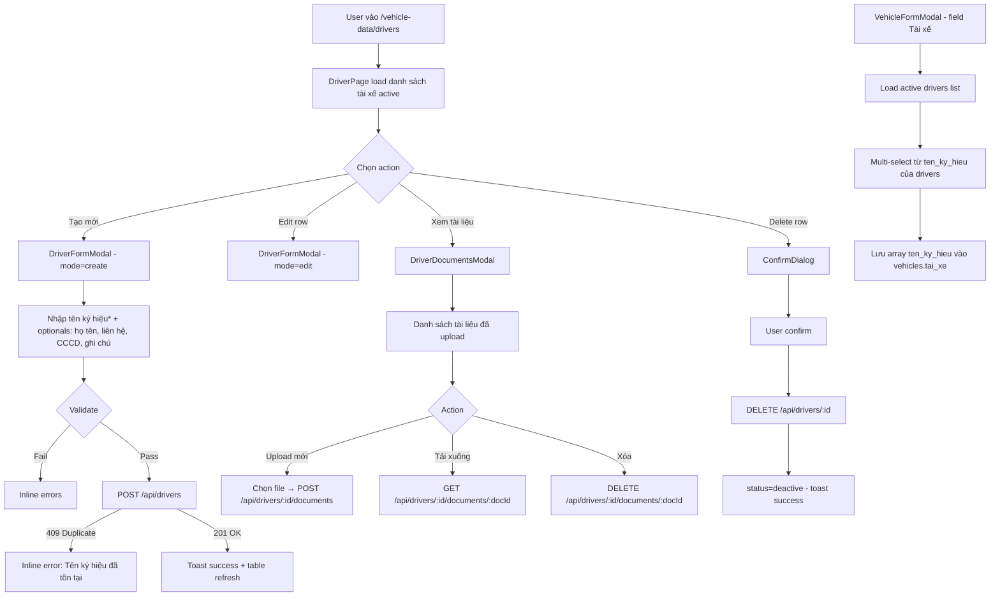

# BA Analysis — Thông tin tài xế (Driver Master Data)

**Ngày:** 2026-04-07
**Feature:** Thông tin tài xế — sub-menu trong "Quản lý dữ liệu xe"
**Scope:** Quản lý hồ sơ tài xế + tích hợp với Dữ liệu xe

---

## 1.1 Flowchart TO-BE



---

## 1.2 Business Rules

```
BR-001: ten_ky_hieu là unique among all rows (active + deactive) — DB UNIQUE constraint
         Lý do: ten_ky_hieu được dùng làm identifier trong vehicles.tai_xe (historical)
BR-002: Chỉ ten_ky_hieu là required khi tạo mới; các trường còn lại optional
BR-003: Delete driver → soft delete (status=deactive), KHÔNG xóa vật lý
         Lý do: driver đã gắn vào vehicles.tai_xe (historical records phải giữ được)
BR-004: Update driver → standard UPDATE (không cần soft update / versioning)
BR-005: vehicles.tai_xe vẫn lưu string[] của ten_ky_hieu — VehicleFormModal
         thay từ free-text thành multi-select từ danh sách drivers active
BR-006: Document upload: file đọc dưới dạng base64 ở FE → gửi JSON → lưu TEXT trong DB
         Max 5MB per file (base64 encoded). Không cần multer.
BR-007: Không giới hạn số tài liệu per driver (có thể nhiều CCCD, bằng lái...)
BR-008: Tên ký hiệu không thể thay đổi sau khi tạo (để tránh break vehicles.tai_xe)
         Hoặc: cảnh báo user nếu driver đã được dùng trong vehicles
         → Implement đơn giản: cho phép edit ten_ky_hieu nhưng hiển thị warning nếu driver đã được gán vào xe
BR-009: Khi VehicleFormModal load, chỉ hiển thị drivers có status=active để chọn
         Nhưng nếu vehicles đang edit đã có driver deactive trong tai_xe → hiển thị "đã bị xóa" hint
```

---

## 1.3 Data Model

```sql
CREATE TABLE drivers (
  id          SERIAL       PRIMARY KEY,
  ten_ky_hieu VARCHAR(100) NOT NULL UNIQUE,   -- required, globally unique
  ho_ten      VARCHAR(255),
  lien_he     VARCHAR(100),                   -- phone / email / contact
  cccd        VARCHAR(50),                    -- CCCD/CMND number
  ghi_chu     TEXT,
  status      VARCHAR(20)  NOT NULL DEFAULT 'active',
  created_at  TIMESTAMP    NOT NULL DEFAULT NOW(),
  updated_at  TIMESTAMP    NOT NULL DEFAULT NOW()
);

CREATE INDEX idx_drivers_status         ON drivers(status);
CREATE INDEX idx_drivers_ten_ky_hieu    ON drivers(ten_ky_hieu);

CREATE TABLE driver_documents (
  id         SERIAL       PRIMARY KEY,
  driver_id  INTEGER      NOT NULL REFERENCES drivers(id) ON DELETE CASCADE,
  file_name  VARCHAR(255) NOT NULL,
  mime_type  VARCHAR(100),
  file_data  TEXT         NOT NULL,   -- base64 encoded file content
  file_size  INTEGER,                 -- original file size in bytes
  created_at TIMESTAMP    NOT NULL DEFAULT NOW()
);

CREATE INDEX idx_driver_documents_driver_id ON driver_documents(driver_id);
```

**Notes:**
- ten_ky_hieu có DB UNIQUE constraint (khác với bien_so, ma — các cột đó unique chỉ trong active rows)
- Lý do: ten_ky_hieu là identifier không nên tái sử dụng dù driver đã deactive
- driver_documents.file_data là TEXT (base64), không cần BYTEA hay file system
- ON DELETE CASCADE: nếu driver bị xóa vật lý → documents tự xóa theo (không dùng trong app nhưng safety net)

---

## 1.4 API Contract

```
GET  /api/drivers
  Response: { success: true, message: "Danh sách tài xế", data: Driver[] }
  — Returns all active drivers, ORDER BY ten_ky_hieu ASC

POST /api/drivers
  Request:  { ten_ky_hieu: string, ho_ten?: string, lien_he?: string, cccd?: string, ghi_chu?: string }
  Response 201: { success: true, message: "Tạo tài xế thành công", data: Driver }
  Response 409: { success: false, message: "Tên ký hiệu 'X' đã tồn tại" }
  Response 400: Validation errors

PUT  /api/drivers/:id
  Request:  { ten_ky_hieu: string, ho_ten?: string, lien_he?: string, cccd?: string, ghi_chu?: string }
  Response 200: { success: true, message: "Cập nhật tài xế thành công", data: Driver }
  Response 404: { success: false, message: "Tài xế không tồn tại" }
  Response 409: { success: false, message: "Tên ký hiệu 'X' đã tồn tại" }

DELETE /api/drivers/:id
  Response 200: { success: true, message: "Đã xóa tài xế" }
  Response 404: { success: false, message: "Tài xế không tồn tại" }

POST /api/drivers/:id/documents
  Request:  { file_name: string, mime_type: string, file_data: string (base64), file_size: number }
  Response 201: { success: true, message: "Upload tài liệu thành công", data: DriverDocument }
  Response 404: Driver not found
  Response 400: File size > 5MB

GET  /api/drivers/:id/documents
  Response 200: { success: true, data: DriverDocument[] }
  — Returns list without file_data (metadata only, for listing)

GET  /api/drivers/:id/documents/:docId
  Response 200: { success: true, data: DriverDocument }
  — Returns full document including file_data (for download)

DELETE /api/drivers/:id/documents/:docId
  Response 200: { success: true, message: "Đã xóa tài liệu" }
  Response 404: Not found
```

**Driver object:**
```json
{
  "id": 1,
  "ten_ky_hieu": "TX01",
  "ho_ten": "Nguyễn Văn A",
  "lien_he": "0909123456",
  "cccd": "012345678901",
  "ghi_chu": "Tài xế lâu năm",
  "status": "active",
  "created_at": "...",
  "updated_at": "..."
}
```

**DriverDocument list item (no file_data):**
```json
{ "id": 1, "driver_id": 1, "file_name": "CCCD_front.jpg", "mime_type": "image/jpeg", "file_size": 204800, "created_at": "..." }
```

---

## 1.5 UI Screens cần thiết

```
- Screen 1: DriverPage       → pages/admin/vehicle-data/DriverPage.tsx
- Screen 2: DriverFormModal  → components/vehicle-data/DriverFormModal.tsx
- Screen 3: DriverDocumentsModal → components/vehicle-data/DriverDocumentsModal.tsx
- Update:   VehicleFormModal → components/vehicle-data/VehicleFormModal.tsx
             (đổi tai_xe từ free-text thành multi-select từ drivers list)
```

**Sidebar update:** Thêm sub-item "Thông tin tài xế" dưới "Quản lý dữ liệu xe".
**Router update:** Thêm route `/vehicle-data/drivers`.

---

## 1.6 Edge Cases

```
- ten_ky_hieu trùng (create/update) → 409 → inline error
- ten_ky_hieu đã dùng trong vehicles.tai_xe → vẫn cho update/deactivate, không block
  (vehicles.tai_xe lưu string, không FK — lịch sử vẫn đúng)
- Driver deactivate → không hiển thị trong VehicleFormModal dropdown
  nhưng nếu vehicles.tai_xe đang có ten_ky_hieu đó → hiện thị bình thường trong table
- File > 5MB → FE báo lỗi trước khi gửi BE
- File không phải image/PDF → cho phép upload bất kỳ loại (không validate mime)
- Driver có documents → delete driver vẫn cho phép (documents bị xóa CASCADE nếu cần)
  → UI: confirm dialog có note "Tất cả tài liệu đính kèm sẽ bị xóa"
- VehicleFormModal: drivers list load fail → fallback về free-text input (graceful degradation)
- Driver list empty → VehicleFormModal hiển thị empty state trong dropdown với link "Tạo tài xế"
```
