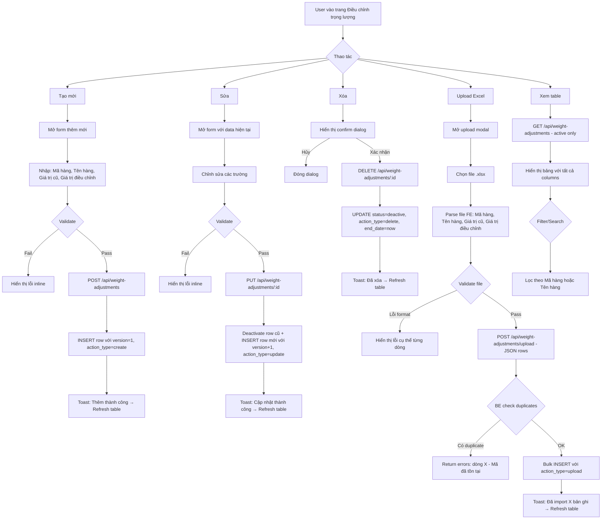

# BA Analysis: Điều chỉnh trọng lượng
**Date:** 2026-04-07
**Feature:** Quản lý dữ liệu kế toán → Điều chỉnh trọng lượng
**Status:** Draft

---

## 1. Flowchart TO-BE



---

## 2. Business Rules

```
BR-001: ma_hang UNIQUE trong active rows — không thể có 2 bản ghi active với cùng ma_hang
BR-002: Soft-update: khi sửa → deactivate row cũ (status=deactive, end_date=now) + INSERT row mới
         Row mới: version = old_version + 1, action_type = 'update', action_by = current user
BR-003: Soft-delete: UPDATE status=deactive, end_date=now, action_type='delete', action_by=current user
         Không xóa vật lý
BR-004: Create: INSERT với version=1, action_type='create', action_by=current user
BR-005: Upload: bulk INSERT với action_type='upload', action_by=current user
         Fail-fast: bất kỳ dòng nào lỗi → không insert gì, return chi tiết lỗi từng dòng
         Check: trùng trong file + trùng với active records trong DB
BR-006: LIST endpoint chỉ trả về status='active' records, ORDER BY ma_hang ASC
BR-007: action_by_name lưu denormalized full_name tại thời điểm tạo (để đảm bảo lịch sử không bị mất khi user bị xóa)
BR-008: gia_tri_cu có thể NULL (khi là lần nhập đầu tiên, không có giá trị cũ)
BR-009: gia_tri_dieu_chinh NOT NULL — đây là giá trị điều chỉnh hiện tại (bắt buộc)
BR-010: Excel template upload: 4 cột bắt buộc = Mã hàng hóa | Tên hàng hóa | Giá trị cũ | Giá trị điều chỉnh
          Dòng đầu là header, dữ liệu từ dòng 2
```

---

## 3. Data Model

```sql
-- ============================================================
-- Migration 009: Weight Adjustments (Điều chỉnh trọng lượng)
-- Module: Quản lý dữ liệu kế toán
-- ============================================================

CREATE TABLE IF NOT EXISTS weight_adjustments (
  id                    SERIAL PRIMARY KEY,

  -- Business data
  ma_hang               VARCHAR(100) NOT NULL,
  ten_hang              VARCHAR(255) NOT NULL,
  gia_tri_cu            NUMERIC(15, 3),                    -- nullable: không có khi lần đầu nhập
  gia_tri_dieu_chinh    NUMERIC(15, 3) NOT NULL,

  -- Version management
  status                VARCHAR(20) NOT NULL DEFAULT 'active'
                          CHECK (status IN ('active', 'deactive')),
  version               INTEGER NOT NULL DEFAULT 1,        -- tăng mỗi lần soft-update
  start_date            TIMESTAMPTZ NOT NULL DEFAULT CURRENT_TIMESTAMP,
  end_date              TIMESTAMPTZ,                       -- NULL nếu vẫn active

  -- Audit
  action_type           VARCHAR(20) NOT NULL DEFAULT 'create'
                          CHECK (action_type IN ('create', 'update', 'delete', 'upload')),
  action_by             INTEGER REFERENCES users(id) ON DELETE SET NULL,
  action_by_name        VARCHAR(255),                      -- denormalized display name

  -- Timestamps
  created_at            TIMESTAMPTZ NOT NULL DEFAULT CURRENT_TIMESTAMP,
  updated_at            TIMESTAMPTZ NOT NULL DEFAULT CURRENT_TIMESTAMP
);

-- Indexes
CREATE INDEX IF NOT EXISTS idx_weight_adjustments_ma_hang  ON weight_adjustments(ma_hang);
CREATE INDEX IF NOT EXISTS idx_weight_adjustments_status   ON weight_adjustments(status);
CREATE INDEX IF NOT EXISTS idx_weight_adjustments_action_by ON weight_adjustments(action_by);

-- Trigger auto-update updated_at
DROP TRIGGER IF EXISTS update_weight_adjustments_updated_at ON weight_adjustments;
CREATE TRIGGER update_weight_adjustments_updated_at
  BEFORE UPDATE ON weight_adjustments
  FOR EACH ROW EXECUTE PROCEDURE update_updated_at_column();

-- ============================================================
-- Permission: accounting_data module
-- ============================================================
INSERT INTO permissions (code, name, module, description) VALUES
  ('accounting_data.view',   'Xem dữ liệu kế toán',    'accounting_data', 'Xem danh sách điều chỉnh trọng lượng'),
  ('accounting_data.manage', 'Quản lý dữ liệu kế toán', 'accounting_data', 'Thêm, sửa, xóa, upload điều chỉnh trọng lượng')
ON CONFLICT (code) DO NOTHING;

-- ADMIN: cả hai permissions
INSERT INTO role_permissions (role_id, permission_id)
SELECT r.id, p.id FROM roles r, permissions p
WHERE r.code = 'ADMIN'
  AND p.code IN ('accounting_data.view', 'accounting_data.manage')
ON CONFLICT DO NOTHING;

-- ACCOUNTANT: cả hai
INSERT INTO role_permissions (role_id, permission_id)
SELECT r.id, p.id FROM roles r, permissions p
WHERE r.code = 'ACCOUNTANT'
  AND p.code IN ('accounting_data.view', 'accounting_data.manage')
ON CONFLICT DO NOTHING;

-- VIEWER: chỉ view
INSERT INTO role_permissions (role_id, permission_id)
SELECT r.id, p.id FROM roles r, permissions p
WHERE r.code = 'VIEWER'
  AND p.code IN ('accounting_data.view')
ON CONFLICT DO NOTHING;
```

---

## 4. API Contract

### GET /api/weight-adjustments
```
Auth: JWT required
Permission: accounting_data.view
Response: {
  success: true,
  data: WeightAdjustment[]
}

WeightAdjustment {
  id: number
  ma_hang: string
  ten_hang: string
  gia_tri_cu: number | null
  gia_tri_dieu_chinh: number
  status: 'active'
  version: number
  start_date: string (ISO)
  end_date: null
  action_type: 'create' | 'update' | 'delete' | 'upload'
  action_by: number | null
  action_by_name: string | null
  created_at: string
  updated_at: string
}
```

### POST /api/weight-adjustments
```
Auth: JWT + accounting_data.manage
Request: {
  ma_hang: string (required, max 100)
  ten_hang: string (required, max 255)
  gia_tri_cu?: number | null
  gia_tri_dieu_chinh: number (required)
}
Response: { success: true, data: WeightAdjustment }
Errors:
  - 409: { success: false, message: "Mã hàng hóa đã tồn tại" }
  - 400: validation errors
```

### PUT /api/weight-adjustments/:id
```
Auth: JWT + accounting_data.manage
Request: same as POST
Response: { success: true, data: WeightAdjustment } (new version)
Errors:
  - 404: not found hoặc không active
  - 409: ma_hang conflict với record active khác
```

### DELETE /api/weight-adjustments/:id
```
Auth: JWT + accounting_data.manage
Response: { success: true, message: "Đã xóa bản ghi" }
Errors:
  - 404: not found hoặc không active
```

### POST /api/weight-adjustments/upload
```
Auth: JWT + accounting_data.manage
Request: {
  rows: [{
    ma_hang: string
    ten_hang: string
    gia_tri_cu?: number | null
    gia_tri_dieu_chinh: number
  }]
}
Response: { success: true, data: { inserted: number } }
Errors:
  - 422: {
      success: false,
      message: "Upload thất bại — có lỗi dữ liệu",
      data: { errors: [{ row: number, ma_hang: string, reason: string }] }
    }
```

---

## 5. UI Screens

```
- Screen 1: WeightAdjustmentPage
  → frontend/src/pages/admin/accounting-data/WeightAdjustmentPage.tsx

- Modal 1: WeightAdjustmentFormModal (Create / Edit)
  → frontend/src/components/accounting-data/WeightAdjustmentFormModal.tsx

- Modal 2: WeightAdjustmentUploadModal
  → frontend/src/components/accounting-data/WeightAdjustmentUploadModal.tsx

- Dialog: Delete Confirm (inline trong WeightAdjustmentPage)
```

---

## 6. Edge Cases

```
- ma_hang trùng khi tạo/upload → 409 / upload error với dòng cụ thể
- gia_tri_cu = null khi tạo đầu tiên → cho phép, hiển thị "—" trong table
- Upload file rỗng (0 dòng data) → lỗi "File không có dữ liệu"
- Upload file thiếu cột bắt buộc → lỗi "Thiếu cột: Mã hàng hóa" hoặc tương tự
- gia_tri_dieu_chinh = 0 → cho phép (có thể điều chỉnh về 0)
- Số âm → validate bắt lỗi (trọng lượng không thể âm)
- User bị xóa sau khi tạo record → action_by_name vẫn hiển thị đúng (denormalized)
- Sửa record nhưng không thay đổi ma_hang → không cần check conflict với chính nó
```

---

## 7. Phân quyền

| Action | Permission required |
|--------|-------------------|
| Xem table | accounting_data.view |
| Tạo mới | accounting_data.manage |
| Sửa | accounting_data.manage |
| Xóa | accounting_data.manage |
| Upload | accounting_data.manage |

ADMIN: full access (bypass permission check ở FE)
ACCOUNTANT: cả view + manage (mặc định)
VIEWER: chỉ view
