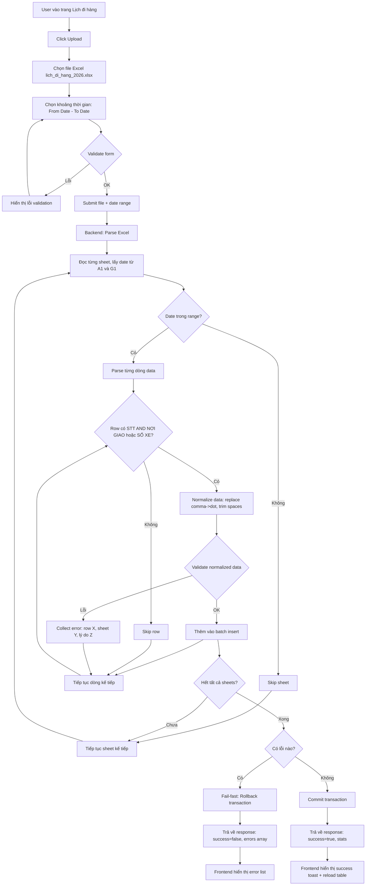

# Business Analysis: Lịch đi hàng (Delivery Schedule)

**Ngày:** 2026-04-18
**Tác giả:** Business Analyst Agent
**Feature:** Upload và quản lý lịch đi hàng từ file Excel

---

## 1. Flowchart TO-BE



---

## 2. Business Rules

### BR-001: Data Validation Rule
**Mô tả:** Chỉ lấy dòng có STT (số thứ tự) VÀ ít nhất một trong hai: NƠI GIAO hoặc SỐ XE không rỗng.
**Lý do:** Dòng không có STT là dòng trống hoặc header, không phải data lịch đi hàng.

### BR-002: Date Range Filter
**Mô tả:** User phải chọn khoảng thời gian (From Date - To Date) khi upload. Hệ thống chỉ xử lý các sheet có date trong khoảng này.
**Lý do:** File Excel chứa dữ liệu cả năm (~170 ngày), user chỉ muốn import một phần dữ liệu.

### BR-003: Date Source
**Mô tả:** Đọc date từ cell A1 (cột 1) và G1 (cột 2) của mỗi sheet. KHÔNG đọc từ sheet name.
**Lý do:** Sheet name không nhất quán (vd: "Sheet204" không chứa date), chỉ có cell A1/G1 chứa datetime object chính xác.

### BR-004: Data Normalization
**Mô tả:** Normalize biển số xe:
- Replace comma (,) → dot (.)
- Trim leading/trailing spaces
- Validate không chứa datetime object ở cột TẤN

**Lý do:** Dữ liệu Excel không nhất quán, có xe viết "61C-123,45" thay vì "61C-123.45".

### BR-005: Fail-fast Upload
**Mô tả:** Nếu có bất kỳ lỗi validation nào (dù chỉ 1 dòng), rollback toàn bộ transaction và trả về danh sách lỗi chi tiết.
**Lý do:** Đảm bảo tính toàn vẹn dữ liệu, tránh import một phần dữ liệu sai.

### BR-006: Excel Structure
**Mô tả:** Mỗi sheet chứa 2 ngày (2 cột), mỗi cột có cấu trúc:
- Row 1: Date (datetime)
- Row 2: "LỊCH ĐI HÀNG"
- Row 3: Headers (STT, NƠI GIAO, TẤN, SỐ XE, CAN, GHI CHÚ)
- Row 4+: Data rows

**Lý do:** Cấu trúc cố định giúp parsing nhất quán.

### BR-007: Permission Required
**Mô tả:** User cần có permission `transport.manage` để upload file.
**Lý do:** Chức năng này nằm dưới "Quản lý dữ liệu xe", chỉ ADMIN hoặc role có quyền manage mới được phép.

---

## 3. Data Model

### 3.1 Table: delivery_schedules

```sql
CREATE TABLE delivery_schedules (
  id                SERIAL PRIMARY KEY,
  ngay              DATE NOT NULL,                    -- Ngày đi hàng
  stt               INTEGER NOT NULL,                  -- Số thứ tự
  noi_giao          VARCHAR(255),                      -- Nơi giao hàng
  tan               DECIMAL(10, 2),                    -- Trọng lượng (tấn)
  so_xe             VARCHAR(50),                       -- Biển số xe (normalized)
  can_info          VARCHAR(255),                      -- Thông tin cân
  ghi_chu           TEXT,                              -- Ghi chú
  created_by        INTEGER REFERENCES users(id),      -- User upload file
  created_at        TIMESTAMP DEFAULT CURRENT_TIMESTAMP,
  updated_at        TIMESTAMP DEFAULT CURRENT_TIMESTAMP
);

CREATE INDEX idx_delivery_schedules_ngay ON delivery_schedules(ngay);
CREATE INDEX idx_delivery_schedules_so_xe ON delivery_schedules(so_xe);
CREATE INDEX idx_delivery_schedules_created_by ON delivery_schedules(created_by);
```

### 3.2 Constraints

- `ngay` + `stt` không unique vì có thể 2 chuyến cùng STT cùng ngày khác xe
- `noi_giao` hoặc `so_xe` ít nhất một trong hai phải có giá trị (enforced ở application layer)

---

## 4. API Contract

### 4.1 Upload Delivery Schedule

**Endpoint:** `POST /api/delivery-schedules/upload`

**Auth:** JWT required + permission `transport.manage`

**Request:**
```typescript
Content-Type: multipart/form-data

{
  file: File,              // Excel file (.xlsx)
  from_date: string,       // YYYY-MM-DD format
  to_date: string          // YYYY-MM-DD format
}
```

**Response Success:**
```typescript
{
  success: true,
  message: "Upload thành công",
  data: {
    total_sheets_processed: number,
    total_rows_inserted: number,
    date_range: {
      from: string,        // YYYY-MM-DD
      to: string           // YYYY-MM-DD
    }
  }
}
```

**Response Validation Error (fail-fast):**
```typescript
{
  success: false,
  message: "Validation failed",
  error: "Có lỗi trong dữ liệu",
  details: [
    {
      sheet: string,         // Sheet name hoặc index
      row: number,           // Row number
      ngay: string,          // YYYY-MM-DD
      field: string,         // Field bị lỗi (vd: "so_xe", "tan")
      value: any,            // Giá trị lỗi
      reason: string         // Lý do (vd: "Invalid datetime in TAN column")
    }
  ]
}
```

### 4.2 Get Delivery Schedules

**Endpoint:** `GET /api/delivery-schedules`

**Auth:** JWT required + permission `transport.view`

**Query Params:**
```typescript
{
  from_date?: string,      // YYYY-MM-DD (default: 30 days ago)
  to_date?: string,        // YYYY-MM-DD (default: today)
  search?: string,         // Search noi_giao, so_xe, ghi_chu
  page?: number,           // Default: 1
  limit?: number           // Default: 50
}
```

**Response:**
```typescript
{
  success: true,
  message: "Lấy danh sách thành công",
  data: {
    schedules: [
      {
        id: number,
        ngay: string,        // YYYY-MM-DD
        stt: number,
        noi_giao: string | null,
        tan: number | null,
        so_xe: string | null,
        can_info: string | null,
        ghi_chu: string | null,
        created_by: {
          id: number,
          full_name: string
        },
        created_at: string   // ISO 8601
      }
    ],
    meta: {
      total: number,
      page: number,
      limit: number,
      total_pages: number
    }
  }
}
```

### 4.3 Delete Delivery Schedules by Date Range

**Endpoint:** `DELETE /api/delivery-schedules/by-date-range`

**Auth:** JWT required + permission `transport.manage`

**Request:**
```typescript
{
  from_date: string,       // YYYY-MM-DD
  to_date: string          // YYYY-MM-DD
}
```

**Response:**
```typescript
{
  success: true,
  message: "Xóa thành công",
  data: {
    deleted_count: number
  }
}
```

---

## 5. UI Screens cần thiết

### Screen 1: DeliverySchedulePage
**Path:** `frontend/src/pages/vehicle-data/DeliverySchedulePage.tsx`
**Route:** `/vehicle-data/delivery-schedule`
**Permission:** `transport.view`

**Components:**
- Header: "Lịch đi hàng" + Upload button (chỉ hiện nếu có `transport.manage`)
- Filter bar: Date range picker (From Date - To Date), Search input
- Table: Ngày, STT, Nơi giao, Tấn, Số xe, Cân, Ghi chú, Người tạo, Ngày tạo
- Pagination

### Screen 2: UploadDeliveryScheduleModal
**Path:** `frontend/src/components/delivery-schedule/UploadDeliveryScheduleModal.tsx`

**Form fields:**
- File upload (accept .xlsx only)
- From Date (date picker)
- To Date (date picker)
- Validation: From Date <= To Date
- Submit button: "Upload" (loading state)

**Success flow:**
- Close modal
- Toast success message: "Upload thành công: {total_rows_inserted} chuyến xe từ {from_date} đến {to_date}"
- Reload table

**Error flow (fail-fast):**
- Hiển thị error list trong modal (không đóng modal)
- Format: "Sheet {sheet_name}, Row {row}, Ngày {ngay}, Field {field}: {reason}"
- Scroll to top of error list
- User fix file → re-upload

---

## 6. Edge Cases

### EC-001: File không đúng định dạng
**Kịch bản:** User upload file .xls (Excel 97-2003) hoặc .csv
**Xử lý:** Validate file extension ở frontend → chỉ accept .xlsx → hiển thị error toast

### EC-002: Date range không hợp lệ
**Kịch bản:** User chọn From Date > To Date
**Xử lý:** Form validation → disable submit button → hiển thị error "From Date phải <= To Date"

### EC-003: Sheet không có date
**Kịch bản:** Cell A1 hoặc G1 không chứa datetime object
**Xử lý:** Skip sheet đó → log warning → tiếp tục sheet kế tiếp

### EC-004: Row có STT nhưng thiếu cả NƠI GIAO và SỐ XE
**Kịch bản:** Row có STT = 5, NƠI GIAO = null, SỐ XE = null
**Xử lý:** Skip row → log warning (BR-001)

### EC-005: Biển số xe có ký tự đặc biệt
**Kịch bản:** SỐ XE = "61C-123,45" (comma thay vì dot)
**Xử lý:** Normalize: replace comma → dot → validate format → nếu vẫn không hợp lệ → fail-fast (BR-004)

### EC-006: Cột TẤN chứa datetime object
**Kịch bản:** User nhập nhầm datetime vào cột TẤN
**Xử lý:** Detect typeof value === datetime → fail-fast với error message "Invalid datetime in TAN column"

### EC-007: File Excel quá lớn (>10MB)
**Kịch bản:** User upload file Excel chứa nhiều năm dữ liệu
**Xử lý:** Backend validate file size → max 10MB → return 413 Payload Too Large

### EC-008: Duplicate data trong cùng 1 file upload
**Kịch bản:** File Excel có 2 sheet chứa cùng ngày (vd: Sheet 1 và Sheet 50 đều có date 1/1/2026)
**Xử lý:** Insert tất cả (không check duplicate trong cùng 1 upload) → business logic cho phép nhiều chuyến cùng ngày

### EC-009: Duplicate với dữ liệu đã có trong DB
**Kịch bản:** User upload lại file đã upload trước đó
**Xử lý:**
- Option 1 (Recommended): Xóa toàn bộ dữ liệu trong date range trước khi insert (replace mode)
- Option 2: Skip duplicate rows (check ngay + stt + so_xe)
- **Chọn Option 1** để đơn giản hóa logic

### EC-010: User upload trong lúc có user khác đang query
**Kịch bản:** User A upload file (transaction đang chạy), User B đang xem danh sách
**Xử lý:** PostgreSQL MVCC tự động xử lý → User B vẫn thấy snapshot cũ cho đến khi transaction commit

### EC-011: Upload fail giữa chừng (timeout, network error)
**Kịch bản:** Upload 50% file thì mất mạng
**Xử lý:** Transaction rollback → không có data nào được insert → User phải upload lại

### EC-012: Date range không có dữ liệu nào trong file
**Kịch bản:** User chọn From: 1/1/2027, To: 31/12/2027 nhưng file chỉ có data năm 2026
**Xử lý:** Return success với `total_rows_inserted: 0` → hiển thị toast warning "Không có dữ liệu nào trong khoảng thời gian đã chọn"

---

## 7. Dependencies

### 7.1 Backend Libraries
- `xlsx` hoặc `exceljs` → parse Excel file
- `multer` → handle file upload
- `pg` → PostgreSQL transactions

### 7.2 Frontend Libraries
- `react-dropzone` → drag & drop file upload
- `react-datepicker` hoặc existing DatePicker component → date range picker
- `react-query` → API calls
- Existing Table, Modal, Button, Input components từ UI library

---

## 8. Success Metrics

- **Upload success rate:** >95% (fail chỉ khi dữ liệu thật sự invalid)
- **Average upload time:** <10s cho file ~170 ngày (~5000 rows)
- **User satisfaction:** User không cần manual data entry, chỉ cần upload file Excel có sẵn

---

## 9. Out of Scope (V1)

- Edit từng row sau khi upload (V2)
- Export lại ra Excel (V2)
- Duplicate detection với dữ liệu đã có (V1 dùng replace mode)
- Batch delete by date range (V2 — V1 chỉ có delete all hoặc delete by manual select rows nếu cần)

---

**Kết luận:**
Chức năng "Lịch đi hàng" cho phép user upload file Excel với date range filter, fail-fast validation, và replace mode. Dữ liệu được normalize trước khi insert, đảm bảo tính toàn vẹn với PostgreSQL transaction.
