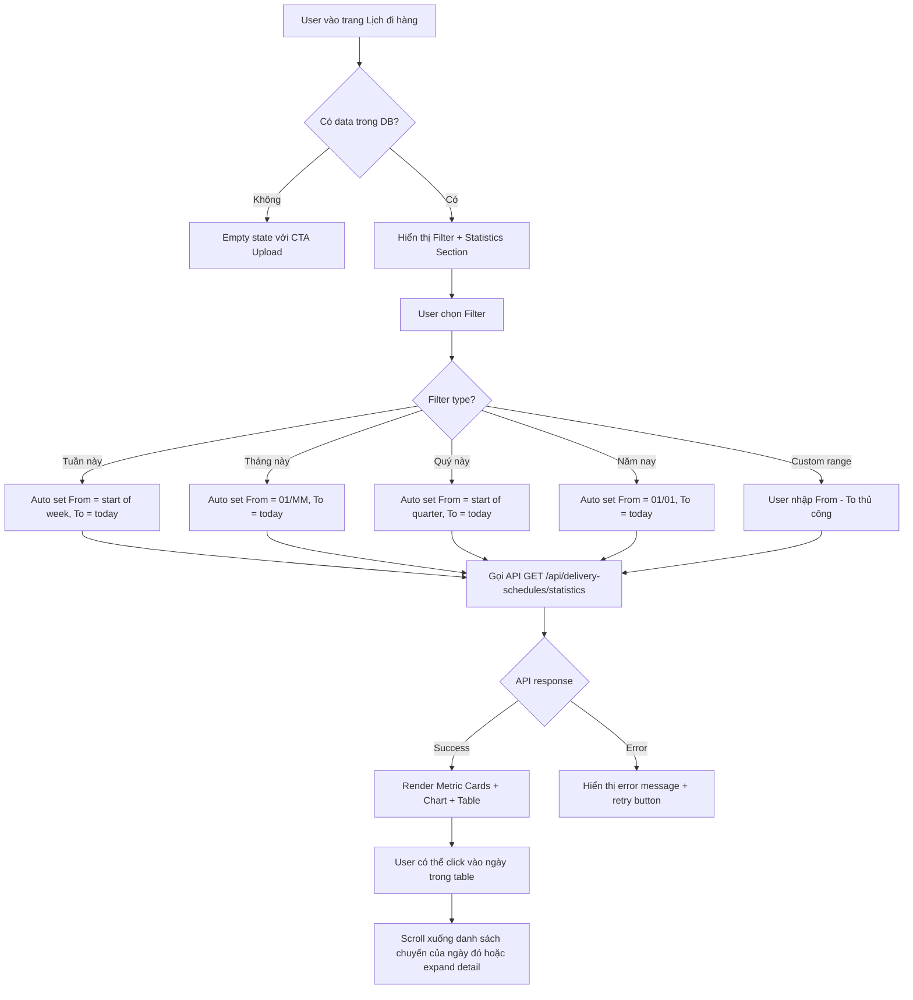

# BA Analysis: Delivery Schedule Statistics

**Ngày:** 2026-04-19
**Feature:** Bổ sung chức năng thống kê cho Lịch đi hàng
**Phiên bản:** 1.0

---

## 1. Feature Overview

Bổ sung chức năng **thống kê tổng quan** ngay trong trang "Lịch đi hàng" (`/vehicle-data/delivery-schedule`), giúp user nhanh chóng nắm được:
- **Số ngày có chuyến** trong khoảng thời gian được filter
- **Tổng số chuyến** trong khoảng thời gian được filter

Hiển thị dưới dạng:
- **Metric cards** (KPI summary)
- **Chart** (biểu đồ xu hướng theo thời gian)
- **Table breakdown** (chi tiết theo ngày)

Filter hỗ trợ: **Tuần, Tháng, Quý, Năm** (quick filter) + custom date range (From Date - To Date như hiện tại).

---

## 2. User Stories

### US-01: Xem thống kê tổng quan
**As a** user (kế toán / quản lý)
**I want to** xem số liệu thống kê tổng quan về lịch đi hàng
**So that** tôi nhanh chóng nắm được tình hình vận hành trong khoảng thời gian cụ thể

**Acceptance Criteria:**
- Hiển thị metric cards: "Số ngày có chuyến" và "Tổng số chuyến"
- Charts hiển thị xu hướng số chuyến theo ngày trong khoảng thời gian filter
- Table breakdown chi tiết: mỗi ngày có bao nhiêu chuyến

### US-02: Filter theo tuần/tháng/quý/năm
**As a** user
**I want to** nhanh chóng filter theo tuần/tháng/quý/năm hiện tại
**So that** không cần nhập thủ công From Date - To Date

**Acceptance Criteria:**
- Có 4 quick filter buttons: "Tuần này", "Tháng này", "Quý này", "Năm nay"
- Click button → auto set From Date - To Date → reload data
- Vẫn giữ custom date range input (hiện tại) cho flexibility

### US-03: Xem biểu đồ xu hướng
**As a** user
**I want to** xem biểu đồ số chuyến theo ngày
**So that** dễ dàng phát hiện ngày có nhiều/ít chuyến bất thường

**Acceptance Criteria:**
- Biểu đồ cột (bar chart) hoặc line chart
- Trục X: ngày (DD/MM)
- Trục Y: số chuyến
- Tooltip hiển thị: Ngày + Số chuyến

---

## 3. Flowchart TO-BE



---

## 4. Business Rules

### BR-001: Định nghĩa "ngày có chuyến"
- Ngày có ít nhất 1 bản ghi trong `delivery_schedules` với `ngay = [date]` và `loai IN ('Giá tấn', 'Giá chuyến')`
- Không tính các bản ghi có `ngay` NULL

### BR-002: Định nghĩa "tổng số chuyến"
- COUNT(DISTINCT id) trong `delivery_schedules` trong khoảng `FROM_DATE <= ngay <= TO_DATE`
- Nếu 1 ngày có nhiều bản ghi → đếm số bản ghi (vì mỗi bản ghi = 1 chuyến)

### BR-003: Filter "Tuần này"
- Start of week: Thứ 2 của tuần hiện tại (ISO 8601)
- End: hôm nay
- VD: Hôm nay 19/04/2026 (Chủ nhật) → Tuần này = 14/04 (T2) đến 19/04

### BR-004: Filter "Tháng này"
- Start: Ngày 01 của tháng hiện tại
- End: Hôm nay
- VD: Hôm nay 19/04/2026 → Tháng này = 01/04 đến 19/04

### BR-005: Filter "Quý này"
- Q1: 01/01 - 31/03
- Q2: 01/04 - 30/06
- Q3: 01/07 - 30/09
- Q4: 01/10 - 31/12
- End: hôm nay (nếu hôm nay trong quý) hoặc cuối quý (nếu xem quý trước)
- VD: Hôm nay 19/04/2026 → Quý 2 → 01/04 đến 19/04

### BR-006: Filter "Năm nay"
- Start: 01/01 của năm hiện tại
- End: Hôm nay
- VD: Hôm nay 19/04/2026 → Năm nay = 01/01/2026 đến 19/04/2026

### BR-007: Chart data grouping
- Nếu range <= 31 ngày → hiển thị từng ngày (bar/point cho mỗi ngày)
- Nếu range > 31 ngày và <= 90 ngày → group theo tuần
- Nếu range > 90 ngày → group theo tháng

### BR-008: Empty data trong range
- Nếu không có chuyến nào trong range → hiển thị metric = 0, chart rỗng, message "Không có dữ liệu trong khoảng thời gian này"

---

## 5. Data Model

### 5.1 Existing Table (Không thay đổi)
```sql
delivery_schedules (
  id SERIAL PK,
  ngay DATE NOT NULL,
  stt INTEGER NOT NULL,
  noi_giao VARCHAR(255),
  tan DECIMAL(10,2),
  so_xe VARCHAR(50),
  can_info VARCHAR(255),
  ghi_chu TEXT,
  loai VARCHAR(20),  -- 'Giá tấn' | 'Giá chuyến'
  created_by INTEGER FK,
  created_at TIMESTAMP,
  updated_at TIMESTAMP
)
```

**Index hiện có:**
- `idx_delivery_schedules_ngay` (ngay) — đã tối ưu cho query theo date range
- `idx_delivery_schedules_loai` (loai)

### 5.2 Không cần thêm bảng mới
Backend sẽ aggregate trực tiếp từ `delivery_schedules` qua SQL query.

---

## 6. API Contract

### 6.1 GET `/api/delivery-schedules/statistics`

**Description:** Lấy thống kê tổng quan theo date range

**Query Parameters:**
```typescript
{
  fromDate: string;  // YYYY-MM-DD, required
  toDate: string;    // YYYY-MM-DD, required
}
```

**Response (Success):**
```json
{
  "success": true,
  "data": {
    "summary": {
      "totalDays": 15,           // Số ngày có ít nhất 1 chuyến
      "totalTrips": 127,          // Tổng số chuyến
      "fromDate": "2026-04-01",
      "toDate": "2026-04-19"
    },
    "dailyBreakdown": [
      {
        "ngay": "2026-04-01",
        "tripCount": 8
      },
      {
        "ngay": "2026-04-02",
        "tripCount": 10
      }
      // ... các ngày có chuyến (không trả về ngày 0 chuyến)
    ],
    "chartData": [
      {
        "label": "01/04",   // DD/MM format cho chart
        "value": 8
      },
      {
        "label": "02/04",
        "value": 10
      }
      // ... tương ứng với dailyBreakdown
    ]
  }
}
```

**Response (Error):**
```json
{
  "success": false,
  "message": "Invalid date range",
  "error": "fromDate must be <= toDate"
}
```

**Business Logic trong API:**
```sql
-- Summary query
SELECT
  COUNT(DISTINCT ngay) AS totalDays,
  COUNT(id) AS totalTrips
FROM delivery_schedules
WHERE ngay >= :fromDate AND ngay <= :toDate;

-- Daily breakdown query
SELECT
  ngay,
  COUNT(id) AS tripCount
FROM delivery_schedules
WHERE ngay >= :fromDate AND ngay <= :toDate
GROUP BY ngay
ORDER BY ngay ASC;
```

**Validation:**
- `fromDate` required, format YYYY-MM-DD
- `toDate` required, format YYYY-MM-DD
- `fromDate <= toDate`
- `toDate <= today` (không cho phép filter tương lai)

---

## 7. UI Screens

### 7.1 Screen: DeliverySchedulePage (Cập nhật)
**Route:** `/vehicle-data/delivery-schedule`
**File:** `frontend/src/pages/admin/vehicle-data/DeliverySchedulePage.tsx`

**Layout TO-BE:**
```
┌─────────────────────────────────────────────────────────────┐
│ Lịch đi hàng                                     [Upload Excel] │
├─────────────────────────────────────────────────────────────┤
│ Filter:                                                      │
│  [Tuần này] [Tháng này] [Quý này] [Năm nay]                 │
│  From Date: [________]  To Date: [________]  [Tìm kiếm]     │
├─────────────────────────────────────────────────────────────┤
│ ┌─────────────────┐  ┌─────────────────┐                    │
│ │ Số ngày có chuyến│  │ Tổng số chuyến   │                    │
│ │      15         │  │      127         │                    │
│ └─────────────────┘  └─────────────────┘                    │
├─────────────────────────────────────────────────────────────┤
│ Biểu đồ số chuyến theo ngày                                 │
│ [Bar Chart: X=ngày, Y=số chuyến]                            │
├─────────────────────────────────────────────────────────────┤
│ Chi tiết theo ngày                                          │
│ ┌───────┬─────────┬──────────┐                              │
│ │ Ngày  │ Số chuyến│ Actions │                              │
│ ├───────┼─────────┼──────────┤                              │
│ │01/04  │    8    │ [Xem]   │                              │
│ │02/04  │   10    │ [Xem]   │                              │
│ └───────┴─────────┴──────────┘                              │
├─────────────────────────────────────────────────────────────┤
│ Danh sách chi tiết (existing table)                         │
│ [Existing delivery schedule table...]                       │
└─────────────────────────────────────────────────────────────┘
```

**Components cần tạo/cập nhật:**
1. `DeliveryStatisticsSummary.tsx` — Metric cards
2. `DeliveryStatisticsChart.tsx` — Bar/Line chart (dùng recharts)
3. `DeliveryDailyBreakdownTable.tsx` — Table chi tiết theo ngày
4. `QuickFilterButtons.tsx` — 4 quick filter buttons
5. Cập nhật `DeliverySchedulePage.tsx` — tích hợp statistics section

---

## 8. Edge Cases

### EC-01: Không có dữ liệu trong range
**Scenario:** User chọn Tuần này, nhưng chưa upload data tuần này
**Handle:**
- Metric cards: hiển thị 0
- Chart: hiển thị empty state "Không có dữ liệu trong khoảng thời gian này"
- Table: hiển thị empty message

### EC-02: Range quá lớn (>1 năm)
**Scenario:** User chọn From = 2020-01-01, To = 2026-04-19
**Handle:**
- API không giới hạn range (vì lịch đi hàng thường không có data nhiều năm)
- Chart tự động group theo tháng (BR-007)
- Nếu quá nhiều datapoints → hiển thị warning "Khoảng thời gian quá dài, chart có thể khó đọc"

### EC-03: toDate > today
**Scenario:** User nhập To Date = 2026-05-01 (tương lai)
**Handle:**
- Frontend validation: disable submit nếu toDate > today
- Backend validation: trả 400 "toDate không được lớn hơn hôm nay"

### EC-04: fromDate > toDate
**Scenario:** User nhập From = 2026-04-19, To = 2026-04-01
**Handle:**
- Frontend validation: hiển thị error inline "Từ ngày phải <= Đến ngày"
- Backend validation: trả 400 error

### EC-05: Click vào ngày trong breakdown table
**Scenario:** User click "Xem" ở dòng 01/04 (8 chuyến)
**Handle:**
- Option 1: Scroll xuống existing table và auto filter ngày đó
- Option 2: Expand row hiển thị danh sách 8 chuyến inline
- **Recommend:** Option 1 (đơn giản hơn)

### EC-06: API timeout với range lớn
**Scenario:** User chọn Năm nay (01/01 - 19/04), có 10,000+ records
**Handle:**
- Backend query có index ngay → nhanh
- Nếu vẫn chậm: thêm loading state "Đang tải thống kê..."
- Timeout 30s → hiển thị error + retry button

---

## 9. Non-Functional Requirements

### NFR-01: Performance
- API `/statistics` phải trả về trong < 2s với range <= 1 năm
- Chart render < 500ms
- Dùng React Query caching: staleTime = 5 phút

### NFR-02: Accessibility
- Metric cards: text contrast ratio >= 4.5:1
- Chart: có alt text mô tả data
- Quick filter buttons: keyboard navigable

### NFR-03: Responsive
- Mobile: metric cards stack vertically
- Chart: responsive width, min-height 300px
- Table: horizontal scroll nếu cần

---

## 10. Dependencies

- **Backend:** Node.js, Express, pg (PostgreSQL)
- **Frontend:** React, recharts (chart library), React Query
- **Existing features:** Delivery schedule upload đã có

---

## 11. Acceptance Criteria (Tổng hợp)

### AC-01: Metric Cards
- [ ] Hiển thị "Số ngày có chuyến" đúng (COUNT DISTINCT ngày)
- [ ] Hiển thị "Tổng số chuyến" đúng (COUNT records)
- [ ] Format số: dùng dấu phẩy (VD: 1,234)
- [ ] Dark mode support

### AC-02: Quick Filters
- [ ] "Tuần này" set đúng start of week (Thứ 2)
- [ ] "Tháng này" set đúng ngày 01
- [ ] "Quý này" set đúng start of quarter
- [ ] "Năm nay" set đúng 01/01
- [ ] Active state khi button được chọn

### AC-03: Chart
- [ ] Hiển thị bar chart hoặc line chart
- [ ] Trục X: ngày (DD/MM format)
- [ ] Trục Y: số chuyến (integer)
- [ ] Tooltip hiển thị đầy đủ: Ngày + Số chuyến
- [ ] Responsive width
- [ ] Empty state khi không có data

### AC-04: Breakdown Table
- [ ] Cột 1: Ngày (DD/MM/YYYY)
- [ ] Cột 2: Số chuyến
- [ ] Cột 3: Actions (button "Xem")
- [ ] Click "Xem" → scroll/filter existing table
- [ ] Pagination nếu > 100 ngày

### AC-05: API
- [ ] GET `/api/delivery-schedules/statistics` trả đúng format
- [ ] Validation fromDate/toDate
- [ ] Query performance < 2s
- [ ] Error handling đầy đủ

### AC-06: i18n
- [ ] Tất cả labels có key vi.json + en.json
- [ ] Không hardcode text

---

## 12. Risks & Mitigations

| Risk | Impact | Mitigation |
|------|--------|------------|
| Query chậm với nhiều data | High | Index ngay đã có; thêm loading state |
| Chart library lỗi render | Medium | Fallback: hiển thị table nếu chart fail |
| User nhầm lẫn filter | Low | Hiển thị rõ "Từ DD/MM/YYYY đến DD/MM/YYYY" |

---

## 13. Out of Scope (Không làm trong phase này)

- Export statistics to Excel
- So sánh 2 khoảng thời gian (VD: tháng này vs tháng trước)
- Drill-down vào từng chuyến từ chart (chỉ từ breakdown table)
- Real-time update khi upload file mới (cần manual refresh)

---

## Appendix: SQL Queries (Reference cho Backend Dev)

### Query: Summary
```sql
SELECT
  COUNT(DISTINCT ngay) AS total_days,
  COUNT(id) AS total_trips
FROM delivery_schedules
WHERE ngay >= $1 AND ngay <= $2;
```

### Query: Daily Breakdown
```sql
SELECT
  ngay,
  COUNT(id) AS trip_count
FROM delivery_schedules
WHERE ngay >= $1 AND ngay <= $2
GROUP BY ngay
ORDER BY ngay ASC;
```

### Query: Chart Data (Same as Daily Breakdown)
Frontend sẽ format `ngay` thành DD/MM cho chart labels.

---

**End of BA Analysis**
