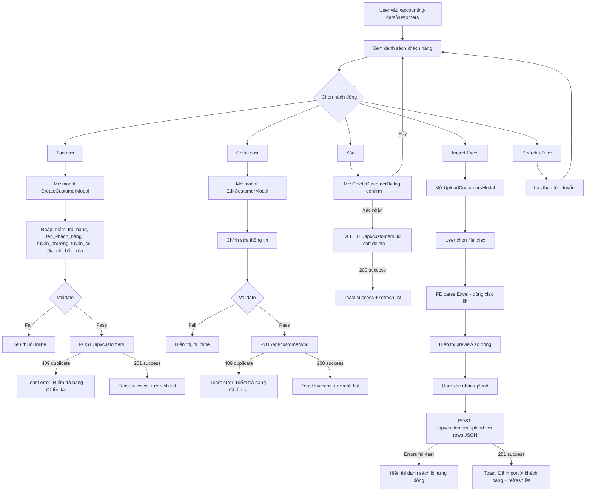

# BA Analysis: Danh sách khách nhận hàng (Customers)

**Ngày:** 2026-04-21
**Feature:** Quản lý danh sách khách hàng nhận hàng
**Module:** Quản lý dữ liệu kế toán (`accounting_data`)

---

## 1.1 Flowchart TO-BE



---

## 1.2 Business Rules

```
BR-001: diem_tra_hang là identifier chính — UNIQUE trong active rows (service layer, không dùng DB UNIQUE constraint trực tiếp)
BR-002: Soft delete — UPDATE SET status='deactive' (không xóa vật lý)
BR-003: Standard UPDATE — không dùng soft-update/versioning, chỉ update trực tiếp row
BR-004: Upload Excel fail-fast — nếu BẤT KỲ dòng nào lỗi (duplicate trong file hoặc DB) → không insert gì, trả về tất cả lỗi
BR-005: boc_xep lưu BOOLEAN: true = có bốc xếp (rỗng trong Excel), false = không có bốc xếp ("Không" trong Excel)
BR-006: Upload Excel parse ở FE (xlsx lib) → gửi JSON rows lên BE → BE validate + bulk insert
BR-007: tuyến_phường và tuyến_cũ là text tự do, không validate format
BR-008: dia_chi_giao_hang là text tự do, có thể rỗng
BR-009: Upload Excel: đọc đúng header row 1 (diem_tra_hang, tuyen_phuong, tuyen_cu, [skip], ten_khach_hang, dia_chi_giao_hang, boc_xep)
BR-010: Permissions: accounting_data.view để xem; accounting_data.manage để tạo/sửa/xóa/upload
```

---

## 1.3 Data Model

```sql
-- Migration: 012_create_customers.sql
CREATE TABLE IF NOT EXISTS customers (
  id                    SERIAL PRIMARY KEY,

  -- Business data
  diem_tra_hang         VARCHAR(255) NOT NULL,        -- Điểm trả hàng (alias, identifier)
  ten_khach_hang        VARCHAR(500) NOT NULL,         -- Tên pháp lý đầy đủ
  tuyen_phuong          VARCHAR(255),                  -- Tuyến-phường (mới)
  tuyen_cu              VARCHAR(255),                  -- Tuyến-cũ
  dia_chi_giao_hang     TEXT,                          -- Địa chỉ giao hàng đầy đủ
  boc_xep               BOOLEAN NOT NULL DEFAULT TRUE, -- TRUE = có bốc xếp, FALSE = không

  -- Lifecycle
  status                VARCHAR(20) NOT NULL DEFAULT 'active'
                          CHECK (status IN ('active', 'deactive')),

  -- Timestamps
  created_at            TIMESTAMPTZ NOT NULL DEFAULT CURRENT_TIMESTAMP,
  updated_at            TIMESTAMPTZ NOT NULL DEFAULT CURRENT_TIMESTAMP
);

-- Indexes
CREATE INDEX IF NOT EXISTS idx_customers_diem_tra_hang ON customers(diem_tra_hang);
CREATE INDEX IF NOT EXISTS idx_customers_status        ON customers(status);
CREATE INDEX IF NOT EXISTS idx_customers_tuyen_phuong  ON customers(tuyen_phuong);

-- Trigger auto-update updated_at
DROP TRIGGER IF EXISTS update_customers_updated_at ON customers;
CREATE TRIGGER update_customers_updated_at
  BEFORE UPDATE ON customers
  FOR EACH ROW EXECUTE PROCEDURE update_updated_at_column();
```

---

## 1.4 API Contract

```
GET /api/customers
  Auth: accounting_data.view
  Query: ?search=<text>&tuyen=<text>
  Response: { success: true, data: Customer[] }

POST /api/customers
  Auth: accounting_data.manage
  Request: { diem_tra_hang, ten_khach_hang, tuyen_phuong?, tuyen_cu?, dia_chi_giao_hang?, boc_xep }
  Response 201: { success: true, data: Customer }
  Response 409: { success: false, message: "Điểm trả hàng đã tồn tại" }

PUT /api/customers/:id
  Auth: accounting_data.manage
  Request: { diem_tra_hang, ten_khach_hang, tuyen_phuong?, tuyen_cu?, dia_chi_giao_hang?, boc_xep }
  Response 200: { success: true, data: Customer }
  Response 404: { success: false, message: "Không tìm thấy khách hàng" }
  Response 409: { success: false, message: "Điểm trả hàng đã tồn tại" }

DELETE /api/customers/:id
  Auth: accounting_data.manage
  Response 200: { success: true, message: "Đã xóa khách hàng" }
  Response 404: { success: false, message: "Không tìm thấy khách hàng" }

POST /api/customers/upload
  Auth: accounting_data.manage
  Request: { rows: Array<{ diem_tra_hang, ten_khach_hang, tuyen_phuong?, tuyen_cu?, dia_chi_giao_hang?, boc_xep }> }
  Response 201: { success: true, data: { inserted: number } }
  Response 400: { success: false, message: "Upload thất bại", data: { errors: [{ row, diem_tra_hang, reason }] } }
```

**Customer object:**
```typescript
{
  id: number;
  diem_tra_hang: string;
  ten_khach_hang: string;
  tuyen_phuong: string | null;
  tuyen_cu: string | null;
  dia_chi_giao_hang: string | null;
  boc_xep: boolean;
  status: 'active' | 'deactive';
  created_at: string;
  updated_at: string;
}
```

---

## 1.5 UI Screens cần thiết

```
- Screen 1: CustomersPage → frontend/src/pages/admin/accounting-data/CustomersPage.tsx
    Bảng danh sách: STT, Điểm trả hàng, Tên khách hàng, Tuyến-phường, Tuyến-cũ, Bốc xếp, Hành động
    Filter: search (diem_tra_hang / ten_khach_hang), filter tuyến
    Actions: Thêm mới | Import Excel | Sửa | Xóa (mỗi row)

- Screen 2: CreateCustomerModal → frontend/src/components/admin/CreateCustomerModal.tsx
    Modal form tạo mới khách hàng
    Fields: Điểm trả hàng*, Tên khách hàng*, Tuyến-phường, Tuyến-cũ, Địa chỉ, Bốc xếp (checkbox)

- Screen 3: EditCustomerModal → frontend/src/components/admin/EditCustomerModal.tsx
    Modal form sửa — pre-fill dữ liệu hiện tại
    Cùng fields với CreateCustomerModal

- Screen 4: DeleteCustomerDialog → frontend/src/components/admin/DeleteCustomerDialog.tsx
    Dialog confirm xóa — hiển thị tên khách hàng, nút Hủy / Xóa

- Screen 5: UploadCustomersModal → frontend/src/components/admin/UploadCustomersModal.tsx
    Modal upload file Excel
    Steps: Chọn file → Preview (số dòng) → Xác nhận upload → Kết quả (success/errors)
```

---

## 1.6 Edge Cases

```
- [Điểm trả hàng trùng khi tạo mới] → BE trả 409, FE hiển thị toast error "Điểm trả hàng đã tồn tại"
- [Điểm trả hàng trùng khi sửa nhưng là chính nó] → BE check id != current → không báo lỗi
- [Upload file Excel rỗng (0 data row)] → FE validate trước khi gửi, hiện toast "File không có dữ liệu"
- [Upload file thiếu cột bắt buộc (diem_tra_hang, ten_khach_hang)] → FE validate header → hiện error
- [Upload nhiều dòng có diem_tra_hang trùng nhau trong file] → fail-fast, báo lỗi từng dòng
- [Upload diem_tra_hang đã tồn tại trong DB] → fail-fast, báo lỗi
- [Xóa khách hàng đang được dùng ở nơi khác] → Chỉ soft-delete, không cần check FK (chưa có FK đến customers)
- [boc_xep trong Excel: "Không" → false; rỗng/khác → true] → FE xử lý khi parse
- [File Excel có cột trống (cột 4)] → FE bỏ qua khi parse
- [Search không có kết quả] → Hiển thị empty state "Không tìm thấy khách hàng"
- [Upload file không phải .xlsx] → FE validate extension trước khi parse
```
