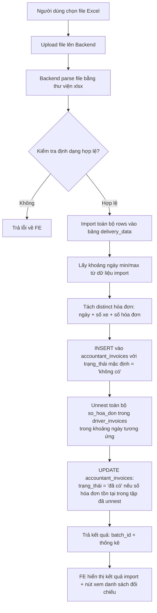

# BA Analysis: Import dữ liệu 5 nhà & Đối chiếu hóa đơn
**Ngày:** 2026-06-15
**Feature:** Import dữ liệu "5 nhà" vào database và đối chiếu hóa đơn với driver_invoices

---

## 1. User Stories

### US-01: Upload và import dữ liệu
> **Là** kế toán viên (ACCOUNTANT), **tôi muốn** upload file Excel dữ liệu giao hàng (ERP Delivery Report) và import toàn bộ dữ liệu vào database **để** lưu trữ tập trung và tra cứu sau này, thay vì chỉ xử lý cục bộ trên trình duyệt.

### US-02: Bóc tách hóa đơn
> **Là** kế toán viên (ACCOUNTANT), **tôi muốn** hệ thống tự động bóc tách tất cả hóa đơn (SO_HD) từ dữ liệu vừa import, tổng hợp theo ngày + số xe + số hóa đơn duy nhất **để** có danh sách hóa đơn kế toán cần đối chiếu.

### US-03: Đối chiếu với driver_invoices
> **Là** kế toán viên (ACCOUNTANT), **tôi muốn** hệ thống tự động đối chiếu từng hóa đơn vừa bóc tách với bảng `driver_invoices` trong cùng khoảng thời gian **để** biết hóa đơn nào đã có trong hệ thống tài xế, hóa đơn nào còn thiếu.

### US-04: Xem kết quả đối chiếu
> **Là** kế toán viên (ACCOUNTANT), **tôi muốn** xem danh sách hóa đơn đã đối chiếu với trạng thái (đã có / không có), lọc theo ngày, số xe, trạng thái **để** nắm bắt tình hình chênh lệch và xử lý kịp thời.

---

## 2. Flowchart TO-BE



---

## 3. Business Rules

| ID | Rule |
|----|------|
| BR-001 | File Excel input có format giống với chức năng "Xử lý data 5 nhà": sheet đầu tiên, bỏ qua 4 dòng header, dữ liệu từ dòng 5 trở đi. |
| BR-002 | Dữ liệu import lưu toàn bộ 34 cột từ Excel vào bảng `delivery_data`, KHÔNG filter, KHÔNG loại trừ dòng nào. **Tuy nhiên**, nếu 1 dòng đã tồn tại trong `delivery_data` (cùng `ngay_hd`, `so_tau_xe`, `so_hd`) → skip (không insert lại). |
| BR-003 | Mỗi lần upload tạo một `batch_id` duy nhất (UUID) để gom nhóm. Check duplicate dùng **1 query UNNEST** cho toàn bộ batch, không query từng dòng. |
| BR-003b | **Tầng 2 — `accountant_invoices`:** Mỗi cặp `(ngay, so_xe_norm, so_hd)` đã tồn tại trong `accountant_invoices` (từ bất kỳ batch nào) sẽ bị skip khi INSERT — chỉ thêm những hóa đơn **chưa từng có**. |
| BR-004 | Hóa đơn bóc tách là tổ hợp duy nhất của (ngày hóa đơn + số xe + số hóa đơn). Cùng số hóa đơn trên cùng ngày nhưng khác xe → 2 record riêng biệt. |
| BR-005 | `accountant_invoices.so_xe` chuẩn hóa theo 3 bước: (1) bỏ mọi ký tự không phải số từ đầu chuỗi (`^[^0-9]*`), (2) bỏ gạch ngang, phẩy, khoảng trắng (`[-,\s]`), (3) bỏ hậu tố sau `/` (`/.*$`). VD: `PPH-50H 88294/L2` → `50H88294`. |
| BR-006 | Đối chiếu hóa đơn với 3 điều kiện đồng thời: (a) `so_xe` chuẩn hóa khớp nhau, (b) `ngay` khớp nhau, (c) số hóa đơn fuzzy match: strip leading zeros cả 2 phía, kiểm tra 4 mức: bằng chính xác → prefix → substring. VD: `00078097` khớp với `7809`, `78097`, `8097`, `097`. |
| BR-007 | Đối chiếu với **toàn bộ** `driver_invoices` (không giới hạn khoảng ngày). EXISTS subquery tự kiểm tra `ngay` khớp chính xác. |
| BR-008 | Mặc định trạng thái là `'không có'`. Sau khi đối chiếu, nếu số hóa đơn thỏa mãn BR-006 → `'đã có'`. |
| BR-009 | Xóa một batch sẽ xóa cả data trong `delivery_data` và `accountant_invoices` thuộc batch đó. |
| BR-010 | Permission: `accounting_data.view` để xem, `accounting_data.manage` để import/xóa. |

---

## 4. Data Model

### 4.1 Bảng mới: `delivery_data`

File Excel upload có cấu trúc cố định 34 cột (theo file tham khảo `reference/upload_data_5_nha/1-14.5.xlsx`):
- **Dòng 0-2:** Metadata (tên công ty, địa chỉ, tiêu đề "SỔ CHI TIẾT BÁN HÀNG")
- **Dòng 3:** Header tiếng Việt (tên các cột)
- **Dòng 4+:** Dữ liệu (file mẫu có ~3867 dòng dữ liệu)

```sql
CREATE TABLE delivery_data (
  id SERIAL PRIMARY KEY,
  batch_id VARCHAR(50) NOT NULL,

  -- Column mapping từ Excel (34 cột, index 0-33)
  channel            TEXT,    -- [0]  Channel
  sub_channel        TEXT,    -- [1]  Sub-channel
  dien_giai_ct       TEXT,    -- [2]  Diễn giải chi tiết (HĐ)
  dien_giai          TEXT,    -- [3]  Diễn giải
  slot               TEXT,    -- [4]  Slot
  waybill_no         TEXT,    -- [5]  Waybill No
  slot_no            TEXT,    -- [6]  Slot No
  user_tao_hd        TEXT,    -- [7]  User tạo Hóa đơn
  user_tao_pxk       TEXT,    -- [8]  User tạo PXK
  po_number          TEXT,    -- [9]  PO Number
  warehouse_no       TEXT,    -- [10] Warehouse No
  warehouse_name     TEXT,    -- [11] Warehouse Name
  ma_pxk             TEXT,    -- [12] Mã PXK
  so_chung_tu        TEXT,    -- [13] Số chứng từ ghi sổ
  so_seri            TEXT,    -- [14] Số Seri
  dia_chi            TEXT,    -- [15] Địa chỉ giao hàng (vn)
  ten_hang_hoa       TEXT,    -- [16] Tên hàng hóa
  ma_dvt             TEXT,    -- [17] Mã ĐVT (Bán hàng) - vd: MT, CAR, JRG
  sp_trong_luong     NUMERIC(15,3),  -- [18] SP - Trọng lượng Net
  hd_trong_luong     NUMERIC(15,3),  -- [19] HĐ - Trọng lượng (Net)
  ma_ncc             VARCHAR(50),    -- [20] Mã nhà cung cấp (5 giá trị: 2000000001, 2000000007, 2100000002, 2000000008, CLV)
  ma_kh              VARCHAR(50),    -- [21] Mã khách hàng
  ten_kh             VARCHAR(500),   -- [22] Tên khách hàng (94 unique)
  ma_hang            VARCHAR(100),   -- [23] Mã hàng hóa (309 unique)
  ten_hang_en        TEXT,    -- [24] Tên hàng hóa (En)
  loai_hang          TEXT,    -- [25] Loại hàng (vd: TAN)
  ma_lh_giao         TEXT,    -- [26] Mã liên hệ giao hàng
  so_luong           NUMERIC(15,3),  -- [27] Số lượng (DVT bán hàng)
  so_tau_xe          VARCHAR(100),   -- [28] Số tàu/Số xe (91 unique, vd: PPH-51D 38021, PPH-50H 92136, PPH-G-68H 02015)
  tai_xe             VARCHAR(255),   -- [29] Tài xế
  so_cont            TEXT,    -- [30] Số Cont
  ngay_hd            DATE,    -- [31] Ngày hóa đơn (Excel serial date → chuyển đổi sang DATE)
  so_hd              TEXT,    -- [32] Số hóa đơn (871 unique, format đa dạng: 00071359, 6485, 1305283, 705401)
  thong_tin_bs       TEXT,    -- [33] Thông tin bổ sung 08 (346 unique, có thể chứa nhiều giá trị ngăn cách dấu phẩy: "81038,81039")

  -- Metadata
  original_filename  VARCHAR(255),
  uploaded_by        INTEGER REFERENCES users(id),
  uploaded_at        TIMESTAMPTZ DEFAULT NOW(),
  created_at         TIMESTAMPTZ DEFAULT NOW()
);

CREATE INDEX idx_delivery_data_batch_id ON delivery_data(batch_id);
CREATE INDEX idx_delivery_data_ngay_hd ON delivery_data(ngay_hd);
CREATE INDEX idx_delivery_data_so_hd ON delivery_data(so_hd);
CREATE INDEX idx_delivery_data_so_tau_xe ON delivery_data(so_tau_xe);
CREATE INDEX idx_delivery_data_ma_ncc ON delivery_data(ma_ncc);
```

**Lưu ý chuyển đổi dữ liệu:**
- **NGAY_HD (col 31):** Giá trị là Excel serial date number (vd: `46146` → `2026-05-04`). Dùng `XLSX.SSF.parse_date_code()` hoặc `new Date((serial - 25569) * 86400 * 1000)` để convert.
- **SO_TAU_XE (col 28):** Cần chuẩn hóa khi đối chiếu với `driver_invoices` (bỏ dấu `-`, dấu `,`, khoảng trắng). Một số xe có prefix `PPH-G-` (xe gạo).
- **SO_HD (col 32):** Format không cố định. Có thể là `00071359` (8 chữ số), `6485` (4 chữ số), `1305283` (7 chữ số), `705401` (6 chữ số). Luôn lưu dạng TEXT để tránh mất leading zeros.
- **THONG_TIN_BS (col 33):** Có thể chứa 1 hoặc nhiều giá trị ngăn cách bởi dấu phẩy (vd: `"81038,81039"`). Lưu nguyên bản dạng TEXT.

### 4.2 Bảng mới: `accountant_invoices`

```sql
CREATE TABLE accountant_invoices (
  id SERIAL PRIMARY KEY,
  batch_id VARCHAR(50) NOT NULL,
  ngay DATE NOT NULL,
  so_xe VARCHAR(100) NOT NULL,
  so_hoa_don TEXT NOT NULL,
  trang_thai VARCHAR(20) NOT NULL DEFAULT 'không có',
  created_at TIMESTAMPTZ DEFAULT NOW()
);

CREATE INDEX idx_accountant_invoices_batch_id ON accountant_invoices(batch_id);
CREATE INDEX idx_accountant_invoices_ngay ON accountant_invoices(ngay);
CREATE INDEX idx_accountant_invoices_so_hoa_don ON accountant_invoices(so_hoa_don);
CREATE INDEX idx_accountant_invoices_trang_thai ON accountant_invoices(trang_thai);
```

### 4.3 Bảng liên quan (đã có): `driver_invoices`

Sử dụng cột `so_hoa_don` (JSONB) để đối chiếu. Cấu trúc:
```sql
so_hoa_don JSONB DEFAULT '[]'   -- Mảng các số hóa đơn, vd: ["HD001","HD002"]
```

---

## 5. API Contract

### 5.1 Import file Excel 5 nhà

```
POST /api/delivery-data/import
Auth: JWT (accounting_data.manage)
Content-Type: multipart/form-data

Request:
  file: File (Excel .xlsx)

Response 200:
{
  "success": true,
  "message": "Import hoàn tất",
  "data": {
    "batch_id": "uuid-string",
    "new_rows": 1500,
    "duplicate_rows": 2368,
    "new_invoices": 450,
    "duplicate_invoices": 37,
    "matched_count": 320,
    "unmatched_count": 130,
    "min_date": "2026-06-01",
    "max_date": "2026-06-15"
  }
}

Response 400 (file không hợp lệ):
{
  "success": false,
  "message": "File không đúng định dạng hoặc không có dữ liệu",
  "data": null
}
```

### 5.2 Lấy danh sách hóa đơn kế toán (đã đối chiếu)

```
GET /api/accountant-invoices?batch_id=xxx&page=1&limit=50&trang_thai=đã%20có&so_xe=51H&so_hoa_don=HD001
Auth: JWT (accounting_data.view)

Response 200:
{
  "success": true,
  "message": "OK",
  "data": {
    "data": [
      {
        "id": 1,
        "batch_id": "uuid",
        "ngay": "2026-06-10",
        "so_xe": "51H12345",
        "so_hoa_don": "HD001",
        "trang_thai": "đã có",
        "created_at": "2026-06-15T10:00:00Z"
      }
    ],
    "pagination": {
      "page": 1,
      "limit": 50,
      "total": 487,
      "totalPages": 10
    }
  }
}
```

### 5.3 Lấy danh sách batch đã import

```
GET /api/delivery-data/batches?page=1&limit=20
Auth: JWT (accounting_data.view)

Response 200:
{
  "success": true,
  "message": "OK",
  "data": {
    "data": [
      {
        "batch_id": "uuid",
        "original_filename": "bao_cao_giao_hang.xlsx",
        "total_rows": 1523,
        "total_invoices": 487,
        "matched_count": 320,
        "unmatched_count": 167,
        "min_date": "2026-06-01",
        "max_date": "2026-06-15",
        "uploaded_by_name": "Admin",
        "uploaded_at": "2026-06-15T10:00:00Z"
      }
    ],
    "pagination": { ... }
  }
}
```

### 5.5 Lấy danh sách hóa đơn thiếu theo số xe (tích hợp danh mục xe)

```
GET /api/accountant-invoices/missing-summary?batch_id=xxx&in_catalog=true
Auth: JWT (accounting_data.view)

Query params:
  batch_id    (optional) - UUID của batch. Nếu không truyền → query TẤT CẢ batches.
  in_catalog  (optional) - true: xe trong danh mục, false: xe ngoài danh mục, bỏ trống: tất cả

Response 200:
{
  "success": true,
  "data": [
    {
      "so_xe": "50H88294",
      "missing_count": 15,
      "in_catalog": true,
      "dates": [
        { "ngay": "2026-05-14", "so_hoa_don": ["00078097", "00078098"] }
      ]
    }
  ]
}
```

Lưu ý: `in_catalog` được xác định bằng LEFT JOIN với bảng `vehicles` (migration 017). Chuẩn hóa `vehicles.plate_number` cùng quy tắc BR-005 rồi so sánh với `accountant_invoices.so_xe`. Chỉ tính `vehicles.status = 'active'`.

### 5.6 Xóa batch

```
DELETE /api/delivery-data/batches/:batchId
Auth: JWT (accounting_data.manage)

Response 200:
{
  "success": true,
  "message": "Đã xóa batch và dữ liệu liên quan",
  "data": { "deleted_rows": 1523, "deleted_invoices": 487 }
}
```

---

## 6. UI Screens

| # | Screen | Route | Mô tả |
|---|--------|-------|-------|
| 1 | **Import Delivery Data** | `/accounting-data/delivery-import` | Upload file Excel, xem kết quả import + thống kê đối chiếu |
| 2 | **Accountant Invoices List** | `/accounting-data/invoice-matching` | Tab "Tất cả hóa đơn": danh sách đầy đủ với filter, pagination. Tab "Hóa đơn thiếu": grouped theo số xe, drill-down từng xe xem ngày + số HĐ, phân biệt xe có/không trong danh mục (tích hợp `vehicles` table). **Mặc định hiển thị tất cả batches** — có thể lọc theo batch cụ thể qua dropdown. |

---

## 7. Edge Cases

| # | Case | Xử lý |
|---|------|-------|
| EC-01 | File Excel không có sheet hoặc ít hơn 5 dòng | Trả lỗi 400: "File không có dữ liệu" |
| EC-02 | File không phải định dạng .xlsx | Trả lỗi 400: "Định dạng file không được hỗ trợ" |
| EC-03 | Số hóa đơn rỗng/null trong cột SO_HD | Bỏ qua dòng đó khi bóc tách hóa đơn (không insert vào accountant_invoices) |
| EC-04 | Cùng batch_id được upload 2 lần (retry) | KHÔNG ngăn chặn — mỗi lần upload tạo batch_id mới |
| EC-05 | File quá lớn (>5000 dòng) | Xử lý bằng UNNEST (1 query duy nhất), không ảnh hưởng performance |
| EC-06 | driver_invoices không có dữ liệu trong khoảng ngày | Tất cả hóa đơn có trạng thái "không có" |
| EC-07 | Số hóa đơn có format đa dạng (4-8 chữ số, có thể mất leading zero) | Luôn so sánh dạng TEXT, không convert sang number. Trim cả 2 phía trước khi đối chiếu |
| EC-08 | Batch bị xóa khi đang có người xem | Trả lỗi 404 cho các request GET liên quan đến batch đã xóa |
| EC-09 | Người dùng không có quyền accounting_data.manage | Trả 403 |
| EC-10 | so_tau_xe chứa prefix PPH-G- (xe gạo) hoặc PPH-P- | Cần chuẩn hóa: `regexp_replace(so_xe, '[-,\s]', '', 'g')`. VD: "PPH-G-68H 02015" → "PPHG68H02015" |
| EC-11 | THONG_TIN_BS chứa nhiều giá trị ngăn cách dấu phẩy (vd: "81038,81039") | Lưu nguyên bản, không tách. Đây là thông tin bổ sung cho việc group dữ liệu khi export, không dùng để đối chiếu |
| EC-12 | NGAY_HD là Excel serial date number (vd: 46146) thay vì ISO date | Parse bằng `excelSerialToDate()` — dùng `getUTC*()` methods để tránh lệch múi giờ. |
| EC-13 | Số xe trong `driver_invoices.so_xe` có ký tự "PPH-" hoặc hậu tố "/L2" | Chuẩn hóa đồng nhất 3 bước trong SQL query (BR-005). |
| EC-14 | PostgreSQL không hỗ trợ `\d` trong regex | Dùng `[0-9]` thay vì `\d`. `^[^\d]*` → `^[^0-9]*`. |
| EC-15 | Import lại file đã import trước đó | Tầng 1: bỏ qua rows trùng trong `delivery_data`. Tầng 2: NOT EXISTS bỏ qua hóa đơn trùng trong `accountant_invoices`. Kết quả trả về `new_rows=0`. |

---

## 8. Performance Considerations

- **Import batch:** Dùng `UNNEST` để insert hàng nghìn dòng trong 1 query duy nhất (pattern từ `driverInvoiceService.uploadMany`).
- **Bóc tách + đối chiếu:** Thực hiện trong 1 query INSERT duy nhất với CTE + EXISTS.
  - `driver_invoice_flat`: Flatten toàn bộ `driver_invoices.so_hoa_don` (JSONB array) thành flat set (so_xe_norm, ngay, so_hoa_don_stripped).
  - `delivery_invoices`: SELECT DISTINCT từ `delivery_data` vừa insert.
  - EXISTS subquery: Khớp 3 điều kiện (so_xe_norm + ngay + fuzzy so_hoa_don) với 4 mức: exact =, prefix LIKE, substring LIKE '%...%'.
  - **Không lọc khoảng ngày** ở CTE driver_invoice_flat — EXISTS tự xử lý việc khớp ngày chính xác, tránh bỏ sót.
- **Tổng cộng: 3-4 database queries** cho toàn bộ quy trình import:
  1. 1 UNNEST check duplicate `delivery_data`
  2. 1 UNNEST INSERT `delivery_data` (chỉ rows mới)
  3. 1 INSERT `accountant_invoices` + đối chiếu (NOT EXISTS loại trừ hóa đơn đã có)
  4. (optional) 1 query đếm `duplicate_invoices`
- **Missing summary**: 1 query LEFT JOIN `vehicles` + group trong code thay vì query riêng từng xe.
- **Regex caveat**: PostgreSQL không hỗ trợ `\d`, phải dùng `[0-9]` cho digit class trong SQL.
