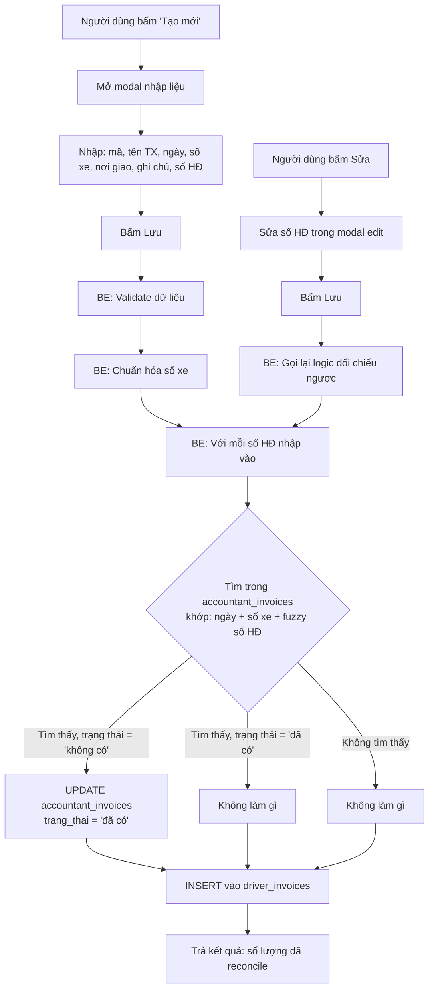

# BA Analysis: Tạo mới / Sửa hóa đơn tài xế & Đối chiếu ngược với accountant_invoices
**Ngày:** 2026-06-15
**Feature:** Driver Invoice Manual Create + Auto-Reconcile

---

## 1. User Stories

### US-01: Tạo mới hóa đơn tài xế thủ công
> **Là** kế toán viên, **tôi muốn** tạo mới một dòng dữ liệu hóa đơn tài xế mà không cần import nguyên file Excel **để** nhập nhanh những hóa đơn lẻ phát sinh.

### US-02: Tự động đối chiếu ngược khi tạo mới
> **Là** kế toán viên, **tôi muốn** khi tạo mới hóa đơn tài xế, hệ thống tự động kiểm tra xem số hóa đơn đó đã có trong `accountant_invoices` chưa, nếu có với trạng thái "không có" thì tự động cập nhật thành "đã có" **để** dữ liệu luôn đồng bộ.

### US-03: Tự động đối chiếu ngược khi sửa số hóa đơn
> **Là** kế toán viên, **tôi muốn** khi sửa số hóa đơn của một dòng driver_invoice, hệ thống kiểm tra lại tương tự như khi tạo mới **để** phản ánh đúng trạng thái đối chiếu.

---

## 2. Flowchart TO-BE



---

## 3. Business Rules

| ID | Rule |
|----|------|
| BR-001 | Cho phép tạo mới 1 dòng driver_invoice thủ công qua API `POST /api/driver-invoices`. |
| BR-002 | Khi tạo mới: validate đầy đủ các trường bắt buộc: `ma`, `ten_tx`, `ngay`, `so_xe`, `noi_giao`, `so_hoa_don` (mảng). |
| BR-003 | `so_xe` được chuẩn hóa theo cùng quy tắc: `regexp_replace(regexp_replace(so_xe, '^[^\d]*', ''), '[-,\s]', '', 'g')`. |
| BR-004 | Khi tạo mới/sửa: với mỗi số hóa đơn trong `so_hoa_don`, tìm trong `accountant_invoices` khớp 3 điều kiện: `ngay` bằng nhau + `so_xe` chuẩn hóa bằng nhau + fuzzy match số hóa đơn. |
| BR-005 | Fuzzy match số HĐ: strip leading zeros cả 2 bên, kiểm tra bằng hoặc prefix của nhau. VD: "78097" match "00078097". |
| BR-006 | Nếu tìm thấy dòng `accountant_invoices` có `trang_thai = 'không có'` → UPDATE thành `'đã có'`. |
| BR-007 | Nếu tìm thấy dòng `accountant_invoices` có `trang_thai = 'đã có'` → bỏ qua (không thay đổi). |
| BR-008 | Logic đối chiếu áp dụng cả khi CREATE và UPDATE số hóa đơn. |
| BR-009 | Reconcile và INSERT driver_invoices trong cùng 1 transaction. |
| BR-010 | Trả về số lượng dòng `accountant_invoices` đã được cập nhật trong response. |

---

## 4. Data Model

Không cần migration mới. Sử dụng lại các bảng hiện có:

- **`driver_invoices`**: đã có (migration 014)
- **`accountant_invoices`**: đã có (migration 016)

Không thêm column mới.

---

## 5. API Contract

### 5.1 Tạo mới hóa đơn tài xế (NEW)

```
POST /api/driver-invoices
Auth: JWT (accounting_data.manage)
Content-Type: application/json

Request:
{
  "ma": "TX001",
  "ten_tx": "Nguyễn Văn A",
  "ngay": "2026-05-14",
  "so_xe": "50H88294",
  "noi_giao": "Cần Thơ",
  "ghi_chu": "Hóa đơn bổ sung",
  "so_hoa_don": ["78097", "78098"]
}

Response 201:
{
  "success": true,
  "message": "Đã tạo hóa đơn tài xế, cập nhật 2 hóa đơn đối chiếu",
  "data": {
    "id": 123,
    "ma": "TX001",
    "ten_tx": "Nguyễn Văn A",
    "ngay": "2026-05-14",
    "so_xe": "50H88294",
    "noi_giao": "Cần Thơ",
    "ghi_chu": "Hóa đơn bổ sung",
    "so_hoa_don": ["78097", "78098"],
    "original_filename": null,
    "uploaded_by": 1,
    "uploaded_at": "2026-06-15T12:00:00.000Z",
    "reconciled_count": 2
  }
}
```

### 5.2 Cập nhật hóa đơn tài xế (MODIFIED — thêm reconcile)

```
PUT /api/driver-invoices/:id
Auth: JWT (accounting_data.manage)

Request: (giống hiện tại, không đổi)
{
  "ma": "...",
  "ten_tx": "...",
  "ngay": "...",
  "so_xe": "...",
  "noi_giao": "...",
  "ghi_chu": "...",
  "so_hoa_don": ["78097", "78099"]
}

Response 200:
{
  "success": true,
  "message": "Cập nhật hóa đơn thành công, cập nhật 1 hóa đơn đối chiếu",
  "data": {
    ... (giống DriverInvoice),
    "reconciled_count": 1
  }
}
```

---

## 6. UI Screens

| # | Screen/Modal | Mô tả |
|---|-------------|-------|
| 1 | **Nút "Tạo mới"** trên `DriverInvoicesPage` | Thêm button "Tạo mới" bên cạnh nút "Upload Excel" |
| 2 | **Modal "Tạo hóa đơn tài xế"** | Form tạo mới giống hệt form edit, nhưng không có dữ liệu pre-fill |
| 3 | **Toast thông báo reconcile** | Sau khi tạo/sửa thành công, hiển thị số lượng hóa đơn đã được cập nhật trong `accountant_invoices` |

---

## 7. Edge Cases

| # | Case | Xử lý |
|---|------|-------|
| EC-01 | Số hóa đơn rỗng hoặc mảng trống | Validate lỗi: "Cần ít nhất 1 số hóa đơn" |
| EC-02 | Trùng lặp với driver_invoice đã có (cùng ma + ngay + so_xe + ghi_chu) | Trả lỗi 409 như logic upload hiện tại |
| EC-03 | accountant_invoices không có dòng nào khớp | Vẫn INSERT thành công, reconciled_count = 0 |
| EC-04 | Số hóa đơn trong driver_invoice có format khác (có chữ, ký tự đặc biệt) | Strip leading zeros, giữ nguyên phần còn lại để so sánh |
| EC-05 | Sửa driver_invoice nhưng số hóa đơn cũ đã reconcile trước đó | Không "rollback" trạng thái cũ. Chỉ reconcile ở chiều thuận (không có → đã có) |

---

## 8. Performance

- Reconcile query dùng cùng pattern như import: 1 query UPDATE `accountant_invoices` dùng EXISTS + fuzzy match
- Tổng: 1 INSERT/UPDATE driver_invoices + 1 UPDATE accountant_invoices = 2 queries
