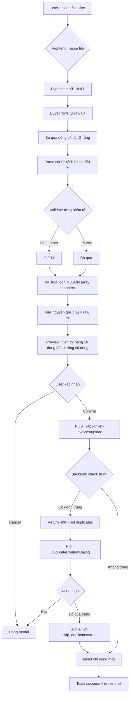

# BA Analysis: Ghi nhận hóa đơn từ tài xế

**Ngày:** 2026-06-15
**Feature:** Ghi nhận hóa đơn từ tài xế (Driver Invoice Recording)
**Reference file:** `reference/Xe Nhỏ 05_2026.xlsx`

---

## 1. Tổng quan

**Mục đích:** Cho phép upload file Excel (format giống file mẫu "Xe Nhỏ 05_2026.xlsx"), hệ thống tự động đọc sheet "XE NHỎ", parse cột G để tách số hóa đơn, lưu vào database có kiểm tra trùng.

**Stakeholders:** Admin, Kế toán (ACCOUNTANT)

**File mẫu cấu trúc — Sheet "XE NHỎ":**
- Row 1-4: Header công ty (CÔNG TNHH DV VT PHÚ PHÁT, địa chỉ, ngày, tên)
- Row 5: Header con (có `Tên :`, `Số xe :` merge cell)
- Row 6: Trống
- Row 7: Sub-header: `B=TÊN`, `D=Ngày`, `E=Số xe`, `F=Nơi giao`
- Row 8+: Data rows với các cột:
  - **B (Mã):** Location code (emp, ems, bcal, ssg, tp, hl, bcpt, pham, ntru, poyun, mpsg, sht, ...)
  - **C (Tên TX):** Tên tài xế (b tâm, a lợi, x1, p vũ, ư lừa, ...)
  - **D (Ngày):** Ngày giao hàng (DateTime)
  - **E (Số xe):** Biển số xe (50H-70216, 50H 87442, 51C-81056, ...)
  - **F (Nơi giao):** Địa điểm giao hàng (EMART P.H.ÍCH, E MART SALA, BIG C AN LAC, ...)
  - **G (Số hóa đơn):** Invoice numbers, có thể là:
    - Single number: `8312`, `8313`, `8324`
    - Multiple separated by `+`: `71471+71473+71468`, `8473+71323+71325+71324+8325`
    - Text (non-numeric): `pgh`, `r`
    - Mixed: `bbnh+6491`

Tổng: 707 dòng có dữ liệu cột G (trong ~1282 dòng).

---

## 2. User Stories

| ID | Story | Priority |
|----|-------|----------|
| US-01 | Là kế toán, tôi muốn upload file Excel hóa đơn từ tài xế để hệ thống tự động parse và lưu dữ liệu | P0 |
| US-02 | Là kế toán, tôi muốn xem preview dữ liệu đã parse trước khi xác nhận import để kiểm tra tính chính xác | P0 |
| US-03 | Là kế toán, tôi muốn hệ thống cảnh báo khi phát hiện dữ liệu trùng để tránh nhập đúp | P0 |
| US-04 | Là kế toán, tôi muốn xem danh sách hóa đơn đã import để tra cứu và đối chiếu | P1 |
| US-05 | Là kế toán, tôi muốn filter danh sách theo mã, tên TX, ngày, số xe, số hóa đơn để tìm kiếm nhanh | P1 |

---

## 3. Flowchart TO-BE



---

## 4. Business Rules

```
BR-001: File upload phải là .xlsx, chứa sheet "XE NHỎ"
BR-002: Dữ liệu đọc từ row 8+, cột B-G:
        B=Mã, C=Tên TX, D=Ngày, E=Số xe, F=Nơi giao, G=Ghi chú (raw)
BR-003: Bỏ qua dòng có cột B (Mã) rỗng hoặc cột G (ghi_chu) rỗng/chỉ whitespace
BR-004: Parse cột G: tách bằng dấu "+" → validate từng phần tử
BR-005: Chỉ giữ các giá trị là số nguyên dương (number), bỏ qua text
        VD: "pgh" → [], "bbnh+6491" → ["6491"]
BR-006: Lưu cột G gốc vào `ghi_chu` (TEXT, hiển thị là "Ghi chú"), kết quả parse vào `so_hoa_don` (JSONB)
BR-007: Check trùng theo composite key (ma, ngay, so_xe, ghi_chu)
BR-007a: so_xe được normalize khi insert: bỏ `-`, `,`, space (vd: "50H-55116" → "50H55116")
BR-008: Upload fail-soft: nếu có dòng trùng → return 409 + danh sách duplicates,
        user có thể skip duplicates để chỉ insert dòng mới
BR-009: Có quyền skip_duplicates=true: backend bỏ qua dòng đã tồn tại, chỉ insert dòng mới
BR-010: Lưu thông tin file: original_filename, uploaded_by, uploaded_at
BR-011: KHÔNG soft-update/soft-delete cho bảng này. Delete = hard delete.
BR-012: Ngày từ Excel: parse linh hoạt (Date object hoặc string), output YYYY-MM-DD
BR-013: Xử lý merge cell trong Excel (như file mẫu có merge cell ở row 1-5)
```

---

## 5. Data Model

```sql
CREATE TABLE driver_invoices (
  id SERIAL PRIMARY KEY,
  ma VARCHAR(50) NOT NULL,
  ten_tx VARCHAR(255) NOT NULL,
  ngay DATE NOT NULL,
  so_xe VARCHAR(50) NOT NULL,
  noi_giao VARCHAR(255) NOT NULL,
  ghi_chu TEXT,
  so_hoa_don JSONB DEFAULT '[]'::jsonb,
  original_filename VARCHAR(255),
  uploaded_by INTEGER REFERENCES users(id),
  uploaded_at TIMESTAMPTZ DEFAULT NOW()
);

CREATE UNIQUE INDEX idx_driver_invoices_unique
  ON driver_invoices(ma, ngay, so_xe, ghi_chu);

CREATE INDEX idx_driver_invoices_ngay ON driver_invoices(ngay);
CREATE INDEX idx_driver_invoices_so_xe ON driver_invoices(so_xe);
CREATE INDEX idx_driver_invoices_ma ON driver_invoices(ma);
CREATE INDEX idx_driver_invoices_uploaded_by ON driver_invoices(uploaded_by);
```

### Parse Logic cho `so_hoa_don`

```typescript
function parseInvoiceNumbers(raw: string): string[] {
  if (!raw || !raw.trim()) return [];
  return raw
    .split('+')
    .map(s => s.trim())
    .filter(s => /^\d+$/.test(s));
}
```

| Input | ghi_chu | so_hoa_don |
|-------|---------------|------------|
| `8473+71323+71325+71324+8325` | `8473+71323+71325+71324+8325` | `["8473","71323","71325","71324","8325"]` |
| `8312` | `8312` | `["8312"]` |
| `pgh` | `pgh` | `[]` |
| `bbnh+6491` | `bbnh+6491` | `["6491"]` |
| `r` | `r` | `[]` |
| ` ` (empty) | — | bỏ qua cả dòng |

---

## 6. API Contract

```
POST /api/driver-invoices/upload
Description: Upload parsed invoice data
Auth: JWT + accounting_data.manage

Request:
{
  "rows": [
    {
      "ma": "emp",
      "ten_tx": "b tâm",
      "ngay": "2026-05-02",
      "so_xe": "50H-70216",
      "noi_giao": "EMART P.H.ÍCH",
      "ghi_chu": "8312",
      "so_hoa_don": ["8312"]
    }
  ],
  "original_filename": "Xe Nhỏ 05_2026.xlsx",
  "skip_duplicates": false
}

Response 200 (thành công):
{
  "success": true,
  "message": "Đã import 50 bản ghi",
  "data": {
    "inserted": 50,
    "duplicates": []
  }
}

Response 200 (có skip duplicate):
{
  "success": true,
  "message": "Đã import 45 bản ghi, bỏ qua 5 dòng trùng",
  "data": {
    "inserted": 45,
    "duplicates": [
      { "ma": "emp", "ngay": "2026-05-02", "so_xe": "50H-70216", "ghi_chu": "8312" }
    ]
  }
}

Response 409 (có duplicate, skip_duplicates=false):
{
  "success": false,
  "message": "Phát hiện 5 dòng trùng lặp",
  "data": {
    "duplicates": [...],
    "new_count": 45,
    "duplicate_count": 5
  },
  "error_code": "DUPLICATE_INVOICES"
}
```

```
GET /api/driver-invoices
Description: List invoices with pagination + filters
Auth: JWT + accounting_data.view

Query params:
  page=1, limit=20,
  ma, ten_tx, ngay_from, ngay_to, so_xe, so_hoa_don

Response:
{
  "success": true,
  "data": {
    "data": [ { id, ma, ten_tx, ngay, so_xe, noi_giao, ghi_chu, so_hoa_don, original_filename, uploaded_by, uploaded_at } ],
    "pagination": { "page": 1, "limit": 20, "total": 707, "totalPages": 36 }
  }
}
```

```
GET /api/driver-invoices/:id
Description: Get single invoice detail
Auth: JWT + accounting_data.view

Response:
{
  "success": true,
  "data": { id, ma, ten_tx, ngay, so_xe, noi_giao, ghi_chu, so_hoa_don, original_filename, uploaded_by, uploaded_at }
}
```

```
PUT /api/driver-invoices/:id
Description: Update an invoice record
Auth: JWT + accounting_data.manage

Request: { ma, ten_tx, ngay, so_xe, noi_giao, ghi_chu?, so_hoa_don }
Response: { success: true, data: { id, ma, ten_tx, ngay, so_xe, noi_giao, ghi_chu, so_hoa_don, ... } }

DELETE /api/driver-invoices/:id
Description: Hard delete an invoice record
Auth: JWT + accounting_data.manage

Response:
{
  "success": true,
  "message": "Đã xóa bản ghi"
}
```

---

## 7. UI Screens

```
- Screen 1: DriverInvoicesPage — Table list + filter bar + upload button + pagination
  → Route: /accounting-data/driver-invoices
- Modal 1: DriverInvoiceUploadModal — Upload zone → parse → preview → confirm
- Modal 2: DuplicateConfirmDialog — Hiện danh sách duplicates, chọn skip/hủy
```

---

## 8. Edge Cases

```
EC-01: File không có sheet "XE NHỎ" → toast error "Không tìm thấy sheet 'XE NHỎ'"
EC-02: File có < 8 dòng → toast warning "File không chứa dữ liệu hóa đơn"
EC-03: Cột G có giá trị text hoàn toàn (pgh, r) → so_hoa_don = [], vẫn insert record
EC-04: Cột G mixed text+number (bbnh+6491) → so_hoa_don = ["6491"]
EC-05: Cột G trống → bỏ qua toàn bộ dòng
EC-06: Upload file trùng 100% → DuplicateConfirmDialog hiện full list duplicates
EC-07: Upload file có lẫn dòng mới + trùng → skip_duplicates=true chỉ insert dòng mới
EC-08: Ngày Excel là Date object (parse linh hoạt: Date | ISO string | dd/mm/yyyy)
EC-09: File có merge cell trong header rows (row 1-7) → cần xử lý khi đọc giá trị
EC-10: Số lượng rows rất lớn (>5000) → pagination + giới hạn parse frontend
EC-11: Cột G chứa "+" ở đầu/cuối ("+8312+" ) → trim và filter empty strings
```
