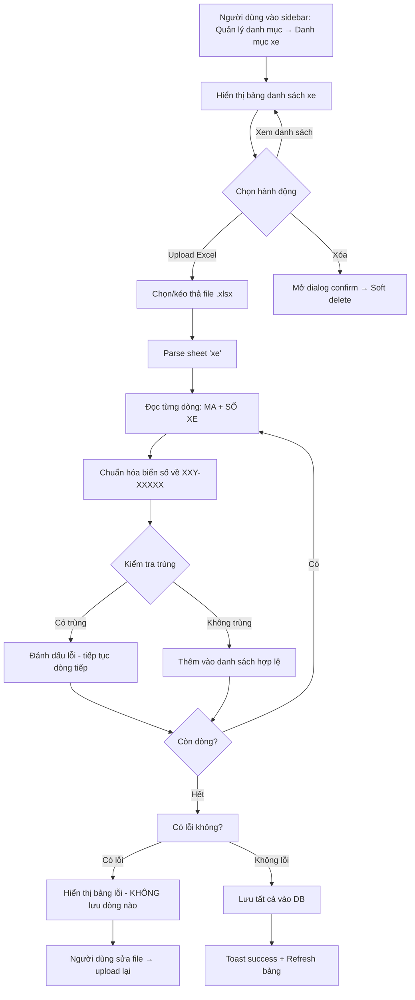

# BA Analysis: Danh mục xe

**Ngày:** 2026-06-16
**Feature:** Danh mục xe
**Parent menu:** Quản lý danh mục (sidebar group mới)
**Trigger:** Upload file Excel sheet "xe" để import danh sách biển số xe + mã tài xế, có kiểm tra trùng và chuẩn hóa biển số về format `XXY-XXXXX`.

---

## 1. Tổng quan

Module "Danh mục xe" cho phép người dùng upload file Excel (sheet `xe`) chứa danh sách xe — mỗi dòng là 1 xe gồm mã tài xế (driver code) và biển số xe (plate number). Hệ thống sẽ chuẩn hóa biển số về định dạng `XXY-XXXXX` (X = chữ số, Y = chữ cái), kiểm tra trùng và lưu vào DB.

Trang còn có chức năng xem danh sách, tìm kiếm, và xóa (soft delete) từng xe.

## 2. Flowchart TO-BE



## 3. Business Rules

| ID | Rule |
|----|------|
| BR-001 | Biển số xe được chuẩn hóa: xóa hết khoảng trắng, dấu chấm, dấu phẩy → lấy 3 ký tự đầu (XXY) + dấu gạch ngang + phần còn lại (XXXXX). VD: `51H -88294` → `51H-88294`, `50H 87442` → `50H-87442`, `50E-164,61` → `50E-16461` |
| BR-002 | `plate_number` (đã chuẩn hóa) là unique key trong DB. Trùng → báo lỗi |
| BR-003 | Upload theo cơ chế fail-fast (atomic): nếu có bất kỳ dòng nào lỗi → không lưu dòng nào, trả về toàn bộ danh sách lỗi |
| BR-004 | Lỗi có thể gồm: biển số rỗng, biển số không đúng format sau khi chuẩn hóa (<7 ký tự), biển số trùng trong file, biển số trùng trong DB |
| BR-005 | Dòng có `MA` hoặc `SỐ XE` rỗng → bỏ qua (không tính là lỗi, không import) |
| BR-006 | Dòng header (dòng đầu tiên: "MA" / "SỐ XE") → bỏ qua |
| BR-007 | Soft delete: UPDATE SET status='deactive' (không xóa vật lý) |
| BR-008 | Chỉ hiển thị xe active trong bảng chính |
| BR-009 | Upload lại xe đã deactive → re-activate (SET status='active' + UPDATE driver_name nếu khác) |

## 4. Data Model

```sql
CREATE TABLE IF NOT EXISTS vehicles (
  id            SERIAL PRIMARY KEY,
  plate_number  VARCHAR(20) NOT NULL,
  driver_name   VARCHAR(255) NOT NULL,
  status        VARCHAR(20) NOT NULL DEFAULT 'active'
                CHECK (status IN ('active', 'deactive')),
  created_at    TIMESTAMPTZ NOT NULL DEFAULT CURRENT_TIMESTAMP,
  updated_at    TIMESTAMPTZ NOT NULL DEFAULT CURRENT_TIMESTAMP
);

-- Unique constraint
CREATE UNIQUE INDEX IF NOT EXISTS idx_vehicles_plate_number_active
  ON vehicles(plate_number) WHERE status = 'active';

-- Trigger for auto-updating updated_at
DROP TRIGGER IF EXISTS update_vehicles_updated_at ON vehicles;
CREATE TRIGGER update_vehicles_updated_at
  BEFORE UPDATE ON vehicles
  FOR EACH ROW EXECUTE PROCEDURE update_updated_at_column();
```

## 5. API Contract

### 5.1 Lấy danh sách xe

```
GET /api/vehicles
Query: ?search=xxx&page=1&limit=20
```

**Response:**
```json
{
  "success": true,
  "data": {
    "vehicles": [
      {
        "id": 1,
        "plate_number": "50H-70216",
        "driver_name": "B Tâm",
        "status": "active",
        "created_at": "2026-06-16T00:00:00Z",
        "updated_at": "2026-06-16T00:00:00Z"
      }
    ],
    "total": 45,
    "page": 1,
    "limit": 20
  }
}
```

### 5.2 Upload Excel

```
POST /api/vehicles/upload
Content-Type: multipart/form-data
Body: file (Excel .xlsx)
```

**Response (thành công):**
```json
{
  "success": true,
  "message": "Đã import 42 xe",
  "data": { "imported": 42, "reactivated": 3 }
}
```

**Response (lỗi fail-fast):**
```json
{
  "success": false,
  "message": "Có 3 lỗi trong dữ liệu — không có dòng nào được lưu",
  "errors": [
    { "row": 8, "driver_name": "V Luân", "plate_number": "51H -88294", "reason": "Biển số đã tồn tại: 51H-88294" },
    { "row": 12, "driver_name": "Ư Lừa", "plate_number": "50E-164,61", "reason": "Biển số không đúng định dạng sau chuẩn hóa" },
    { "row": 15, "driver_name": "N Quốc", "plate_number": "50H-50999", "reason": "Biển số trùng với dòng 7: 50H-50999" }
  ]
}
```

### 5.3 Xóa xe (soft delete)

```
DELETE /api/vehicles/:id
```

**Response:**
```json
{ "success": true, "message": "Đã xóa xe" }
```

## 6. UI Screens cần thiết

```
- Screen 1: Danh mục xe (danh sách + upload) → frontend/src/pages/admin/catalog/VehicleCatalogPage.tsx
- Modal 1:  Upload Excel → frontend/src/components/catalog/UploadVehiclesModal.tsx
- Modal 2:  Xác nhận xóa → frontend/src/components/catalog/DeleteVehicleDialog.tsx
```

## 7. Edge Cases

- File Excel không có sheet "xe" → báo lỗi "Không tìm thấy sheet 'xe' trong file"
- Sheet "xe" trống (không có dữ liệu sau khi bỏ header + dòng rỗng) → báo lỗi "Không có dữ liệu hợp lệ"
- Biển số sau chuẩn hóa có độ dài < 7 (ví dụ: "50H" mà không có phần sau) → báo lỗi "Biển số không đúng định dạng"
- Trùng biển số trong cùng 1 file → báo lỗi trùng với dòng nào
- Trùng biển số với DB (active record) → báo lỗi "Biển số đã tồn tại"
- Biển số đã có trong DB nhưng status=deactive → re-activate (không báo lỗi)
- Upload không có dòng nào hợp lệ → vẫn báo fail-fast với danh sách lỗi
- Driver name trùng với biển số khác → không coi là lỗi (1 tài xế có thể lái nhiều xe trong những lần upload khác nhau)
