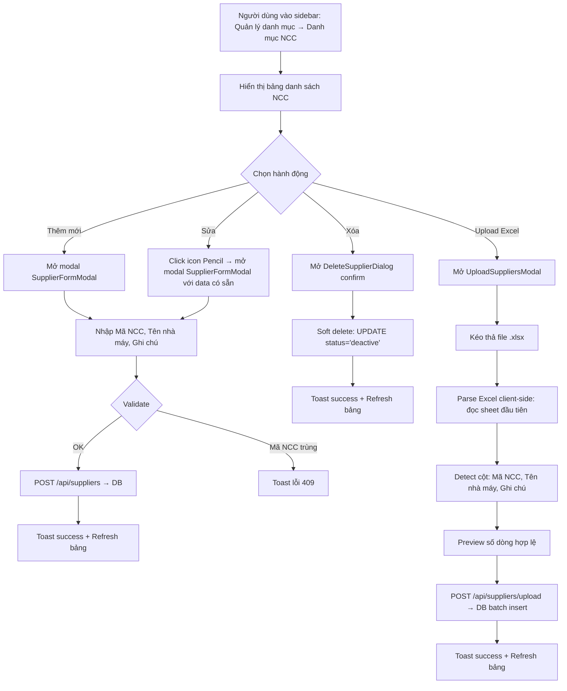

# BA Analysis: Danh mục nhà cung cấp

**Ngày:** 2026-06-17
**Feature:** Danh mục nhà cung cấp (Supplier Catalog)
**Parent menu:** Quản lý danh mục (`/catalog/suppliers`)
**Trigger:** Cần danh mục nhà cung cấp để tra cứu mã NCC và tên nhà máy trong quy trình kế toán.

---

## 1. Tổng quan

Module "Danh mục nhà cung cấp" cho phép quản lý danh sách nhà cung cấp với 3 trường: Mã NCC (`supplier_code`), Tên nhà máy (`name`), Ghi chú (`notes`). Hỗ trợ đầy đủ CRUD: tạo mới, sửa, xóa (soft delete) từng record, upload hàng loạt qua Excel. Trang có tìm kiếm và phân trang.

Feature này là module con thứ 2 trong nhóm sidebar "Quản lý danh mục" (sau "Danh mục xe").

## 2. Flowchart TO-BE



## 3. Business Rules

| ID | Rule |
|----|------|
| BR-001 | `supplier_code` là unique trong active records. Tạo mới hoặc sửa với mã đã tồn tại → lỗi 409 |
| BR-002 | `supplier_code` và `name` là bắt buộc, `notes` là optional |
| BR-003 | Soft delete: UPDATE SET status='deactive' (không xóa vật lý) |
| BR-004 | Chỉ hiển thị suppliers active trong bảng chính |
| BR-005 | Upload Excel: đọc sheet đầu tiên, tự động detect cột theo tên header (Mã NCC, Tên nhà máy, Ghi chú) |
| BR-006 | Upload dùng batch INSERT trong transaction. Nếu có lỗi → ROLLBACK toàn bộ |
| BR-007 | Tìm kiếm theo `supplier_code`, `name`, hoặc `notes` (ILIKE) |
| BR-008 | Phân trang mặc định 20 records/page |
| BR-009 | Tất cả authenticated user đều truy cập được (không cần permission riêng) |

## 4. Data Model

```sql
CREATE TABLE IF NOT EXISTS suppliers (
  id              SERIAL PRIMARY KEY,
  supplier_code   VARCHAR(20) NOT NULL,
  name            VARCHAR(255) NOT NULL,
  notes           TEXT,

  status          VARCHAR(20) NOT NULL DEFAULT 'active'
                  CHECK (status IN ('active', 'deactive')),

  created_at      TIMESTAMPTZ NOT NULL DEFAULT CURRENT_TIMESTAMP,
  updated_at      TIMESTAMPTZ NOT NULL DEFAULT CURRENT_TIMESTAMP
);

CREATE UNIQUE INDEX IF NOT EXISTS idx_suppliers_code_active
  ON suppliers(supplier_code) WHERE status = 'active';

CREATE INDEX IF NOT EXISTS idx_suppliers_status ON suppliers(status);
CREATE INDEX IF NOT EXISTS idx_suppliers_name ON suppliers(name);

DROP TRIGGER IF EXISTS update_suppliers_updated_at ON suppliers;
CREATE TRIGGER update_suppliers_updated_at
  BEFORE UPDATE ON suppliers
  FOR EACH ROW EXECUTE PROCEDURE update_updated_at_column();
```

## 5. API Contract

### 5.1 Lấy danh sách NCC (paginated)

```
GET /api/suppliers
Query: ?search=xxx&page=1&limit=20
```

**Response:**
```json
{
  "success": true,
  "data": {
    "suppliers": [
      {
        "id": 1,
        "supplier_code": "2000000001",
        "name": "CLF",
        "notes": null,
        "status": "active",
        "created_at": "2026-06-17T00:00:00Z",
        "updated_at": "2026-06-17T00:00:00Z"
      }
    ],
    "total": 5,
    "page": 1,
    "limit": 20
  }
}
```

### 5.2 Tạo mới NCC

```
POST /api/suppliers
Body: { "supplier_code": "2000000001", "name": "CLF", "notes": "" }
```

**Response:** `201` + supplier object. Lỗi 409 nếu mã NCC trùng.

### 5.3 Cập nhật NCC

```
PUT /api/suppliers/:id
Body: { "supplier_code": "2000000001", "name": "CLF Updated", "notes": "..." }
```

**Response:** `200` + supplier object. Lỗi 404 nếu không tìm thấy, 409 nếu mã NCC trùng.

### 5.4 Xóa NCC (soft delete)

```
DELETE /api/suppliers/:id
```

**Response:** `{ "success": true, "message": "Đã xóa nhà cung cấp" }`

### 5.5 Upload Excel

```
POST /api/suppliers/upload
Body: { "rows": [{ "supplier_code": "...", "name": "...", "notes": "..." }] }
```

**Response:** `{ "success": true, "data": { "inserted": 5 } }`

## 6. UI Screens

```
- Screen 1: SupplierCatalogPage → frontend/src/pages/admin/catalog/SupplierCatalogPage.tsx
- Modal 1:  SupplierFormModal (Create + Edit) → frontend/src/components/catalog/SupplierFormModal.tsx
- Modal 2:  DeleteSupplierDialog → frontend/src/components/catalog/DeleteSupplierDialog.tsx
- Modal 3:  UploadSuppliersModal → frontend/src/components/catalog/UploadSuppliersModal.tsx
```

## 7. Edge Cases

- Upload file không có header đúng → báo lỗi "Không tìm thấy cột Mã NCC và Tên nhà máy"
- File rỗng → thông báo "Không có dữ liệu hợp lệ"
- Mã NCC trùng trong DB khi tạo mới/sửa → lỗi 409, toast error
- Xóa record không tồn tại → lỗi 404
- Tìm kiếm không có kết quả → hiển thị empty state "Không tìm thấy nhà cung cấp nào phù hợp"
