# BA Analysis: Quản lý Nhật ký Hệ thống (Audit Log Management)

**Ngày:** 2026-06-18
**Feature:** Hệ thống quản lý nhật ký truy cập và thao tác người dùng, gồm 2 tầng: HTTP-level (access_logs) và Business-level (audit_logs).
**Phương án:** PA4 (Hybrid = Middleware HTTP + Service Business Event Logging)

---

## 1. User Stories

### US-01: Xem nhật ký truy cập (Access Logs)
> **Là** quản trị viên (ADMIN) hoặc kế toán viên (ACCOUNTANT), **tôi muốn** xem danh sách tất cả request POST/PUT/DELETE/PATCH đến hệ thống, bao gồm: ai gọi, method nào, path nào, status code, IP, thời gian xử lý **để** theo dõi hành vi truy cập và phát hiện truy cập bất thường.

### US-02: Xem nhật ký thao tác (Audit Logs)
> **Là** quản trị viên (ADMIN) hoặc kế toán viên (ACCOUNTANT), **tôi muốn** xem danh sách các thao tác nghiệp vụ quan trọng: ai login/logout, ai tạo/sửa/xóa dữ liệu nào (invoice, customer, supplier, vehicle, user, role...), với chi tiết cũ/mới, thời gian thực hiện **để** truy vết lịch sử thay đổi dữ liệu khi cần kiểm tra hoặc audit.

### US-03: Filter và tìm kiếm log
> **Là** người dùng có quyền xem log, **tôi muốn** lọc nhật ký theo user, action, entity type, status code, khoảng thời gian, và phân trang kết quả **để** nhanh chóng tìm được thông tin cần thiết.

### US-04: Tự động xóa log cũ
> **Là** hệ thống, log cũ (>90 ngày với access_logs, >180 ngày với audit_logs) sẽ được tự động xóa định kỳ hàng ngày **để** tránh tích lũy dữ liệu quá lớn, giữ hiệu năng DB.

---

## 2. Flowchart TO-BE

```mermaid
flowchart TD
  subgraph "Ghi log tự động (BE Middleware)"
    A[Mọi request POST/PUT/DELETE/PATCH]
    A --> B[authenticateToken middleware]
    B --> C[auditMiddleware: ghi timestamp bắt đầu]
    C --> D[Route handler xử lý]
    D --> E[Response gửi về client]
    E --> F[auditMiddleware: res.on finish - ghi access_logs]
    F --> G[(access_logs table)]
  end

  subgraph "Ghi log nghiệp vụ (BE Services)"
    H[Service method được gọi]
    H --> I{Gọi auditService.logAudit fire-and-forget}
    I --> J[(audit_logs table)]
  end

  subgraph "Xem log (FE)"
    K[User vào /logs từ sidebar Thiết lập người dùng]
    K --> L{Chọn tab}
    L -->|Nhật ký truy cập| M[GET /api/logs/access với filters]
    L -->|Nhật ký thao tác| N[GET /api/logs/audit với filters]
    M --> O[Table access_logs + pagination]
    N --> P[Table audit_logs + expandable details + pagination]
  end

  subgraph "Cleanup (BE Cron)"
    Q[Cron job: 3:00 AM mỗi ngày]
    Q --> R[DELETE access_logs > 90 ngày]
    Q --> S[DELETE audit_logs > 180 ngày]
  end
```



---

## 3. Business Rules

| ID | Rule |
|----|------|
| BR-001 | Access logs chỉ ghi nhận các request **POST, PUT, DELETE, PATCH**. Bỏ qua GET để giảm noise. |
| BR-002 | Access logs ghi nhận: user_id (NULL nếu chưa auth), method, path, status_code, ip_address, user_agent, response_time_ms. Ghi dữ liệu fire-and-forget, không block response. |
| BR-003 | Audit logs ghi nhận thao tác nghiệp vụ từ 12 service chính: auth (LOGIN/LOGOUT), user, role, permission, driver_invoice, customer, supplier, vehicle, weight_adjustment, delivery_data, dispatch_schedule, delivery_schedule, reconcile_job. |
| BR-004 | Audit logs ghi nhận: user_id (ai thực hiện), username (denormalized), action, entity_type, entity_id, entity_label (mô tả ngắn), details (JSONB tùy chọn), ip_address. |
| BR-005 | Ghi log không được ảnh hưởng đến business logic chính. Nếu INSERT log thất bại, chỉ log lỗi ra console, không throw exception. |
| BR-006 | Permission `logs.view` kiểm soát quyền xem cả 2 loại log. ADMIN và ACCOUNTANT mặc định có quyền này. |
| BR-007 | Log cleanup: access_logs giữ 90 ngày, audit_logs giữ 180 ngày. Chạy cron 1 lần/ngày lúc 3:00 AM (UTC+7). |
| BR-008 | Filter log hỗ trợ: user_id, method, path (partial match), status_code, action, entity_type, entity_id, date range (from/to). Tất cả filter là optional. |
| BR-009 | Kết quả log được sắp xếp theo thời gian giảm dần (mới nhất trước). Phân trang mặc định 50 items/page. |
| BR-010 | Audit logs cho phép expand row để xem JSON details đầy đủ (định dạng formatted JSON). |

---

## 4. Data Model

### 4.1 Bảng mới: `access_logs`

```sql
CREATE TABLE IF NOT EXISTS access_logs (
  id                SERIAL PRIMARY KEY,
  user_id           INTEGER REFERENCES users(id) ON DELETE SET NULL,
  method            VARCHAR(10) NOT NULL,
  path              VARCHAR(500) NOT NULL,
  status_code       SMALLINT NOT NULL,
  ip_address        VARCHAR(45),
  user_agent        TEXT,
  response_time_ms  INTEGER,
  created_at        TIMESTAMPTZ DEFAULT NOW()
);

CREATE INDEX IF NOT EXISTS idx_access_logs_user_id ON access_logs(user_id);
CREATE INDEX IF NOT EXISTS idx_access_logs_created_at ON access_logs(created_at DESC);
CREATE INDEX IF NOT EXISTS idx_access_logs_method ON access_logs(method);
CREATE INDEX IF NOT EXISTS idx_access_logs_status_code ON access_logs(status_code);
CREATE INDEX IF NOT EXISTS idx_access_logs_path ON access_logs(path);
```

### 4.2 Bảng mới: `audit_logs`

```sql
CREATE TABLE IF NOT EXISTS audit_logs (
  id                SERIAL PRIMARY KEY,
  user_id           INTEGER REFERENCES users(id) ON DELETE SET NULL,
  username          VARCHAR(100),
  action            VARCHAR(50) NOT NULL,
  entity_type       VARCHAR(50) NOT NULL,
  entity_id         INTEGER,
  entity_label      VARCHAR(255),
  details           JSONB,
  ip_address        VARCHAR(45),
  created_at        TIMESTAMPTZ DEFAULT NOW()
);

CREATE INDEX IF NOT EXISTS idx_audit_logs_user_id ON audit_logs(user_id);
CREATE INDEX IF NOT EXISTS idx_audit_logs_created_at ON audit_logs(created_at DESC);
CREATE INDEX IF NOT EXISTS idx_audit_logs_action ON audit_logs(action);
CREATE INDEX IF NOT EXISTS idx_audit_logs_entity_type ON audit_logs(entity_type);
CREATE INDEX IF NOT EXISTS idx_audit_logs_entity ON audit_logs(entity_type, entity_id);
```

### 4.3 Seed permission `logs.view`

```sql
INSERT INTO permissions (code, name, module, description) VALUES
  ('logs.view', 'Xem nhật ký hệ thống', 'logs', 'Xem nhật ký truy cập và nhật ký thao tác của người dùng')
ON CONFLICT (code) DO NOTHING;

-- ADMIN: toàn quyền
INSERT INTO role_permissions (role_id, permission_id)
SELECT r.id, p.id FROM roles r, permissions p
WHERE r.code = 'ADMIN' AND p.code = 'logs.view'
ON CONFLICT DO NOTHING;

-- ACCOUNTANT: xem log
INSERT INTO role_permissions (role_id, permission_id)
SELECT r.id, p.id FROM roles r, permissions p
WHERE r.code = 'ACCOUNTANT' AND p.code = 'logs.view'
ON CONFLICT DO NOTHING;
```

---

## 5. API Contract

### 5.1 Lấy nhật ký truy cập
```
GET /api/logs/access?userId=&method=&path=&statusCode=&dateFrom=&dateTo=&page=1&limit=50
Auth: JWT (logs.view)
Response: {
  success: true,
  data: AccessLog[],
  meta: { total, page, limit, totalPages }
}

AccessLog: {
  id, user_id, user_name?, method, path, status_code,
  ip_address, user_agent, response_time_ms, created_at
}
```

### 5.2 Lấy nhật ký thao tác
```
GET /api/logs/audit?userId=&action=&entityType=&entityId=&dateFrom=&dateTo=&page=1&limit=50
Auth: JWT (logs.view)
Response: {
  success: true,
  data: AuditLog[],
  meta: { total, page, limit, totalPages }
}

AuditLog: {
  id, user_id, username, action, entity_type,
  entity_id, entity_label, details, ip_address, created_at
}
```

---

## 6. Fire-and-Forget Logging Strategy

```typescript
// Pattern dùng trong auditService.ts
function logAccess(data: AccessLogData): void {
  setImmediate(() => {
    pool.query(`INSERT INTO access_logs (...) VALUES (...)`, params)
      .catch(err => console.error('[AuditService] Failed to log access:', err.message));
  });
}

function logAudit(data: AuditLogData): void {
  setImmediate(() => {
    pool.query(`INSERT INTO audit_logs (...) VALUES (...)`, params)
      .catch(err => console.error('[AuditService] Failed to log audit:', err.message));
  });
}
```

**Lý do dùng `setImmediate`:** Đẩy INSERT ra khỏi event loop hiện tại, response gửi về client không phải chờ INSERT log hoàn tất. Nếu DB lỗi, log chỉ bị mất, không ảnh hưởng đến nghiệp vụ chính.

---

## 7. Service Integration Map

Các controller/service cần được sửa để truyền `userId` + gọi `auditService.logAudit()`:

| Service | Trigger points | Action | Entity Type | Ghi chú |
|---|---|---|---|---|
| `authController.ts` | Login thành công, Logout | LOGIN, LOGOUT | auth | `details: { email }` |
| `usersController.ts` / `userService.ts` | createUser, updateUser, deleteUser, resetPassword | CREATE, UPDATE, DELETE | user | entity_label = username |
| `rolesController.ts` / `roleService.ts` | createRole, updateRole, toggleRole | CREATE, UPDATE, TOGGLE | role | entity_label = role name |
| `permissionsController.ts` / `permissionService.ts` | updateRolePermissions | UPDATE_PERMISSIONS | permission | entity_label = role name |
| `driverInvoiceController.ts` | create, update, delete | CREATE, UPDATE, DELETE | driver_invoice | entity_label = "Invoice #id" |
| `customerController.ts` | create, update, delete | CREATE, UPDATE, DELETE | customer | entity_label = customer name |
| `supplierController.ts` | create, update, delete | CREATE, UPDATE, DELETE | supplier | entity_label = supplier name |
| `vehicleController.ts` | upload, delete | CREATE, DELETE | vehicle | entity_label = plate number |
| `weightAdjustmentController.ts` | create, update, delete | CREATE, UPDATE, DELETE | weight_adjustment | entity_label = ma_hang |
| `deliveryDataController.ts` | importFile, deleteBatch | IMPORT, DELETE | batch | details: { filename, rowCount } |
| `dispatchScheduleController.ts` | create, update, delete | CREATE, UPDATE, DELETE | dispatch_schedule | entity_label = "Dispatch #id" |
| `deliveryScheduleController.ts` | upload, deleteByDateRange | UPLOAD, DELETE | delivery_schedule | details: { fromDate, toDate, filename } |
| `reconcileJobController.ts` | createConfig, updateConfig, deleteConfig, toggleConfig, triggerReconcile | CREATE, UPDATE, DELETE, TOGGLE, TRIGGER | job | entity_label = config name |

---

## 8. UI Screens

| # | Screen | Route | Mô tả |
|---|--------|-------|-------|
| 1 | **Nhật ký hệ thống** | `/logs` | Trang chính với 2 tab: "Nhật ký truy cập" và "Nhật ký thao tác". Mỗi tab có bộ filter riêng + table + pagination. |
| 2 | **Row expand (Audit)** | (inline trong tab 2) | Click vào row audit log để expand xem chi tiết JSON formatted của `details`. |

Menu item nằm trong group "Thiết lập người dùng", bên cạnh "Quản lý người dùng", "Quản lý vai trò", "Quản lý quyền".

---

## 9. Edge Cases

| # | Case | Xử lý |
|---|------|-------|
| EC-01 | Request không có token (public endpoint như register/login) | Vẫn ghi access_log nhưng user_id = NULL |
| EC-02 | User bị xóa sau khi đã có log | FK ON DELETE SET NULL -> user_id = NULL, nhưng username trong audit_logs đã denormalized nên vẫn đọc được |
| EC-03 | DB mất kết nối khi ghi log | catch error, console.error, không throw -> không ảnh hưởng response |
| EC-04 | Log table quá lớn sau thời gian dài | Cron job tự động xóa log cũ mỗi ngày |
| EC-05 | Không có log nào khớp filter | Hiển thị empty state: "Không tìm thấy log nào" |
| EC-06 | Response bị lỗi 500 | Vẫn ghi access_log với status_code = 500 |
| EC-07 | Request body quá lớn (upload file) | Không ghi body vào log. Chỉ ghi metadata (method, path, status, response time) |
| EC-08 | Concurrency: nhiều request ghi log cùng lúc | Mỗi INSERT là độc lập, không conflict |
| EC-09 | VIEWER role không có permission logs.view | VIEWER không thấy menu "Nhật ký hệ thống" trong sidebar |
