# BA Analysis: Job Đối chiếu HĐ tự động

**Ngày:** 2026-06-18
**Feature:** Job chạy định kỳ đối chiếu `accountant_invoices` với `driver_invoices`, kèm màn hình cấu hình

---

## 1. User Stories

### US-01: Cấu hình Job đối chiếu
> **Là** kế toán viên (ACCOUNTANT), **tôi muốn** thiết lập lịch chạy job đối chiếu với số ngày quét và các giờ cố định trong ngày **để** hệ thống tự động cập nhật trạng thái hóa đơn mà không cần thao tác thủ công.

### US-02: Job tự động đối chiếu
> **Là** kế toán viên (ACCOUNTANT), **tôi muốn** hệ thống chạy job theo lịch đã cấu hình, quét các `accountant_invoices` có `trang_thai='không có'` trong phạm vi N ngày tính từ hôm nay, đối chiếu với toàn bộ `driver_invoices` và cập nhật `trang_thai='đã có'` nếu khớp **để** đảm bảo dữ liệu luôn được đồng bộ.

### US-03: Kích hoạt Job thủ công
> **Là** kế toán viên (ACCOUNTANT), **tôi muốn** có nút "Chạy ngay" để thực thi job một lần ngay lập tức **để** kiểm tra hoặc đối chiếu gấp khi cần.

### US-04: Xem lịch sử chạy Job
> **Là** kế toán viên (ACCOUNTANT), **tôi muốn** xem danh sách các lần job đã chạy với trạng thái (thành công/thất bại), số hóa đơn đã quét, số đã khớp, thời gian chạy **để** theo dõi và xác minh job hoạt động đúng.

---

## 2. Flowchart TO-BE

```mermaid
flowchart TD
  subgraph "Cấu hình (FE)"
    A[Trang Cấu hình Job Đối chiếu]
    A --> B{Tạo mới / Sửa cấu hình}
    B --> C[Nhập: số ngày quét + danh sách giờ chạy]
    C --> D[Bật/Tắt trạng thái active]
    D --> E[Lưu cấu hình -> BE]
    E --> F[BE lưu DB + cập nhật scheduler]
  end

  subgraph "Job định kỳ (BE)"
    G[Scheduler đọc config active]
    G --> H{Đến giờ chạy?}
    H -->|Có| I[Ghi log: status='running']
    I --> J[Query accountant_invoices WHERE trang_thai='không có' AND ngay >= today - N days]
    J --> K[Đối chiếu với driver_invoices - fuzzy match: so_xe + ngay + so_hoa_don]
    K --> L[UPDATE accountant_invoices SET trang_thai='đã có']
    L --> M[Ghi log: status='success' + matched_count]
    H -->|Không| G
  end

  subgraph "Chạy thủ công (FE)"
    N[Nút 'Chạy ngay' tại màn cấu hình]
    N --> O[POST /api/reconcile-jobs/trigger]
    O --> P[BE thực thi job đồng bộ]
    P --> Q[Trả kết quả về FE: matched_count, scanned_count]
    Q --> R[Toast thông báo kết quả]
  end

  subgraph "Xem lịch sử (FE)"
    S[Tab 'Lịch sử chạy Job']
    S --> T[GET /api/reconcile-jobs/logs]
    T --> U[Table: thời gian, status, số khớp, số quét, lỗi]
  end
```



---

## 3. Business Rules

| ID | Rule |
|----|------|
| BR-001 | Mỗi cấu hình job có: tên, số ngày quét (`lookback_days`), danh sách giờ chạy (`schedule_hours`), trạng thái active/inactive. |
| BR-002 | `lookback_days` mặc định = 180. Hệ thống quét `accountant_invoices.ngay >= CURRENT_DATE - lookback_days`. |
| BR-003 | `schedule_hours` cho phép chọn nhiều giờ trong ngày, mỗi giờ là số nguyên 0-23 (vd: [8, 12, 18] = chạy lúc 8:00, 12:00, 18:00). |
| BR-004 | Job chỉ đối chiếu các `accountant_invoices` có `trang_thai = 'không có'` (không chạm vào các record đã `'đã có'`). |
| BR-005 | Đối chiếu dùng fuzzy match giống hệt logic hiện tại: (a) so_xe chuẩn hóa khớp, (b) ngay khớp chính xác, (c) so_hoa_don strip leading zero -> 4 mức: exact, prefix A->B, prefix B->A, substring. |
| BR-006 | Mỗi lần job chạy ghi 1 bản ghi log với: `started_at`, `finished_at`, `status`, `scanned_count`, `matched_count`, `error_message` (nếu có). |
| BR-007 | Khi bật/tắt cấu hình (toggle active), scheduler phải cập nhật ngay lập tức mà không cần restart server. |
| BR-008 | Khi xóa cấu hình, job tương ứng bị hủy khỏi scheduler, nhưng log cũ vẫn giữ nguyên. |
| BR-009 | Chạy thủ công (trigger now) thực thi đồng bộ, trả kết quả ngay cho FE. KHÔNG ghi đè log của job định kỳ - trigger tạo log riêng. |
| BR-010 | Nếu không có cấu hình active nào, scheduler không chạy job nào. |
| BR-011 | Permission: `accounting_data.manage` cho tất cả CRUD config + trigger. `accounting_data.view` để xem logs. |

---

## 4. Data Model

### 4.1 Bảng mới: `reconcile_job_configs`

```sql
CREATE TABLE IF NOT EXISTS reconcile_job_configs (
  id              SERIAL PRIMARY KEY,
  name            VARCHAR(255) NOT NULL DEFAULT 'Đối chiếu hóa đơn',
  lookback_days   INTEGER NOT NULL DEFAULT 180,
  schedule_hours  INTEGER[] NOT NULL DEFAULT '{8, 12, 18}',
  is_active       BOOLEAN NOT NULL DEFAULT true,
  last_run_at     TIMESTAMPTZ,
  next_run_at     TIMESTAMPTZ,
  created_by      INTEGER REFERENCES users(id),
  updated_by      INTEGER REFERENCES users(id),
  created_at      TIMESTAMPTZ DEFAULT NOW(),
  updated_at      TIMESTAMPTZ DEFAULT NOW()
);
```

### 4.2 Bảng mới: `reconcile_job_logs`

```sql
CREATE TABLE IF NOT EXISTS reconcile_job_logs (
  id              SERIAL PRIMARY KEY,
  config_id       INTEGER REFERENCES reconcile_job_configs(id) ON DELETE SET NULL,
  trigger_type    VARCHAR(10) NOT NULL DEFAULT 'scheduled',  -- 'scheduled' | 'manual'
  started_at      TIMESTAMPTZ NOT NULL,
  finished_at     TIMESTAMPTZ,
  status          VARCHAR(20) NOT NULL DEFAULT 'running',    -- 'running' | 'success' | 'failed'
  lookback_days   INTEGER,
  scanned_count   INTEGER DEFAULT 0,
  matched_count   INTEGER DEFAULT 0,
  error_message   TEXT,
  created_at      TIMESTAMPTZ DEFAULT NOW()
);

CREATE INDEX IF NOT EXISTS idx_reconcile_job_logs_config_id ON reconcile_job_logs(config_id);
CREATE INDEX IF NOT EXISTS idx_reconcile_job_logs_status ON reconcile_job_logs(status);
CREATE INDEX IF NOT EXISTS idx_reconcile_job_logs_started_at ON reconcile_job_logs(started_at);
```

---

## 5. API Contract

### 5.1 Lấy danh sách cấu hình
```
GET /api/reconcile-jobs/configs
Auth: JWT (accounting_data.view)
Response: { success, data: ReconcileJobConfig[] }
```

### 5.2 Tạo cấu hình
```
POST /api/reconcile-jobs/configs
Auth: JWT (accounting_data.manage)
Body: { name, lookback_days, schedule_hours, is_active }
Response: 201 { success, message, data: ReconcileJobConfig }
```

### 5.3 Cập nhật cấu hình
```
PUT /api/reconcile-jobs/configs/:id
Auth: JWT (accounting_data.manage)
Body: { name, lookback_days, schedule_hours, is_active }
Response: 200 { success, message, data: ReconcileJobConfig }
```

### 5.4 Xóa cấu hình
```
DELETE /api/reconcile-jobs/configs/:id
Auth: JWT (accounting_data.manage)
Response: 200 { success, message, data: { id } }
```

### 5.5 Bật/Tắt cấu hình
```
PATCH /api/reconcile-jobs/configs/:id/toggle
Auth: JWT (accounting_data.manage)
Response: 200 { success, message, data: { id, is_active } }
```

### 5.6 Chạy job thủ công
```
POST /api/reconcile-jobs/trigger
Auth: JWT (accounting_data.manage)
Body: { config_id?, lookback_days? }
Response: 200 { success, message, data: { log_id, scanned_count, matched_count, status } }
```

### 5.7 Xem lịch sử chạy job
```
GET /api/reconcile-jobs/logs?config_id=&status=&page=&limit=
Auth: JWT (accounting_data.view)
Response: 200 { success, data: { data: ReconcileJobLog[], pagination } }
```

---

## 6. Scheduler Architecture

- **Library:** `node-cron` - nhẹ, không cần Redis, phù hợp single-process Node.js.
- **Khởi tạo:** Server start -> load tất cả config `is_active=true` -> với mỗi giờ trong `schedule_hours`: `cron.schedule('0 {hour} * * *', executeJobFn)`.
- **Cập nhật động:** Khi config thay đổi -> hủy cron jobs cũ -> đăng ký lại cron jobs mới.
- **Graceful shutdown:** `process.on('SIGTERM')` -> hủy tất cả cron jobs, close DB pool.

---

## 7. UI Screens

| # | Screen | Route | Mô tả |
|---|--------|-------|-------|
| 1 | **Cấu hình Job Đối chiếu** | `/accounting-data/reconcile-jobs` | Quản lý cấu hình job: tạo/sửa/xóa/bật-tắt + nút "Chạy ngay" + tab "Lịch sử" |
| 2 | **Modal Tạo/Sửa cấu hình** | (modal) | Form: tên, số ngày quét, chọn giờ chạy, active switch |

---

## 8. Edge Cases

| # | Case | Xử lý |
|---|------|-------|
| EC-01 | Không có config active nào | Scheduler idle, FE hiển thị "Chưa có cấu hình job nào đang hoạt động" |
| EC-02 | Server restart khi job đang chạy | Log `status='running'` bị treo -> job tiếp theo đánh dấu `'failed'` nếu quá 1h |
| EC-03 | DB connection mất khi job chạy | Try-catch -> log `'failed'` + error_message, không crash server |
| EC-04 | Nhiều config cùng giờ chạy | Các job chạy song song, độc lập qua DB pool |
| EC-05 | lookback_days = 0 hoặc âm | Validation: `>= 1` |
| EC-06 | schedule_hours rỗng | Validation: chọn ít nhất 1 giờ |
| EC-07 | Trigger thủ công khi job định kỳ đang chạy | Chạy song song, không conflict (UPDATE atomic per row) |
| EC-08 | driver_invoices không có dữ liệu | Job chạy bình thường, matched_count=0, status='success' |
| EC-09 | Xóa config khi job đang chạy | Job chạy đến khi xong, log giữ config_id = null (ON DELETE SET NULL) |
