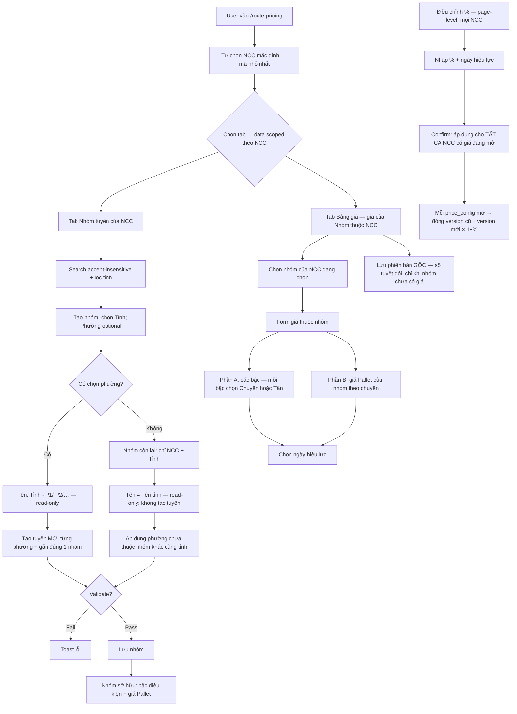

# BA Analysis: Tính giá theo tuyến đường (Route Pricing)

**Ngày:** 2026-07-11  
**Feature:** Quản lý tuyến đường, nhóm tuyến và bảng giá theo nhà cung cấp (`suppliers`)  
**Module:** Giá theo tuyến (`route_pricing`) — **module + permission riêng**, không thuộc `accounting_data`
**Scope:** FULL

---

## 1. Mô tả yêu cầu

Hệ thống cần quản lý **giá vận chuyển theo tuyến đường**, với các đặc điểm:

1. Mỗi **nhà cung cấp (`suppliers`)** có **danh sách tuyến riêng** — tuyến của MCC và NDFC độc lập, không dùng chung.
2. Mỗi **tuyến đường** (trong phạm vi 1 NCC) = **Tỉnh** + **Phường/Xã**, chọn từ **master đơn vị hành chính VN** ([vietnamese-provinces-database](https://github.com/thanglequoc/vietnamese-provinces-database) — 2 cấp: `provinces` → `wards`, không huyện).
3. Nhiều phường cùng tỉnh **của cùng NCC** có thể **gom thành một nhóm**. Khi **tạo nhóm** có chọn phường: hệ thống **tạo tuyến mới** cho từng phường (không tái dùng). Mỗi tuyến (có phường cụ thể) chỉ thuộc **một** nhóm.
4. **Nhóm có thể chỉ gồm NCC + Tỉnh** (không chọn phường). Phường trống = nhóm **còn lại**: áp dụng cho mọi phường/tuyến của tỉnh đó **chưa** nằm trong nhóm khác (cùng NCC + tỉnh). Tối đa **một** nhóm còn lại / (NCC, tỉnh).
5. **Tên nhóm** do hệ thống sinh — user không được sửa:
   - Có phường: `{Tên tỉnh} - {Phường1}/ {Phường2}/ …`
   - Không phường (còn lại): `{Tên tỉnh}`
6. Mỗi **nhóm tuyến** thuộc đúng 1 NCC và sở hữu bộ giá của mình, gồm:
   - **Các bậc điều kiện (theo khoảng tấn)** — mỗi bậc **tự chọn** đơn vị tính: **chuyến** hoặc **tấn** (vd. ≤2.5 tấn tính theo chuyến; bậc khác có thể theo tấn).
   - **Giá Pallet** — thuộc nhóm, luôn tính **theo chuyến**.
7. Pallet nằm **trong Nhóm tuyến giống như giá**: cùng bảng giá của nhóm, cùng phiên bản theo thời gian.
8. **Nhà cung cấp = `suppliers`** sẵn có (nghiệp vụ có thể gọi “tập đoàn”); không tạo entity `corporations`. CRUD NCC tại `/catalog/suppliers`.
9. **Bậc điều kiện cấu hình trong DB** — **không hardcode** khung/ngưỡng. Mỗi bậc có:
   - Khoảng tấn `(from_ton, to_ton]` (mở trái, đóng phải)
   - `pricing_unit` ∈ {`chuyen`, `tan`} — **theo từng bậc**, không theo cả nhóm
   - Giá tương ứng (VND/chuyến hoặc VND/tấn)
   - `min_billable_ton` (chỉ khi bậc = tấn, optional)
   Ví dụ minh họa:
   - (0, 2.5] → đơn vị **Chuyến** → giá 1.500.000/chuyến
   - (2.5, 8] → đơn vị **Tấn**, min 5 tấn → giá 90.000/tấn
   - (8, 16] → đơn vị **Tấn** → giá 80.000/tấn
10. Giá quản lý theo **khung thời gian (effective date)**:
   - **Lần đầu** nhập bảng giá gốc: nhập **số tuyệt đối** (bậc + Pallet) + ngày hiệu lực.
   - **Mọi lần cập nhật sau:** **chỉ theo % tăng/giảm** — không nhập lại số tuyệt đối.
   - Một lần điều chỉnh % áp dụng cho **mọi nhà cung cấp** đang có bảng giá hiệu lực (toàn hệ thống), cùng `effective_from`.


**Liên quan hiện có (thay đổi trong phase này):**
- `customers.tuyen_phuong` / `tuyen_cu` — text tự do; map sang `delivery_routes` vẫn nhập master thủ công.
- Delivery import **BR-011 cũ** (hardcode ≤2.5 / >8-16 / >16-23 / Pallet) → **thay bằng lookup** từ master Route Pricing. **Không giữ hardcode khung giá.**
- `suppliers` — catalog nhà cung cấp. Mỗi NCC có danh sách tuyến / nhóm / giá riêng; CRUD tại `/catalog/suppliers`.
- `trip_codes.so_tien` — giá theo mã chuyến (vehicle-data), **không** thay thế bảng giá tuyến.

---

## 1.1 Flowchart TO-BE



---

## 1.2 Business Rules

```
BR-000: Mọi tuyến / nhóm / bảng giá đều scoped theo supplier_id. Đổi NCC trên UI → load danh sách khác hoàn toàn.
BR-001: Tuyến = (supplier_id, province_code, ward_code). UNIQUE trong active rows theo từng NCC (service layer).
        Lưu kèm denormalized `tinh` = provinces.name, `phuong` = wards.name (từ master).
        Cùng cặp Tỉnh+Phường có thể tồn tại ở 2 NCC khác nhau như 2 bản ghi độc lập.
BR-001b: Master địa giới hành chính: import từ
        https://github.com/thanglequoc/vietnamese-provinces-database
        (PostgreSQL: `provinces`, `wards` — mô hình 2 cấp sau sắp xếp; không dùng huyện).
        UI/API chọn Tỉnh/Phường **chỉ** từ master này — không free-text.
BR-002: Soft delete tuyến: status='deactive'. Không xóa cứng.
BR-003: Không cho soft-delete tuyến đang thuộc nhóm active của cùng NCC (chặn + báo lỗi).
BR-004: Nhóm tuyến thuộc đúng 1 NCC + 1 tỉnh (province_code). Thành viên (nếu có) phải cùng tỉnh VÀ cùng supplier với nhóm.
BR-004b: Tạo nhóm — hai chế độ:
        (A) **Có phường** (`ward_codes` ≥ 1): với mỗi ward → **INSERT** `delivery_routes` mới rồi gắn members.
            Không tái dùng tuyến đã có. Trùng (supplier, province, ward) active → 409 DUPLICATE_ROUTE.
        (B) **Không phường** (`ward_codes` rỗng / omit): nhóm **còn lại** (`is_residual = true`).
            Chỉ lưu NCC + tỉnh; **không** tạo `delivery_routes` / members.
            Nghĩa nghiệp vụ: giá nhóm này áp dụng mọi phường của tỉnh **chưa** thuộc nhóm khác (cùng NCC + tỉnh).
BR-004c: Tên nhóm **do hệ thống sinh** (không cho user sửa / không nhận `name` từ client):
        - Có phường: `{provinces.name} - {wards.name_1}/ {wards.name_2}/ …`
        - Còn lại (không phường): `{provinces.name}`
        Đổi danh sách phường (create/update) → **tính lại** `name` (+ `is_residual`) trên server.
BR-004d: Trong cùng (supplier_id, province_code) active: tối đa **một** nhóm `is_residual=true`.
        Tạo nhóm còn lại thứ 2 → 409 DUPLICATE_RESIDUAL_GROUP.
BR-005: Mỗi tuyến active (có ward cụ thể) thuộc **đúng một** nhóm active có members.
        Không chia sẻ tuyến giữa các nhóm. Nhóm còn lại **không** “sở hữu” tuyến qua members —
        chỉ cover theo exclusion khi lookup.
BR-005b: Lookup chọn nhóm (cùng supplier + province):
        1) Nếu tồn tại nhóm có member khớp ward → dùng nhóm đó.
        2) Else nếu tồn tại nhóm `is_residual` của tỉnh → dùng nhóm còn lại.
        3) Else → không tìm thấy (không fallback hardcode).
BR-006: (Đã bỏ) Không còn pricing_unit ở cấp nhóm. Đơn vị tính chọn **theo từng bậc điều kiện**.
BR-007: Mỗi nhóm có tối đa 1 price_config (1-1). Supplier suy ra từ route_groups.supplier_id.
BR-008: Giá luôn version theo effective_from (DATE). Tại thời điểm t, chỉ 1 phiên bản hiệu lực:
        effective_from ≤ t AND (effective_to IS NULL OR effective_to > t).
BR-009: Tạo phiên bản số tuyệt đối (POST prices) **chỉ khi** nhóm chưa có version nào (bảng giá gốc).
        Nếu đã có version → 400 ABSOLUTE_UPDATE_FORBIDDEN — phải dùng điều chỉnh %.
BR-010: Điều chỉnh % (toàn hệ thống):
        - Input: percent, effective_from, note?
        - Scope: **mọi** price_config đang có version mở (effective_to IS NULL), **mọi nhà cung cấp**.
        - new_price = round_to_thousands(old_price * (1 + percent/100))
          — làm tròn **hàng nghìn** (3 chữ số 0 nguyên, ví dụ `1.000`), half-up; **không** làm tròn thập phân.
          Công thức: `Math.round(raw / 1000) * 1000` (vd. 108400 → 108000; 108500 → 109000).
          Áp dụng mọi tier.price + pallet_trip_price.
        - Mỗi config: đóng version cũ (effective_to=D) + insert version mới; lưu adjustment_percent, base_version_id.
        - Ghi chung adjustment_batch_id (UUID) trên mọi version tạo trong lần gọi — audit.
        - Không cho điều chỉnh % theo từng NCC / từng nhóm riêng.
BR-010b: Không có API/UI “cập nhật số tuyệt đối” sau lần nhập gốc (trừ khi chưa từng có giá).
BR-011: Giá Pallet là thành phần giá của Nhóm (cùng price_version), đơn vị cố định = chuyến; bắt buộc mọi version; **cho phép = 0**.
BR-012: Bậc điều kiện (`route_price_tiers`) — **không hardcode ngưỡng**; mỗi bậc độc lập:
        - from_ton / to_ton: **left-open right-closed `(from, to]`**; to NULL = ∞.
          Match: `weight > from_ton AND (to_ton IS NULL OR weight <= to_ton)`.
          Ví dụ: w=2.5 thuộc bậc (0, 2.5]; w=2.5 không thuộc (2.5, 8].
        - Các bậc không chồng lấn.
        - pricing_unit ∈ {'chuyen','tan'} — **bắt buộc trên từng bậc** (vd. bậc ≤2.5 có thể Chuyến; bậc khác có thể Tấn).
        - price NUMERIC: nếu chuyen = VND/chuyến; nếu tan = VND/tấn.
        - min_billable_ton: chỉ hợp lệ khi pricing_unit='tan'; NULL khi chuyen.
        - Khi tan: w trong bậc và w < min_billable → bill = min_billable × price.
        - Khi chuyen: tiền = price (1 chuyến), không nhân trọng lượng.
BR-013: Lookup (bắt buộc cho Delivery Import): input (supplier_id, tinh, phuong, weight_mt?, is_pallet, as_of_date)
        → chọn nhóm theo BR-005b (member khớp ward, else residual tỉnh) → version hiệu lực
        → is_pallet: pallet_trip_price + khung_label="Pallet" + don_vi="Chuyến"
        → else: match bậc theo weight_mt → trả price, pricing_unit của bậc, billable_ton (nếu tan),
                khung_label derive từ from/to, don_vi = "Chuyến"|"Tấn" theo **bậc khớp** (không theo nhóm).
BR-013b: Delivery Import — thay BR-011 hardcode: "Khung giá" / "Đơn vị tính" từ lookup; xóa threshold cố định.
BR-014: Permissions **riêng module** (không dùng accounting_data.*):
        - `route_pricing.view` — xem tuyến / nhóm / bảng giá / lịch sử
        - `route_pricing.manage` — CRUD + nhập giá gốc + điều chỉnh % toàn hệ thống
        Seed gán: ADMIN, ACCOUNTANT có cả hai; VIEWER chỉ view (hoặc theo matrix role khi implement).
BR-015: Nhà cung cấp = bảng `suppliers`. Không CRUD suppliers trong module giá; dùng `/catalog/suppliers`.
BR-016: Tên nhóm UNIQUE trong cùng (supplier_id, province_code) active.
BR-017: Điều chỉnh % là thao tác toàn cục (mọi NCC) — không tách permission theo NCC ở v1.
BR-018: Cho backdate effective_from miễn không overlap trên từng config; gap cảnh báo warning không block.
BR-019: API list routes/groups/prices bắt buộc filter supplier_id (query required). Thiếu → 400.
BR-020: Cấm hardcode khung giá / ngưỡng tấn trong backend hoặc frontend.
BR-021: Điều chỉnh % khi không có config nào đang mở → 400 NOTHING_TO_ADJUST.
BR-022: Module độc lập: route FE `/route-pricing`, menu sidebar riêng — **không** nằm dưới nhóm Dữ liệu kế toán / accounting_data.
BR-023: ward_code phải thuộc province_code đã chọn (FK wards.province_code). Sai → 400 INVALID_WARD.
```

### Công thức tính tiền (reference — dùng khi lookup)

| Trường hợp | Công thức |
|------------|-----------|
| Hàng Pallet | `pallet_trip_price` (1 chuyến) |
| Bậc khớp `w`, `pricing_unit=chuyen` | `price` (1 chuyến) |
| Bậc khớp `w`, `pricing_unit=tan` | `bill_ton = max(w, min_billable_ton ?? w)` → `bill_ton × price` |

---

## 1.3 Data Model

```sql
-- Migration: XXX_create_route_pricing.sql
-- Nguồn master: https://github.com/thanglequoc/vietnamese-provinces-database
-- Import script PostgreSQL của repo (provinces + wards; 2 cấp — không huyện).
-- Có thể copy CreateTable + ImportData hoặc subset tương đương vào migrations project.

-- 0) Master địa giới (read-only sau import; cập nhật theo release dataset khi cần)
CREATE TABLE IF NOT EXISTS provinces (
  code                     VARCHAR(20) PRIMARY KEY,
  name                     VARCHAR(255) NOT NULL,
  name_en                  VARCHAR(255),
  full_name                VARCHAR(255),
  full_name_en             VARCHAR(255),
  code_name                VARCHAR(255),
  administrative_unit_id   INTEGER
);

CREATE TABLE IF NOT EXISTS wards (
  code                     VARCHAR(20) PRIMARY KEY,
  name                     VARCHAR(255) NOT NULL,
  name_en                  VARCHAR(255),
  full_name                VARCHAR(255),
  full_name_en             VARCHAR(255),
  code_name                VARCHAR(255),
  province_code            VARCHAR(20) NOT NULL REFERENCES provinces(code),
  administrative_unit_id   INTEGER
);
CREATE INDEX IF NOT EXISTS idx_wards_province ON wards(province_code);

-- 1) Tuyến đường — mỗi NCC có danh sách riêng
CREATE TABLE IF NOT EXISTS delivery_routes (
  id              SERIAL PRIMARY KEY,
  supplier_id     INTEGER NOT NULL REFERENCES suppliers(id),
  province_code   VARCHAR(20) NOT NULL REFERENCES provinces(code),
  ward_code       VARCHAR(20) NOT NULL REFERENCES wards(code),
  tinh            VARCHAR(255) NOT NULL,   -- denormalized provinces.name
  phuong          VARCHAR(255) NOT NULL,   -- denormalized wards.name
  status          VARCHAR(20) NOT NULL DEFAULT 'active'
                    CHECK (status IN ('active', 'deactive')),
  created_by      INTEGER REFERENCES users(id),
  updated_by      INTEGER REFERENCES users(id),
  created_at      TIMESTAMPTZ NOT NULL DEFAULT CURRENT_TIMESTAMP,
  updated_at      TIMESTAMPTZ NOT NULL DEFAULT CURRENT_TIMESTAMP
);
CREATE INDEX IF NOT EXISTS idx_delivery_routes_supplier ON delivery_routes(supplier_id);
CREATE INDEX IF NOT EXISTS idx_delivery_routes_province ON delivery_routes(province_code);
CREATE INDEX IF NOT EXISTS idx_delivery_routes_status ON delivery_routes(status);
-- Unique active (supplier_id, province_code, ward_code) enforced at service layer

-- 2) Nhà cung cấp = bảng suppliers hiện có (không tạo corporations)

-- 3) Nhóm tuyến — thuộc 1 NCC (không có pricing_unit cấp nhóm)
CREATE TABLE IF NOT EXISTS route_groups (
  id              SERIAL PRIMARY KEY,
  supplier_id     INTEGER NOT NULL REFERENCES suppliers(id),
  name            VARCHAR(255) NOT NULL,
  province_code   VARCHAR(20) NOT NULL REFERENCES provinces(code),
  tinh            VARCHAR(255) NOT NULL,   -- denormalized provinces.name
  is_residual     BOOLEAN NOT NULL DEFAULT FALSE,  -- true = nhóm còn lại (không phường)
  note            TEXT,
  status          VARCHAR(20) NOT NULL DEFAULT 'active'
                    CHECK (status IN ('active', 'deactive')),
  created_by      INTEGER REFERENCES users(id),
  updated_by      INTEGER REFERENCES users(id),
  created_at      TIMESTAMPTZ NOT NULL DEFAULT CURRENT_TIMESTAMP,
  updated_at      TIMESTAMPTZ NOT NULL DEFAULT CURRENT_TIMESTAMP
);
CREATE INDEX IF NOT EXISTS idx_route_groups_supplier ON route_groups(supplier_id);
CREATE INDEX IF NOT EXISTS idx_route_groups_province ON route_groups(province_code);
CREATE INDEX IF NOT EXISTS idx_route_groups_status ON route_groups(status);
-- Unique one residual per (supplier, province) among active: enforce at service layer

-- 4) Thành viên nhóm (route phải cùng supplier với group — enforce ở service)
CREATE TABLE IF NOT EXISTS route_group_members (
  id              SERIAL PRIMARY KEY,
  route_group_id  INTEGER NOT NULL REFERENCES route_groups(id) ON DELETE CASCADE,
  route_id        INTEGER NOT NULL REFERENCES delivery_routes(id),
  created_at      TIMESTAMPTZ NOT NULL DEFAULT CURRENT_TIMESTAMP,
  UNIQUE (route_group_id, route_id)
);
CREATE INDEX IF NOT EXISTS idx_rgm_group ON route_group_members(route_group_id);
CREATE INDEX IF NOT EXISTS idx_rgm_route ON route_group_members(route_id);

-- 5) Config giá: 1-1 với nhóm
CREATE TABLE IF NOT EXISTS route_price_configs (
  id              SERIAL PRIMARY KEY,
  route_group_id  INTEGER NOT NULL REFERENCES route_groups(id) UNIQUE,
  status          VARCHAR(20) NOT NULL DEFAULT 'active'
                    CHECK (status IN ('active', 'deactive')),
  created_by      INTEGER REFERENCES users(id),
  created_at      TIMESTAMPTZ NOT NULL DEFAULT CURRENT_TIMESTAMP,
  updated_at      TIMESTAMPTZ NOT NULL DEFAULT CURRENT_TIMESTAMP
);

-- 6) Phiên bản giá theo thời gian
CREATE TABLE IF NOT EXISTS route_price_versions (
  id                  SERIAL PRIMARY KEY,
  price_config_id     INTEGER NOT NULL REFERENCES route_price_configs(id),
  effective_from      DATE NOT NULL,
  effective_to        DATE,
  pallet_trip_price   NUMERIC(15,0) NOT NULL,        -- VND nguyên; sau % làm tròn hàng nghìn
  adjustment_percent  NUMERIC(8,4),                  -- NULL nếu phiên bản gốc (tuyệt đối)
  adjustment_batch_id UUID,                          -- cùng UUID cho mọi NCC trong 1 lần adjust %
  base_version_id     INTEGER REFERENCES route_price_versions(id),
  created_by          INTEGER REFERENCES users(id),
  created_at          TIMESTAMPTZ NOT NULL DEFAULT CURRENT_TIMESTAMP
);
CREATE INDEX IF NOT EXISTS idx_rpv_config_from ON route_price_versions(price_config_id, effective_from);
CREATE INDEX IF NOT EXISTS idx_rpv_batch ON route_price_versions(adjustment_batch_id);

-- 7) Bậc điều kiện — mỗi bậc chọn chuyen | tan
CREATE TABLE IF NOT EXISTS route_price_tiers (
  id                  SERIAL PRIMARY KEY,
  price_version_id    INTEGER NOT NULL REFERENCES route_price_versions(id) ON DELETE CASCADE,
  from_ton            NUMERIC(10,3) NOT NULL,        -- exclusive lower: weight > from_ton
  to_ton              NUMERIC(10,3),                 -- inclusive upper: weight <= to_ton; NULL = ∞
  pricing_unit        VARCHAR(10) NOT NULL CHECK (pricing_unit IN ('chuyen', 'tan')),
  price               NUMERIC(15,0) NOT NULL,        -- VND nguyên / chuyến hoặc / tấn
  min_billable_ton    NUMERIC(10,3),                 -- chỉ khi pricing_unit='tan'
  sort_order          INTEGER NOT NULL DEFAULT 0,
  CHECK (
    (pricing_unit = 'chuyen' AND min_billable_ton IS NULL)
    OR (pricing_unit = 'tan')
  )
);
CREATE INDEX IF NOT EXISTS idx_rpt_version ON route_price_tiers(price_version_id);
```

**Ràng buộc phiên bản (service):**
- Không overlap khoảng `[effective_from, effective_to)`.
- Khi insert version mới: update version đang `effective_to IS NULL` → `effective_to = new.effective_from`.

---

## 1.4 API Contract

Base: `/api/route-pricing`  
Auth: JWT + `route_pricing.view` (GET) / `route_pricing.manage` (mutating)

### Geo master (Tỉnh / Phường)

```
GET    /api/route-pricing/geo/provinces
  → { success, data: [{ code, name, full_name }] }
  Auth: JWT + route_pricing.view

GET    /api/route-pricing/geo/wards?province_code=
  → { success, data: [{ code, name, full_name, province_code }] }
  → 400 nếu thiếu province_code
```

### Routes (tuyến đường)

```
GET    /api/route-pricing/routes
  Query: ?supplier_id= (required) &search=&province_code=&status=active
  → { success, data: DeliveryRoute[] }  -- gồm province_code, ward_code, tinh, phuong

POST   /api/route-pricing/routes
  Body: { supplier_id, province_code, ward_code }
  → 201 (tinh/phuong lấy từ master) | 409 DUPLICATE_ROUTE | 400 INVALID_WARD | 400 MISSING_SUPPLIER

PUT    /api/route-pricing/routes/:id
  Body: { province_code, ward_code }   -- không đổi supplier_id
  → 200 | 409 | 404 | 400 INVALID_WARD

DELETE /api/route-pricing/routes/:id
  Soft delete → 200 | 409 ROUTE_IN_ACTIVE_GROUP
```

### Nhà cung cấp (suppliers) — reuse, không API mới trong module giá

```
GET /api/suppliers   (catalog hiện có) → list active cho bộ lọc page-level
CRUD nhà cung cấp: /catalog/suppliers
```

### Route groups (nhóm tuyến)

```
GET    /api/route-pricing/groups
  Query: ?supplier_id= (required) &province_code=&search=
  → data: RouteGroup[] (include members: [{ route_id, province_code, ward_code, tinh, phuong }])

POST   /api/route-pricing/groups
  Body: {
    supplier_id,
    province_code,
    ward_codes?: string[],  -- omit hoặc [] = nhóm còn lại (is_residual); ≥1 = nhóm cụ thể
    note?
    -- không có `name` — server sinh theo BR-004c
  }
  → Có ward: tạo tuyến mới + members; Không ward: is_residual=true, không tạo tuyến
  → 201 | 400 INVALID_WARD | 409 DUPLICATE_ROUTE | 409 ROUTE_ALREADY_IN_GROUP
    | 409 DUPLICATE_RESIDUAL_GROUP | 409 DUPLICATE_GROUP_NAME

PUT    /api/route-pricing/groups/:id
  Body: { note?, ward_codes?: string[] }  -- không đổi supplier/province_code; không nhận `name`
  → ward_codes [] → chuyển sang residual (gỡ members + soft-delete routes của nhóm; check DUPLICATE_RESIDUAL)
  → ward_codes ≥1 → sync members (INSERT mới / gỡ bỏ); tắt is_residual; tính lại name
  → 200 | 400 | 409 DUPLICATE_ROUTE | 409 ROUTE_ALREADY_IN_GROUP | 409 DUPLICATE_RESIDUAL_GROUP

DELETE /api/route-pricing/groups/:id  -- soft delete + clear members
```

### Price configs & versions

```
GET    /api/route-pricing/prices
  Query: ?supplier_id= (required) &route_group_id=
  → configs của các nhóm thuộc NCC + current_version + history summary

GET    /api/route-pricing/prices/:configId/versions
  → list versions DESC effective_from (kèm tiers[])

POST   /api/route-pricing/prices
  Body: {
    route_group_id,
    effective_from,
    pallet_trip_price,
    tiers: [{ from_ton, to_ton?, pricing_unit, price, min_billable_ton? }]
  }
  → 201 tạo config + phiên bản GỐC (số tuyệt đối)
  → 400 ABSOLUTE_UPDATE_FORBIDDEN nếu nhóm đã có version

POST   /api/route-pricing/prices/adjust   (toàn hệ thống — mọi NCC)
  Body: {
    percent,                  -- e.g. 8 = +8%; -5 = giảm 5%
    effective_from,
  }
  → 201 {
      adjustment_batch_id,
      affected: number,       -- số price_config đã tạo version mới
      suppliers_affected: number
    }
  → 400 NOTHING_TO_ADJUST nếu không có version đang mở
  → KHÔNG còn POST /prices/:configId/adjust (per-group / per-NCC)

GET    /api/route-pricing/lookup
  Query: supplier_id, tinh, phuong, weight_mt?, is_pallet=true|false, as_of=YYYY-MM-DD
  → {
      pricing_unit,           -- của bậc khớp hoặc 'chuyen' nếu pallet
      price,                  -- đơn giá bậc / pallet
      billable_ton?,          -- chỉ khi bậc = tan
      pallet_trip_price?,
      khung_label,
      don_vi,                 -- "Chuyến" | "Tấn" theo bậc / pallet
      version_id
    }
```

**Error codes:**
| Code | HTTP | Ý nghĩa |
|------|------|---------|
| MISSING_SUPPLIER | 400 | Thiếu supplier_id |
| DUPLICATE_ROUTE | 409 | province+ward đã tồn tại **trong NCC này** |
| ROUTE_IN_ACTIVE_GROUP | 409 | Không xóa tuyến đang trong nhóm |
| INVALID_WARD | 400 | ward_code không thuộc province_code / không tồn tại |
| DUPLICATE_GROUP_NAME | 409 | Tên nhóm trùng trong cùng (supplier, province) active |
| DUPLICATE_RESIDUAL_GROUP | 409 | Đã có nhóm còn lại (không phường) cho NCC + tỉnh này |
| ROUTES_PROVINCE_MISMATCH | 400 | Thành viên khác tỉnh nhóm |
| ROUTES_SUPPLIER_MISMATCH | 400 | Thành viên không thuộc cùng NCC với nhóm |
| ROUTE_ALREADY_IN_GROUP | 409 | Tuyến/phường đã thuộc nhóm khác |
| OVERLAPPING_VERSION | 409 | Trùng/chồng effective date |
| INVALID_TIERS | 400 | Bậc chồng / gap / thiếu / min_billable sai với unit |
| ABSOLUTE_UPDATE_FORBIDDEN | 400 | Đã có giá — chỉ được cập nhật bằng % toàn hệ thống |
| NOTHING_TO_ADJUST | 400 | Không có bảng giá đang mở để điều chỉnh % |
| SUPPLIER_NOT_FOUND | 404 | supplier_id không tồn tại / không active |
---

## 1.5 Use Cases

| ID | Actor | Use case | AC |
|----|-------|----------|-----|
| UC-01 | Kế toán | Chọn NCC rồi tạo/sửa/xóa tuyến (Tỉnh/Phường từ master) | List chỉ tuyến của NCC; duplicate trong NCC → 409 |
| UC-02 | Kế toán | Tạo nhóm có phường; tên `Tỉnh - P1/…` | Tạo tuyến mới; 1 tuyến = 1 nhóm |
| UC-02b | Kế toán | Tạo nhóm chỉ NCC + Tỉnh (phường trống) | is_residual; cover phường còn lại |
| UC-03 | Kế toán | Đổi NCC trên page → thấy danh sách tuyến/nhóm/giá khác | Data không lẫn giữa NCC |
| UC-04 | Kế toán | Nhập bảng giá GỐC (tuyệt đối) cho nhóm chưa có giá | Chỉ lần đầu |
| UC-05 | Kế toán | Bậc (0, 2.5]=Chuyến; (2.5, 8]=Tấn min5; w=2.5 → Chuyến | Lookup đúng don_vi |
| UC-06 | Kế toán trưởng | Điều chỉnh +8% từ ngày D — **mọi NCC** | Mọi config mở ×1.08; 1 batch_id |
| UC-06b | Kế toán | Thử thêm version tuyệt đối khi đã có giá | 400 ABSOLUTE_UPDATE_FORBIDDEN |
| UC-07 | Viewer | Xem bảng giá / lịch sử theo NCC | Chỉ GET |
| UC-08 | Hệ thống | Lookup theo supplier+tuyến+ngày | Đúng version của đúng NCC |
| UC-09 | Hệ thống | Delivery Import lấy Khung giá / Đơn vị tính từ lookup | Không hardcode threshold |

---

## 1.6 Acceptance Criteria

```
AC-001: Chọn NCC MCC → tạo tuyến từ master (vd. HCM + các phường) thuộc MCC.
AC-002: Tạo nhóm MCC có phường → tên `Tỉnh - P1/ P2/ P3`; tạo tuyến mới; mỗi tuyến chỉ thuộc nhóm đó.
AC-002b: Thử tạo nhóm với phường đã có tuyến active cùng NCC → 409 DUPLICATE_ROUTE.
AC-002c: Tạo nhóm chỉ NCC + Tỉnh (ward trống) → `is_residual`, tên = tên tỉnh, không tạo tuyến.
AC-002d: Lookup phường chưa thuộc nhóm cụ thể → dùng nhóm còn lại của tỉnh (nếu có).
AC-002e: Hai nhóm residual cùng NCC+tỉnh → 409 DUPLICATE_RESIDUAL_GROUP.
AC-003: Không gắn được phường tỉnh khác; không chuyển tuyến từ nhóm A sang nhóm B (1 tuyến = 1 nhóm).
AC-004: NCC NDFC có thể tạo cùng cặp province+ward như bản ghi riêng — không conflict với MCC.
AC-005: Đổi NCC trên page → danh sách tuyến/nhóm/giá đổi theo; không thấy data NCC kia.
AC-006: Nhập gốc MCC; NDFC cũng có bảng giá; adjust +8% ngày 25 → **cả MCC và NDFC** đều có version mới ×1.08, cùng batch_id.
AC-007: Lookup w=2 và w=2.5 → Chuyến (bậc (0,2.5]); w=2.5001 → Tấn bậc (2.5,8], billable=5; pallet → Chuyến.
AC-008: Soft-delete tuyến đang trong nhóm → 409.
AC-009: User chỉ view không thấy nút mutate / adjust %.
AC-010: Mọi version có pallet + ≥1 bậc; mỗi bậc có pricing_unit riêng.
AC-011: Không hardcode ngưỡng / đơn vị trong Delivery Import.
AC-012: Đổi bậc trên bản gốc → export dùng cấu hình; sau adjust % dùng giá đã nhân.
AC-013: Lookup thiếu data → lỗi rõ, không fallback hardcode.
AC-014: POST prices tuyệt đối lần 2 trên cùng nhóm → 400 ABSOLUTE_UPDATE_FORBIDDEN.
AC-015: Nút/API điều chỉnh % không nhận supplier_id — luôn toàn hệ thống.
AC-016: Dropdown Tỉnh/Phường chỉ lấy từ master vietnamese-provinces-database (không free-text).
AC-017: Tên nhóm luôn do server sinh theo BR-004c; UI hiển thị read-only; body không có `name`.
```

---

## 1.7 UI/UX Requirements (tóm tắt cho UI Spec)

- Menu sidebar **riêng:** **Giá theo tuyến** (`/route-pricing`) — không nằm trong Dữ liệu kế toán
- Permission: `route_pricing.view` / `route_pricing.manage` (seed + matrix)
- **Page-level:** auto-select **NCC** mặc định (mã nhỏ nhất); mọi tab scoped theo NCC
- **2 tabs:** Nhóm tuyến | Bảng giá (bỏ tab Tuyến đường)
- Tab Nhóm: search accent-insensitive + filter tỉnh
- Tạo nhóm: search + multi-select phường; cột bảng nhóm = **Phường/Xã** (không gọi “Thành viên”)
- **Không** nút Thêm tuyến thủ công; **không** nút/link Catalog trên trang
- Nút **Điều chỉnh %** (toàn hệ thống, mọi NCC) — confirm rõ scope; sau % làm tròn hàng nghìn
- Tab Bảng giá: chỉ **Thêm bảng giá gốc** khi nhóm chưa có version; không “thêm phiên bản tuyệt đối” sau đó
- Form bậc: mỗi dòng chọn Chuyến|Tấn; giá nhập/hiển thị VND nguyên
- Tỉnh/Phường: select từ master VN (không nhập tay)
- Tạo nhóm: search + multi-select phường; trống = nhóm còn lại; có phường = tạo tuyến mới
- **Không** nút Thêm tuyến thủ công
- Tên hệ thống read-only: có P → `Tỉnh - P1/ P2/…`; không P → `Tên tỉnh`
- Toast success/error theo convention hiện tại

---

## 1.8 Out of Scope (phase này)

- Đồng bộ tự động `customers.tuyen_phuong` → `delivery_routes`
- Thay thế `trip_codes.so_tien`
- Multi-currency
- Approval workflow nhiều cấp trước khi giá có hiệu lực

**In scope (bắt buộc):** Lookup API + thay hardcode khung giá trong Delivery Import bằng lookup master.

---

## 1.9 Open Questions — đã chốt

| # | Câu hỏi | Đề xuất mặc định |
|---|---------|------------------|
| Q1 | Nhà cung cấp / tập đoàn? | **Đã chốt:** dùng `suppliers` — không tạo `corporations` |
| Q1b | Tuyến dùng chung hay theo NCC? | **Đã chốt:** mỗi NCC có danh sách tuyến riêng |
| Q1c | Hardcode khung giá Delivery Import? | **Đã chốt:** không — dùng lookup master |
| Q1d | Đơn vị tính cấp nhóm hay cấp bậc? | **Đã chốt:** theo **từng bậc** (chuyến \| tấn) |
| Q1e | Cập nhật giá tuyệt đối hay %? | **Đã chốt:** gốc = tuyệt đối; sau đó **chỉ %**; % = **mọi NCC** |
| Q2 | Khoảng bậc tấn inclusive/exclusive? | **Đã chốt:** `(from_ton, to_ton]` — mở trái, đóng phải |
| Q3 | Làm tròn sau %? | **Đã chốt:** Round **hàng nghìn** (3 chữ số 0 nguyên, ví dụ `1.000`) — không thập phân |
| Q4 | Cho backdate effective_from? | **Đã chốt:** Có, miễn không overlap |
| Q5 | Map `customers.tuyen_phuong` text → route? | **Sau v1** — v1 nhập master tuyến thủ công |
| Q6 | Module / permission? | **Đã chốt:** module riêng `route_pricing` + `route_pricing.view` / `route_pricing.manage` — **không** dùng `accounting_data` |
| Q7 | Nguồn Tỉnh/Phường? | **Đã chốt:** [vietnamese-provinces-database](https://github.com/thanglequoc/vietnamese-provinces-database) (`provinces` + `wards`) |
| Q8 | Tạo nhóm chọn nhiều phường? | **Đã chốt:** multi ward **optional**; tên hệ thống không sửa; có P → tạo tuyến mới; không P → residual |
| Q9 | Nhóm chỉ NCC + Tỉnh? | **Đã chốt:** Có — phường trống = các tuyến/phường còn lại chưa thuộc nhóm khác cùng tỉnh |
