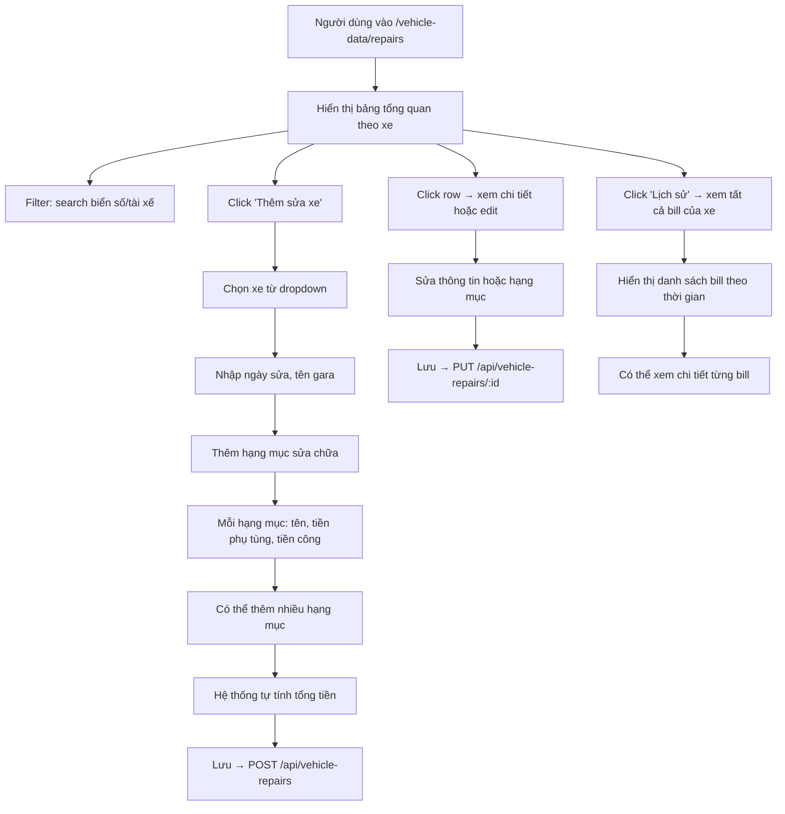

# BA Analysis: Lịch sử Sửa xe

**Ngày:** 2026-07-21
**Module:** Quản lý dữ liệu xe

---

## 1. Tổng quan

Tính năng "Lịch sử sửa xe" cho phép quản lý và theo dõi toàn bộ lịch sử sửa chữa, bảo dưỡng của từng xe trong đội. Mỗi lần sửa xe được ghi nhận thành 1 bill với các thông tin: ngày sửa, tên gara, danh sách hạng mục sửa chữa (kèm tiền phụ tùng và tiền công). Hệ thống tự động tính tổng tiền cho mỗi bill.

> **Tham khảo:** UI/Cách hiển thị tương tự tính năng "Quản lý đăng kiểm" đã có.

---

## 2. User Stories

| ID | User Story | Actor |
|----|------------|-------|
| US-01 | Xem danh sách tổng quan lịch sử sửa xe của tất cả xe, filter theo biển số/tài xế | Admin, Accountant |
| US-02 | Xem chi tiết một lần sửa xe (danh sách hạng mục, từng hạng mục có tiền phụ tùng + tiền công) | Admin, Accountant |
| US-03 | Tạo mới bill sửa xe: chọn xe, nhập ngày sửa, tên gara, thêm một hoặc nhiều hạng mục (mỗi hạng mục gồm tên, tiền phụ tùng, tiền công) | Admin, Accountant |
| US-04 | Cập nhật bill sửa xe (sửa thông tin, thêm/xóa/sửa hạng mục) | Admin, Accountant |
| US-05 | Xóa bill sửa xe (soft delete) | Admin |
| US-06 | Xem lịch sử tất cả bill sửa xe của 1 xe cụ thể | Admin, Accountant |

---

## 3. Flowchart TO-BE



---

## 4. Business Rules

| ID | Rule |
|----|------|
| BR-01 | Một xe có thể có nhiều bill sửa xe (lưu toàn bộ lịch sử) |
| BR-02 | Mỗi bill sửa xe có thể có một hoặc nhiều hạng mục sửa chữa |
| BR-03 | Tổng tiền 1 bill = SUM(tiền phụ tùng + tiền công) của tất cả hạng mục trong bill |
| BR-04 | Tổng tiền được lưu denormalized trong `repair_records.total_amount` để hiển thị nhanh, đồng thời luôn đồng bộ khi CRUD hạng mục |
| BR-05 | Tiền phụ tùng (parts_cost) và tiền công (labor_cost) đều >= 0, cho phép 0 nếu hạng mục không có phụ tùng hoặc không mất công |
| BR-06 | Soft delete: status = 'deleted', không xóa vật lý |
| BR-07 | Khi xóa bill → các hạng mục vẫn giữ nguyên trong DB (chỉ thay đổi status bill) |
| BR-08 | Hạng mục có thể bị xóa cứng khi user xóa khỏi bill (vì là dữ liệu con, không có giá trị độc lập) |
| BR-09 | Danh sách tổng quan hiển thị theo xe: mỗi dòng = 1 xe, hiển thị tổng số lần sửa, lần sửa gần nhất, tổng tiền đã sửa |
| BR-10 | Tiền phụ tùng và tiền công lưu dưới dạng số nguyên (VNĐ), không dùng decimal |

---

## 5. Data Model

### 5.1 Bảng mới: `repair_records`

```sql
CREATE TABLE IF NOT EXISTS repair_records (
  id              SERIAL PRIMARY KEY,
  vehicle_id      INTEGER NOT NULL REFERENCES vehicles(id),
  repair_date     DATE NOT NULL,
  garage_name     VARCHAR(255) NOT NULL,
  total_amount    BIGINT NOT NULL DEFAULT 0,
  notes           TEXT,
  status          VARCHAR(20) NOT NULL DEFAULT 'active'
                  CHECK (status IN ('active', 'deleted')),
  created_by      INTEGER REFERENCES users(id) ON DELETE SET NULL,
  created_at      TIMESTAMPTZ NOT NULL DEFAULT CURRENT_TIMESTAMP,
  updated_at      TIMESTAMPTZ NOT NULL DEFAULT CURRENT_TIMESTAMP
);

CREATE INDEX IF NOT EXISTS idx_repair_records_vehicle
  ON repair_records(vehicle_id);

CREATE INDEX IF NOT EXISTS idx_repair_records_date
  ON repair_records(repair_date DESC);

CREATE INDEX IF NOT EXISTS idx_repair_records_status
  ON repair_records(status);

DROP TRIGGER IF EXISTS update_repair_records_updated_at ON repair_records;
CREATE TRIGGER update_repair_records_updated_at
  BEFORE UPDATE ON repair_records
  FOR EACH ROW EXECUTE PROCEDURE update_updated_at_column();
```

### 5.2 Bảng mới: `repair_items`

```sql
CREATE TABLE IF NOT EXISTS repair_items (
  id              SERIAL PRIMARY KEY,
  repair_id       INTEGER NOT NULL REFERENCES repair_records(id) ON DELETE CASCADE,
  item_name       VARCHAR(255) NOT NULL,
  parts_cost      BIGINT NOT NULL DEFAULT 0,
  labor_cost      BIGINT NOT NULL DEFAULT 0,
  created_at      TIMESTAMPTZ NOT NULL DEFAULT CURRENT_TIMESTAMP
);

CREATE INDEX IF NOT EXISTS idx_repair_items_repair
  ON repair_items(repair_id);
```

---

## 6. API Contract

### 6.1 Vehicle Repairs (`/api/vehicle-repairs`)

| Method | Endpoint | Permission | Mô tả |
|--------|----------|-----------|-------|
| GET | `/api/vehicle-repairs?search=&page=&limit=` | `vehicle_data.view` | List tổng quan theo xe (summary view) |
| GET | `/api/vehicle-repairs/vehicle/:vehicleId?page=&limit=` | `vehicle_data.view` | List tất cả bill của 1 xe |
| GET | `/api/vehicle-repairs/:id` | `vehicle_data.view` | Chi tiết 1 bill (kèm danh sách items) |
| POST | `/api/vehicle-repairs` | `vehicle_data.manage` | Tạo bill mới (kèm items) |
| PUT | `/api/vehicle-repairs/:id` | `vehicle_data.manage` | Cập nhật bill (kèm items) |
| DELETE | `/api/vehicle-repairs/:id` | `vehicle_data.manage` | Soft delete |

**Request Body (POST/PUT):**
```json
{
  "vehicle_id": 1,
  "repair_date": "2026-07-21",
  "garage_name": "Gara Ô tô ABC",
  "notes": "Thay dầu, thay lọc gió",
  "items": [
    { "item_name": "Thay dầu máy", "parts_cost": 500000, "labor_cost": 100000 },
    { "item_name": "Thay lọc gió", "parts_cost": 200000, "labor_cost": 50000 }
  ]
}
```

**Response (GET /:id):**
```json
{
  "success": true,
  "data": {
    "id": 1,
    "vehicle_id": 1,
    "plate_number": "51H-12345",
    "driver_name": "Nguyễn Văn A",
    "repair_date": "2026-07-21",
    "garage_name": "Gara Ô tô ABC",
    "total_amount": 850000,
    "notes": "Thay dầu, thay lọc gió",
    "status": "active",
    "items": [
      { "id": 1, "item_name": "Thay dầu máy", "parts_cost": 500000, "labor_cost": 100000 },
      { "id": 2, "item_name": "Thay lọc gió", "parts_cost": 200000, "labor_cost": 50000 }
    ],
    "created_by": 1,
    "created_at": "2026-07-21T10:00:00Z",
    "updated_at": "2026-07-21T10:00:00Z"
  }
}
```

**Response (GET /summary):**
```json
{
  "success": true,
  "data": {
    "vehicles": [
      {
        "vehicle_id": 1,
        "plate_number": "51H-12345",
        "driver_name": "Nguyễn Văn A",
        "latest_repair_id": 5,
        "latest_repair_date": "2026-07-15",
        "latest_garage_name": "Gara Ô Tô XYZ",
        "repair_count": 3,
        "total_repair_amount": "12500000"
      }
    ],
    "total": 1,
    "page": 1,
    "limit": 20
  }
}
```

---

## 7. Permissions

Sử dụng lại permissions đã có cho vehicle_data:

| Code | Mô tả | ADMIN | ACCOUNTANT | VIEWER |
|------|-------|-------|------------|--------|
| `vehicle_data.view` | Xem dữ liệu sửa xe | ✓ | ✓ | ✓ |
| `vehicle_data.manage` | Quản lý dữ liệu sửa xe (CRUD) | ✓ | ✓ | ✗ |

---

## 8. UI Screens

| Route | Component | Mô tả |
|-------|-----------|-------|
| `/vehicle-data/repairs` | `RepairPage.tsx` | Bảng tổng quan theo xe + filter + CRUD |
| — | `RepairFormModal.tsx` | Modal tạo/sửa/xem bill, form động thêm hạng mục |
| — | `RepairHistoryModal.tsx` | Modal lịch sử tất cả bill của 1 xe |

---

## 9. Edge Cases

| # | Case | Xử lý |
|---|------|-------|
| EC-01 | Tạo bill không có hạng mục nào | Lỗi validation: "Phải có ít nhất 1 hạng mục" |
| EC-02 | Xe deactive | Ẩn khỏi danh sách tổng quan |
| EC-03 | Xóa hạng mục duy nhất trong bill đang edit | Không cho phép nếu là hạng mục cuối cùng |
| EC-04 | Tiền phụ tùng hoặc tiền công âm | Lỗi validation: "Số tiền không được âm" |
| EC-05 | Cập nhật bill đã bị xóa | 404: "Không tìm thấy bill sửa xe" |
| EC-06 | Tổng tiền vượt quá giới hạn BIGINT | BIGINT (9.2 tỷ tỷ) — thực tế không vượt |
| EC-07 | Xe chưa có bill sửa xe nào | Hiển thị "Chưa có dữ liệu" trong bảng tổng quan |
| EC-08 | PUT update items: thêm/xóa/sửa đồng thời | Xóa hết items cũ, insert lại danh sách mới trong transaction |
